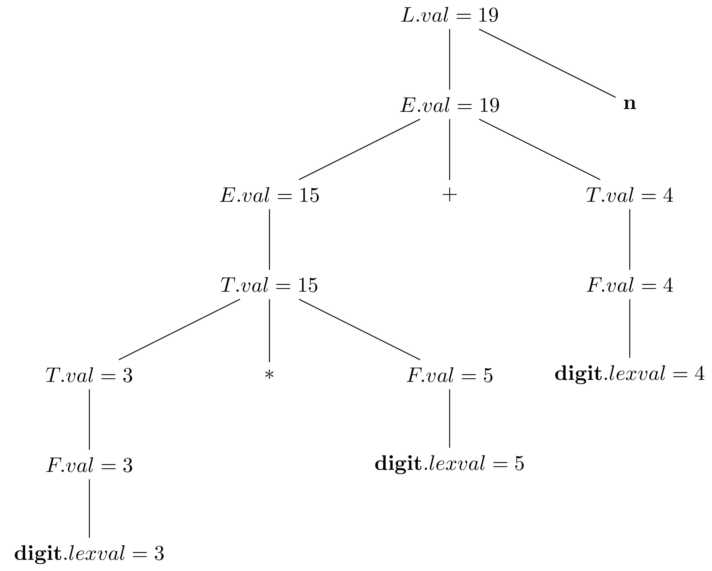
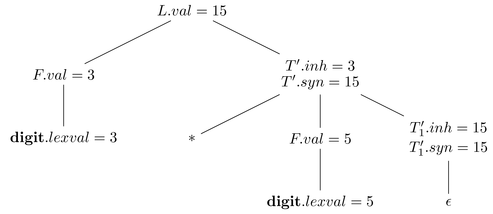

# Syntax-Directed Translation

$$
\newcommand{\ra}{\rightarrow}
\newcommand{\b}{\bold}
$$

### 1. Syntax-Directed Definitions

##### # SDD and Its Attributes

A **syntax-directed definition** (SDD) is a context-free grammar together with attributes and rules. Attributes are associated with grammar symbols and rules are associated with productions.

A **synthesized attribute** for a nonterminal $A$ at a parse-tree node $N$ is defined by a semantic rule associated with the production at $N$. (Note that the production must have $A$ as its head.) A synthesized attribute at node $N$ is defined only in terms of attribute values at the children of $N$ and at $N$ itself.

An **inherited attribute** for a nonterminal $B$ at a parse-tree node $N$ is defined by a semantic rule associated with the production at the parent of $N$. (Note that production must have $B$ as a symbol in its body.) An inherited attribute at node $N$ is defined only in terms of attribute values at $N$'s parent, $N$ itself, and $N$'s siblings.

An SDD that involves only synthesized attributes is called **S-attributed**.

> **Example 1**. The following SDD is based on arithmetic expressions with operators $+$ and $*$:
>
> | Productions      | Semantic Rules                 |
> | :--------------- | :----------------------------- |
> | $L\ra E~\b n$    | $L.val = E.val$                |
> | $E \ra E_1 + T$  | $E.val = E_1.val + T.val$      |
> | $E\ra T$         | $E.val = T.val$                |
> | $T\ra T_1 * F$   | $T.val = T_1.val \times F.val$ |
> | $T\ra F$         | $T.val = F.val$                |
> | $F \ra (E)$      | $F.val = E.val$                |
> | $F\ra \b{digit}$ | $F.val = \b{digit}.lexval$     |
>
> This is a S-attributed SDD since each rule compute an attribute for the nonterminal at the head of the production from attributes taken from the body of the production.

Inherited attributes can be useful when the structure of a parse tree does not match the abstract syntax of the source code.

> **Example 2**. The following SDD computes continous multiplications using a non-left-recursive version expression grammar.
>
> | Productions       | Semantic Rules                                       |
> | ----------------- | ---------------------------------------------------- |
> | $T\ra FT'$        | $T'.inh = F.val \\ T.val = T'.syn$                   |
> | $T\ra *FT_1'$     | $T_1'.inh = T'.inh\times F.val \\ T'.syn = T_1'.syn$ |
> | $T' \ra \epsilon$ | $T'.syn = T'.inh$                                    |
> | $F\ra \b{digit}$  | $F.val = \b{digit}.lexval$                           |
>
> For instance, the top-down parse of $3 * 5$ begins with the production $T\ra FT'$ where $F$ generates digit $3$ but the operator $*$ is generated by $T'$. Thus the left operand $3$ appears in a different subtree of the parse tree from $*$. An inherited attribute will therefore be used to pass the operand to the operator.

An SDD without side effect is sometimes called an **attribute grammar**. The rules in an attribute grammar define the value of an attribute purely in terms of the values of other attributes and constants.

##### # Annotated Parse Tree

We can show the values of its attributes in parse trees to visualize the translation specified by an SDD, which is called an **annotated parse tree**.

> **Example 3**. We shows an annotated parse tree for input string $3 * 5 + 4$ contructed using grammar shown in Example 1.
>
> 

> **Example 4**. We shows an annotated parse tree for input string $3 * 5$ constructed using grammar shown in Example 2.
>
> 

