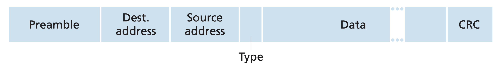

# Ethernet

##### # Topology

**Ethernet** is one design of the [local network]() with bus topology, applying CSMA/CD as the solution of communication collision. To reduce the probability of collision, switched Ethernet has been developed to remove the collision outside the [collision domain]() by introducing [swith]() to devide the network into multiple collision domains.

In modern high-speed Ethernet, the physical topology has actually been developed into **fully-connected** network. Each devide connected into its corresponding switch, and all the switches are fully-connected. This approach basically avoid any collisions, except those between switch and device, and this can also be easily eliminated by making the line full-deplexed.

##### # CSMA/CD

**Carrier sense multiple access/collision detection(CSMA/CD)**, is a solution for the collision of communication for multiple access supported network. The energy fluctuation are monitored, in both before (**carrier sense**) and during the transmission (**collision detection**, this is only possible in the wired link).

If the devide wants to send frame, it first detect whether there's someone else sending currently. If the channel is free, it send the frame. Otherwise it waits for the channel free (when no energy in the channel detected). If no collision is detected during the whole frame transmission process (when the energy level detected kept same as the sending one), the transmission has been successfully completed.

While due to the speed limit of the electromagnetic wave, it is still possible that someone sends the frame and causing collision even when each devides are carrier-sense. In that case, all the frames will not be transported correctly, hence the transmission in all the senders has to terminate, and **WAIT**.

The core design of CSMA/CD, which makes it different with other solutions like ALOHA, is the specification about how to wait, which named as **truncated binary exponential backoff algorithm**. The collision counter, denoted as $n$, are introduced, to indicate how busy the bus is. For a new frame we initialize `n=0` and we `n++` after each collision, the time of waiting is randomly selected in all the non-negative numbers less than $2^n$, that is, in the integer set $\{0, 1, \ldots, 2^n-1\}$, multiple with one [time solt]() (51.2 microseconds for tranditional 10Mbps Ethernet).  Notice that after waiting, the devide is permitted to **be ready** to send its frame again, the carrier sense mechanism is still required, as if in the very beginning.

The algorithm get its name from the exponentially increased waiting expectation after new collision. Specially, the upper bound of waiting time will be limited as $2^{10}$ when `n>10`.

If the collision counter exceeds the maxmium resend limit, the frame will be thrown away, and an error message will be generated passing into upper layer.

This design implement the adjustment based on the state of channel, ==EVIDENCE_REQUEST: hence might provides higher proformance compares to ALOHA.==

##### # Performance

##### # Error Detection

Ethernet use [cyclic redundant check](cyclic_redundant_check.md) as the error detection algorithm.

##### # Frame Structure

The traditional Ethernet frame constructs by six components:

|        Field        | size (in Bytes) |              Description               |
| :-----------------: | :-------------: | :------------------------------------: |
|      Preamble       |        8        | 7 Bytes `10101010`, 1 Bytes `10101011` |
| Destination Address |        6        |        destination mac address         |
|   Source Address    |        6        |           source mac address           |
|        Type         |        2        |            type of the data            |
|        Data         |     46-1482     |                                        |
|    CRC checksum     |        4        |                                        |

##### # Comparison

Compared to Wi-Fi, the wired Ethernet are more stable and reliable, hence its has been applied into the vehicle and industry nowadays.

