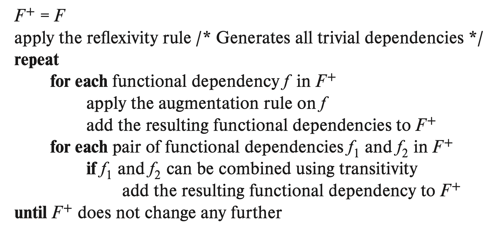

# Functional Dependency

The **functional dependency** $\alpha\rightarrow\beta$ holds in an **instance of relation schema** $r(R)$ iff $t_1[\alpha] = t_2[\alpha] \Rightarrow t_1[\beta] = t_2[\beta]$ for any tuples $t_1, t_2$. 

If the functional dependency $\alpha\rightarrow\beta$ holds for all the valid instances of relation $r(R)$, we say the functional dependency holds for the relation schema $r(R)$.

[Superkey]() can then be defined based on functional dependency: if the functional dependency $K \rightarrow R$ holds for $r(R)$, then $K$ is a superkey of $r(R)$. That is, superkey can be considered as a special case of functional dependency, and functional dependency is the generalization of superkey, who has the ability to express constraints that cannot be expressed by superkey.

If $\beta\subset\alpha$, the functional dependency $\alpha \rightarrow \beta$ is called **trivial** since this dependency holds for all the relation schema. Specially, dependency $A \rightarrow A$ is trivial obviously.

For all the instance that satisfies $F_1$ that also satisfies $F_2$, we define $F_2$ is logically implied by $F_1$, denoted as $F_1 \Rightarrow F_2$. If $F_1 \Leftrightarrow F_2$ we say they are equivalent.


##### # Closure of Functional Dependency

The Armstrong's axiom is **sound and complete**(that is, all and only the correct dependencies will be generated) to find the closure of functional dependency:
$$
\begin{align}
&\text{Reflexivity Rule:}
&&\beta \subset \alpha &&\Rightarrow \alpha \rightarrow \beta
\\
&\text{Augmentation Rule:}
&&\alpha \rightarrow \beta &&\Rightarrow \gamma\alpha \rightarrow \gamma\beta
\\
&\text{Transitivity Rule:}
&&\alpha \rightarrow \beta, \beta \rightarrow \gamma &&\Rightarrow \alpha \rightarrow \gamma
\end{align}
$$
Some further rules can be inferred from Armstrong's axiom:
$$
\begin{align}
&\text{Union and Decomposition:}
&&\alpha\rightarrow\beta, \alpha\rightarrow\gamma &&\Leftrightarrow \alpha \rightarrow \beta\gamma
\\
&\text{Pseudotransitivity Rule:}
&&\alpha \rightarrow \beta, \gamma\beta \rightarrow \delta &&\Rightarrow \alpha\gamma \rightarrow \delta
\end{align}
$$
By applying the Armstrong's axiom and its deductions, we'll be able to construct the closure $F^+$ of any functional dependency set $F$. Here gives the pseudocode to construct $F^+$:



==TODO: Use LaTeX package to generate pseudocode, add Python implementation.==


##### # Closure of Attribute Set

The attribute $B$ is **functionally determined** by $\alpha$ iff $\alpha \rightarrow B$. The set of attributes that functionally determined by $\alpha$ is called the **closure of $\alpha$** under $F$. It is trivial to implement a naive algorithm to generates $\alpha^+$:

```python
def get_attrs_closure(self, attrs):
    assert attrs <= self.attrs
    attrs_closure = attrs
    modified = True

    while modified:
        modified = False
        for p, q in self.deps:
            if p <= attrs_closure and not q <= attrs_closure:
                attrs_closure = attrs_closure.union(q)
                modified = True

	return attr_closure
```

Refer to [`relation.py`](src__functional_dependency/relation.py) to the implementation, with unittest and performance test provided.

A more delicate algorithm (with higher implementation complexity, of course) to compute closure of attribute set: ==TODO: Complete the optimized algorithm==.

```python
def get_attrs_closure(self, attrs):
	closure = set()
	fd_count = [p for p, q in dependencies]

	for attr in self.attrs:
    	pass
```


##### # Canonical Cover

The canonical cover $F_c$ is the equivalence of $F$ that meets

- None of $F_c$ includes irrelavent attribute.
- All of functional dependency in $F_c$ is unique, that is, there does not exist two functional dependency $\alpha_1 \rightarrow \beta_1$ and $\alpha_2 \rightarrow \beta_2$ that meets $\alpha_1 = \alpha_2$.


##### # Boyce-Codd Normal Form

**Boyce-Cordd Normal Form(BCNF)** is the normal form which requires all the nontrivial functional dependencies are removed. Formally, a relation schema meets BCNF if and only if one of the following is true for all functional dependency $\alpha \rightarrow \beta$ in $F^+$, where $F^+$ is the [closure]() of functional dependency set $F$ upon $r(R)$:

- $\alpha$ is one of the superkey of $R$.
- $\alpha \rightarrow \beta$ is trivial.


##### # Third Normal Form

**Third Normal Form(3NF)** relaxed the requirement of functional dependency, which allows some non-superkey nontrival functional dependency. 

- $\alpha$ is one of the superkey of $R$.
- $\alpha \rightarrow \beta$ is trivial.
- each attribute $A$ of $\beta - \alpha$ belongs to one of the candidate of $R$.

The third condition relaxes the requirement to remove all nontrivial functional dependencies from BCNF.

