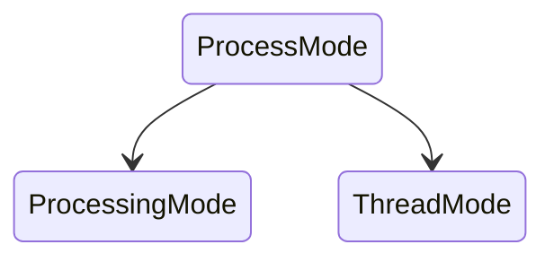
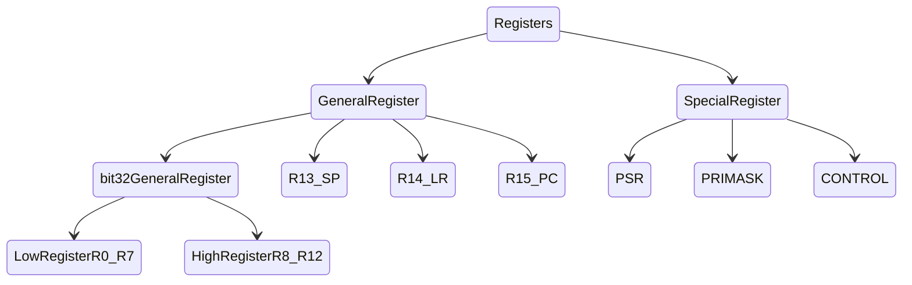
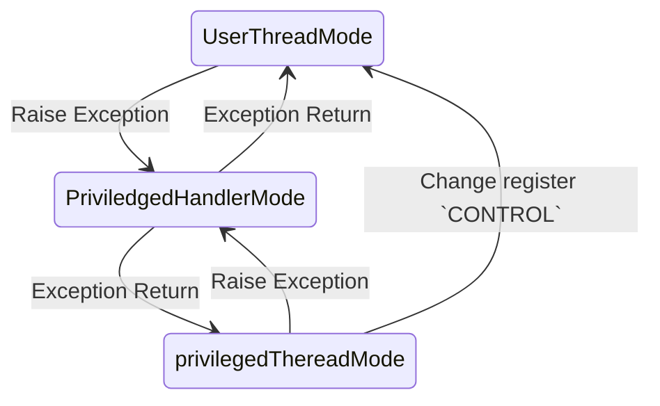

# ARM Cortex-M Processor

### 1. Basic Concepts

##### # Definition

**ARM(Advanced RISC Machine)** is the name of company, a set of microprocessor, and one kind of technology. The RISC design simplify structure of processor, reduce complex instructions, and support processor extension.

The mainstream movement from MISC to RISC relays on the development of memory.

==RISC-V open source.==


##### # Property

- Best performace : power consumption ratio.
- Both Thumb(16bit) / ARM(32bit) instructions set supported. Balanced performace and code density. The choice of instruction has been automated in modern ARM processor.
- Large amounts of registers, faster execution of instruction.
- Most of the data manipulation are done in the registers, 


### 2. Architecture Version

##### # V1 Architecture (ARM1)

- Basic data processing instructions (no multiplication).

- Byte/half word/word load/store.

    ```assembly
    ADD AX, [BX];
    ```

    ```assembly
    LD R1, [R2];
    ADD R1, R1;
    ```

    


##### # V2 Architecture (ARM2, ARM3)

- Multiplication & division supported.


##### # V3 Architecture (ARM6)

- 4GB Addressing space.


##### # V4 Architecture (ARM7, ARM9)

- First architecture in commercial use.
- 16-bit Thumb instruction supported.


##### # V5 Architecture (ARM10)

- Add instruction `CLZ`: Count leading zero. Due to the development of encryption technique.


##### # V6 Architecture

- SIMD (single instruction multiple data) supported. Optimize the audio/video processing application.


##### # V7 Architecture

- SIMD and DSP optimization


##### # V8 Architecture

- The first 64-bit instruction processor.


### 4. Mode and Privilege

Two operation status includes for Cortex-M4: 

- Thumb status. When the processor is executing instructions (Thumb 16-bit instruction or 32-bit instruction).

- Debug status. When the processor paused because it reaches the breakpoint (or some other reasons).

Two mode includes for Cortex-M4:

- **Thread mode** for application running.
- **Handler mode** for error handling.

Two priviledges included for Cortex-M4:

- **Software deprivileged**. System clock, NVIC and system control block is permitted. MSR/MRS limited access, and CPS not allowed.
- **Software privileged**.

The process in deprivileged level calls the system call named SVC(supervisor calls) to enter the privileged level.




### 5. Register

There are 32-bit registers Cortex-M4 process, classified to 7 types: 4 types of general registers and 3 types of special registers:




### 6. Exception

##### # Exception Table

| Code |        Type         |   Priority   |                         Description                          |
| :--: | :-----------------: | :----------: | :----------------------------------------------------------: |
|  0   |          -          |      -       |                         No exception                         |
|  1   |        Reset        |      -3      |                            Reset                             |
|  2   |         NMI         |      -2      |                  Non-maskable interruption                   |
|  3   | Catastrophic faults |      -1      | All of the faults will cause catastrophic fault when the configurable fault handing process is prohibited |
| ...  |         ...         |     ...      |                             ...                              |
|  16  |       IRQ #0        | Programmable |                       IO interrupt #0                        |
|  17  |       IRQ #1        | Programmable |                       IO interrupt #1                        |
| ...  |         ...         |     ...      |                             ...                              |
| 255  |      IRQ # 239      | Programmable |                      IO interrupt #239                       |


##### # Data Push

When an exception arised, the processor first push the 8 registers into stack:

| Address | N-8  | N-4  | N-32 | N-28 | N-24 | N-20 | N-16 | N-12 |
| :-----: | :--: | :--: | :--: | :--: | :--: | :--: | :--: | :--: |
|  Data   |  PC  | PSR  |  R0  |  R1  |  R2  |  R3  | R12  |  LR  |


##### # Exception Handling




