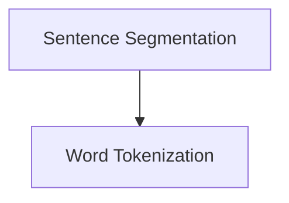
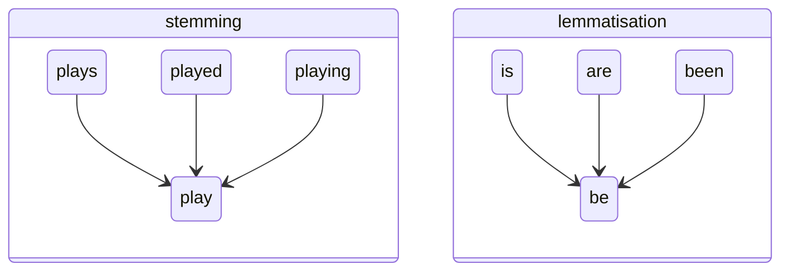

# Natural Language Processing

### 1. Introduction

##### # Basic Procedures

The following basic steps are included in natural language processing:




# Text Preprocessing

### 1. Filtering


### 2. Text Tokenization

The process converting the sequences into **token** is **tokenization**, the lexical analyzer classify the token during this process.

Let $N$ denotes the number of tokens, and $V$ denotes vocabulary(set of types), $|V|$ is the size of vocabulary. The relation $|V|> O(\sqrt N)$ has been proved by ==TODO==.

```python
import nltk.tokenize as tk

doc = "Are you curious about tokenization? Let's see how it works! We need to analyze a couple of sentences, with punctuations to see it in action."

sent_tokens = tk.sent_tokenize(doc)
word_tokens = tk.word_tokenize(doc)
```

The `tk.sent_tokenize` method split the document as sentences, and `tk.word_tokenize` as words. Specially, the class with its method `WordPunctTokenizer.tokenize` is provided to regard the punct as a word.

```python
tokenizer = tk.WordPunctTokenizer()
tokens = tokenizer.tokenize(doc)
```


### 3. Stemming and Lemmatisation

**Stemming** removes the syntax prefix/suffix to get the stem of a word, and **lemmatisation** converts the word's complex form ito its original form. Sometimes ==TODO== is required 



```python
import nltk
import nltk.stem.porter as pt
import nltk.stem.lancaster as lc
import nltk.stem.snowball as sb

for word in words:
    stem_pt = pt.PorterStemmer().stem(word)
	stem_lc = lc.LancasterStemmer().stem(word)
    stem_sb = sb.Snowball().stem(word)
```

```python
import nltk.stem as ns
lemmatizer = ns.WordNetLemmatizer()
for word in words:
    n_lemma = lemmatizer.lemmatize(word, pos='n')
    v_lemma = lemmatizer.lemmatize(word, pos='v')
```


```python
import re
from collections import Counter
with open() as file:
    content = file.read()
    

pattern = re.compile()
content = 

tokens = tk.word_tokenize
tokens = []
tokens_pos = 
result.append(PorterStemmer().stem(token))
result.append(lemmatizer.lemmatize(token, pos=postag))
Counter(result).most_common(100)
```


