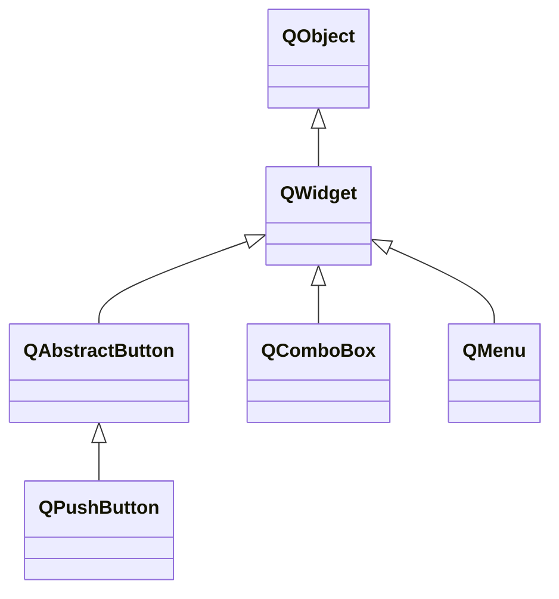

# Qt

<u>This document shows the very fundamental concepts about Qt.</u>


### 1. Compile Qt Program

<u>Three approaches to compling the Qt Program introduced: manually, CMake, and QMake.</u>

##### # Manually `g++`

==TODO: Find out how to build Qt program manually with `clang`==. Notice that this approach might be difficult since the Qt provides `cmake` files in the library, which is not usable for the complier itself.


##### # CMake Approach


##### # QMake Approach

Similar to `cmake`, Qt provides `qmake` to generate makefile automatically. The extension of description file for `qmake` is `.pro`. The basic `hello.pro` demo is

```qmake
QT += widgets
SOURCES = hello.cpp
TARGET = hello
```

Use `qmake -o Makefile hello.pro` to generate the `Makefile`.

- In macOS, `make` will generate a macOS Application bundle(`.app` directory), (and an object file as the byproduct), where contains the `Mach-O 64-bit executable` file in `./Contents/MacOS`.
- ==TODO: Linux Behaviour.==
- ==TODO: Windows Behaviour.==

Further knowledge about `qmake` and `pro` file will be introduced in [`qmake`](qmake.md).


### 2. Program Demo

<u>Demonstrate the minimal Qt Programs to show how the baisc structure.</u>


##### # Minimal Qt Program

The minimal program of Qt 

```c
#include <QApplication>

int main(int argc, char **argv) {
    QApplication app (argc, argv);
    return app.exec();
}
```

The `QApplication` object takes the input arguments and launches event loop by invoking `app.exec()` method. Since no window or event handler is created, the program will just run the infinite loop without any windows and responding.


##### # Minimal Widget

The component of Qt's graphic interface is **widget**. This reflects in the class hierarchy, where all the window objects are inherited from `QWidget` directly or indirectly. For example, the `QPushButton` class inherits `QAbstractButton` and the latter one inherits `QWidget`.




```c
#include <QApplication>
#include <QPushButton>

int main(int argc, char **argv){
    QApplication app(argc, argv);
    QPushButton button("Hello world !");
    button.show();
	return app.exec();
}
```

We instantiate the `QtWidget` `QPushButton` and `show()` it, each widget is placed in the indepndent header, as this example shown.


### 3. Utility Widget

##### # `QWidget`

The windows itself is also a widget, named as `QWidget`.

```c++
#include <QApplication>
#include <QWidget>

int main (int argc, char* argv[]) {
    QApplication app(argc, argv);
    QWidget window;

    window.resize(250, 150);
    window.move(300, 300);
    window.setWindowTitle("Simple example");
    window.setToolTip("QWidget");
    window.show();

    return app.exec();
}
```

Most of the functions of method are self-explain by their names. No further illustration necessary.


##### #


