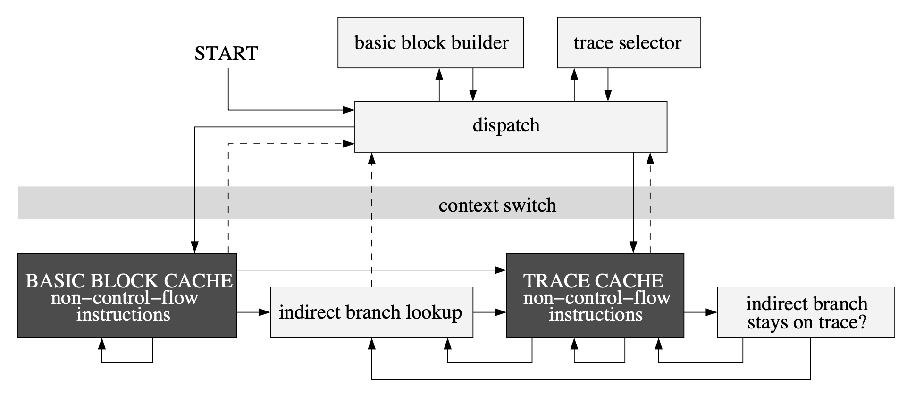

# An Infrastructure for Adaptive Dynamic Optimization

##### 1. Motivation: Static Opt. vs Dynamic Opt.

Flaws of static analysis:

- Not able to handle some modern software techniques like class loading, shared library, runtime binding, dynamically-generated code, etc.
- Not able to observe runtime behaviour of program, not responsive to changed program behaviour.
- May not able to distinguish data from program.

Flaws of dynamic analysis:

- Runtime overhead.
- Stay Transparency to user application.

Thus, if we can keep transparency and reduce runtime overhead to acceptable level, dynamic analysis can be applied for better optimization.


##### 2. Framework Objective and Usage Interface.

This paper build an infrastructure to provides C interface to expose dynamic instrumentation ability. A DynamoRIO client can write custom monitoring codes in these event-driven callback routines.

For instance, Dynamo will call `dynamorio_basic_block` once a **basic block** (sequences of instructions ending with a single control transfer instruction) is created. 

```c
void dynamorio_basic_block(void *context, app_pc tag, InstrList *bb);
```

Following callback function counts `inc` instruction in program.

```c
EXPORT void dynamorio_basic_block(void *context, app_pc tag, InstrList *trace) {
  Instr *instr, *next_instr;
  int opcode;
  if (!enable) return;
  for (instr = instrlist_first(bb); instr != NULL; instr = next_instr) {
    next_instr = instr_get_next(instr);
    opcode = instr_get_opcode(instr);
    if (opcode == OP_inc) {
      inc_cnt++;
    }
  }
}
```

Beside observation, some APIs like `dr_replace_fragment` provides ability to **modify** instruction by specifying new `InstrList*`.


##### 3. Reduce Runtime Overhead.



In the DynamoRIO execution flow **context switch** (dotted lines) is identified to be performance critical pathes. Multiple techniques are proposed to reduce runtime overhead through **bypassing DynamoRIO dispatcher**:

1. **Basic block cache.** DynamoRIO copies basic block into a code cache and executes them **natively** (=='natively' indicates executing by machine directly itself instead of VM interpreter? But there seems to be no VM in Dynamo anyway, so the actual optimization here is to make instructions inside basic block execute sequentially without going back to DynamoRIO?==).

2. **Link direct branches.** DynamoRIO **links** two blocks connected via **direct branch** (avoiding go back to DynamoRIO)

3. **Combine indirect branches with traces.** Basic blocks that are frequently executed in sequence are stitched together into a unit called a trace.

   Notice that check must be inserted to ensure the actual target indicates the execution flow is in the trace or not (by a series of `cmp` instrustions). It will fallback to the OS-Dynamo address hashtable lookup if that check failed.

   As mentioned, in original [Dynamo]() paper there are two approaches two indentifying the head of a trace, by which constructing a trace:

   - target of backward branches
   - exit of existing traces

   In DynamoRIO `dr_mark_trace_head` and `dynamorio_end_trace` are introduced so the client is able to define custom trace.

Another trick is **dynamic instruction representation**. That is, DynamoRIO decodes instruction to higher representation only if it is necessary for certain client operation. Four representation are introduced in DynamoRIO.