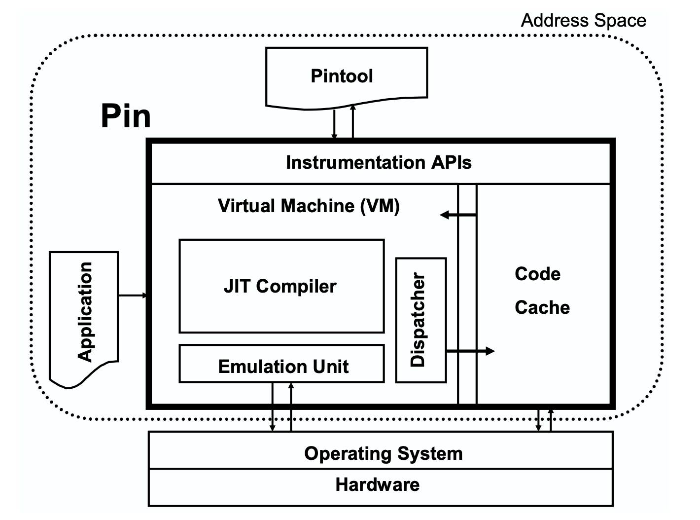
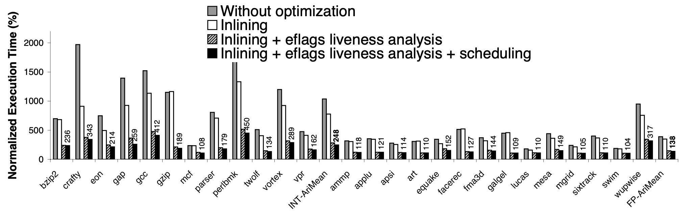

# Pin: Building Customized Program Analysis Tools with Dynamic Instrumentation

##### 1. Instrumentation Categories

- code instrumentation.
- binary instrumentation.
  - static binary instrumentation. ATOM, EEL, Etch, Morph.
  - dynamic binary instrumentation
    - **probe-based**. Dyninst, Vulcan, DTrace.
    - **jit-based**. Valgrind, Strata, DynamoRIO, Diota, Pin.


##### 2. Pin Usage Example

Similar to DynamoRIO, Pin provide callback interfaces to hijack program execution. For instance, the following `Pintool` (Pin client codes) snippet detects all memory write instruction and print information about accessed address and size.

```c
VOID RecordMemWrite(VOID *ip, VOID *addr, UINT32 size) {
  fprintf(trace, "p: W %p %d\n", ip, addr, size);
}

// Print a memory write record
VOID Instruction(INS ins, VOID *v) {
  // instruments writes using a predicated call,
  // i.e. the call happens iff the store is actually executed
  if (INS_IsMemoryWrite(ins)) {
    INS_InsertPredicatedCall(
      ins, IPOINT_BEFORE, AFUNPTR(RecordMemWrite),
    	IARG_INST_PTR, IARG_MEMORYWRITE_EA,
      IARG_MEMORYWRITE_SIZE, IARG_END);
  }
}

int main() {
  // ...
  INS_AddInstrumentFunction(Instruction, 0);
}
```

Pin provides instrumentation API for multiple abstraction levels including instructions(example above), traces, procedures, and images.


##### 3. Architecture

Pin has a **VM** eqiupped with **JIT Compiler**, **emulator** and **dispatcher**.

- JIT compiler compiles and instruments application code, which is then launched by the dispatcher.
- The emulator interprets instructions that cannot be executed directly (like syscalls)



Note that though Pin, Pintool and application code share same address space, they do not share the same libraries, which avoid tricky reentrant problems.


##### 4. Performance Optimization

Traditional methods: code caching, indirect linking.

New techniques introduced in Pin to optimize jitted codes: register reallocation, liveness analysis, inlining, instruction scheduling.

1. **Code Caching.**
2. **Indirect Linking** mechanism in Pin is similar to DynamoRIO with 3 differences:
   - DynamoRIO only generates traces once, while Pin incrementally builds them while the program is running.
   - Dynamo use a global hash table for all indirect jumps whereas Pin uses local hash table.
   - Pin apply **function cloning** technique to accelerate te the most common form of indirect control transfers: **returns**.
3. **Register Reconciliation**. Pin abandoned the fixed register binding map. The register binding for trace being compiled is constructed based on the binding for linked complied trace **to minimize MOV operation among registers **.
4. **Liveness Analysis **(especically `eflags` for x86) to reduce register spills. Pin compute register liveness incrementally (specifically, record the liveness at the beginning of the trace in a hash table using address A after a trace A is complied).
5. **Inlining**. Evaluation shows the performance bottleneck lies on the **execution of instrumentation code** instead of compiling. Without inlining, Pin calls bridge routine performing context switch stuffs (save registers, set up arguments, call analysis routine). Inlining eliminates bridge routine.
6. **Instruction Scheduling**. Pintool hint `IPOINT_ANYWHERE` allows Pin to schedule the instrumentation codes into a proper location inside the scope.

Performance impacts by applying inlining + eflags liveness analysis + scheduing:



comparison with other instrumentation tools:

- Valgrind requires manually inlining.
- DynamoRIO requires manually inlining and register management.

