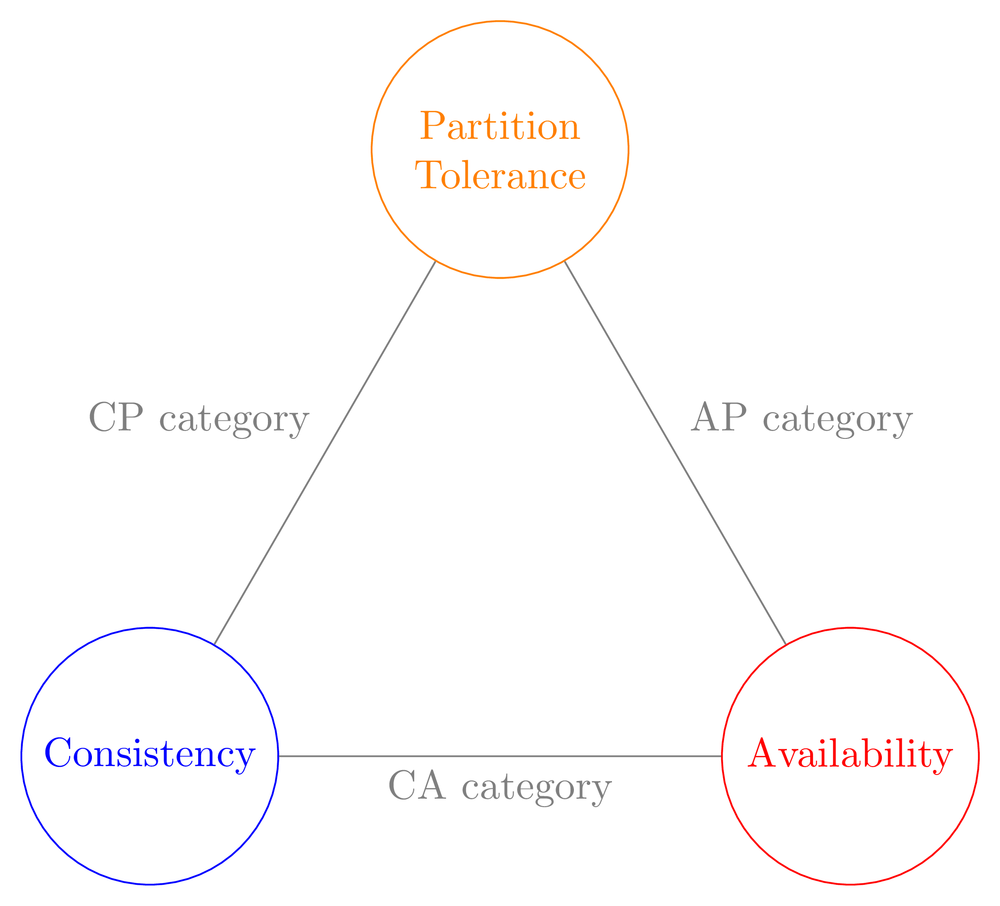
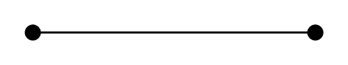
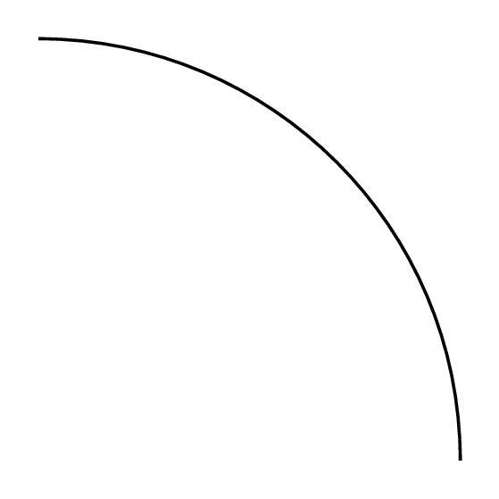

# Tikz

## 1. Tikz Introduction

Create a tikz picture using `tikzpicture` block:

```latex
\begin{tikzpicture}
% tikz code goes here...
\end{tikzpicture}
```

A graph is constructed by **nodes** and connections(**paths**). Here is a intuitive demo



```latex
\documentclass[tikz,border=5pt]{standalone}
\usepackage{tikz}
\usetikzlibrary{math}

\tikzset{
	gurantee/.style={draw, circle, minimum size=22mm},
	every path/.style={color=gray}
}

\begin{document}
\begin{tikzpicture}
\tikzmath{\a = 3;}
\node[gurantee, color=blue]                 (C) at (0, 0)               {Consistency};
\node[gurantee, color=red]                  (A) at ({2 * \a}, 0)        {Availability};
\node[gurantee, color=orange, align=center] (P) at (\a, {sqrt(3) * \a}) {Partition\\Tolerance};

\draw (C) -- (A) node[midway, below]       (CA) {CA category};
\draw (A) -- (P) node[midway, above right] (AP) {AP category};
\draw (P) -- (C) node[midway, above left]  (CP) {CP category};
\end{tikzpicture}
\end{document}
```

Focus on lines between `tikzpicture` envrironment first, we create three nodes named `C, A, P` respectively, set their coordinates by **absolute positioning** `at (x, y)`, text by `{text}`, and other attributes by `[key(=value), ...]`. This is the general structure of a tikz node and many other components.

After three nodes are created, we create **paths** between them using `draw (node1) -- (node2)`. In addition, to add text along to the path, we create node right after the path declaration, and using **relative positioning** attributes to position nodes relative to paths.

Some details left:

- For objects with the same attributes, we can create a style class using `\tikzset` and apply those common styles by giving a class name. For instance, `gurantee` set style `{draw, circle, minimum size=22mm}` to all (real) nodes. The motivations are:

    - `draw` must be set to draw the border.
    - The default shape of node is `rectangle`, set `circle` to replace it with circle instead.
    - Node tends to be as minimum as possible based on their text, which leads to various sizes of nodes, we usually set a `minimum size` to some large enough value to force those nodes in the same class to be identical in size. (Since there is no `size` attribute to force a precise size).

    Specically, if all nodes or paths in this diagram shall apply the same style, we simply use `every node` or `every path` as the class name.

- To support configurable side length, `\tikzmath` is introduced to define a local variable `\a` and can be used in mathematical block `{}` in which a number is required.

    A variable can be defined using `\tikzmath` both inside or outside one `\tikzpicture`. The variable is a **local variable** if it is defined inside, in this case it can only be accessed in current `\tikzpicture` environment. On the contrary, the variable is a **global variable** if it is defined outside and can be accessed by all `\tikzpicture`.

    This scope rule can be also applied to other configuration block such as `\tikzset`. In this example the `\tikzset` is declared globally hence can be accessed by all `\tikzpicture` environments.

We'll omit the the tikz block identifier in our following demos, as also other requisite LaTeX block for conciseness.


### 2. Node


### 3. Path

##### # Create Path Using Node or Coordinates

`\draw` creates a line that connect two nodes. We can draw a line using both explict node names or just giving the coordinates:

```latex
\draw (0, 0) -- (0, 2);
\draw (0, 2) -- (2, 2);
\draw (2, 2) -- (0, 0);
```


or

```tex
\node[draw, circle, fill, inner sep = 1pt] (A) at (0, 0)
\node[draw, circle, fill, inner sep = 1pt] (B) at (2, 0)
\draw (A) -- (B)
```




###### # Draw Arc

An arc is defined by start position, initial & terminated angles, and radius:

```latex
\draw (0, 0) arc (0: 90: 2);
```




##### # Path Attributes

There are many other configurable attributes of path:

- Color
- Line Style
- Arrow

