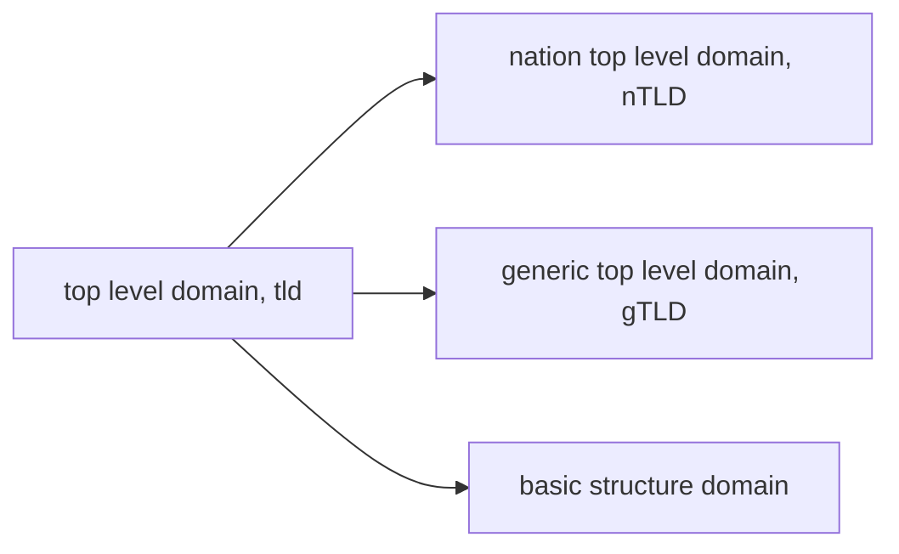

# Domain Name System

### 1. Why DNS

As we known, the IP address is no more than 32-bit binary, represented by dotted-decimal notation ususally. Although applying this simplication, the notation is still not quite friendly to human beings. Hence Internet create a text-based **domain name ** to replace IP address, the system that maps domain name to IP address is the **domain name system**.

When the user tries to access the domain name in application layer(browser normally), the DNS system will map the domain name to the coressponding IP address, prepared for the TCP connection, for the next step.

有了域名以后就有人开始怀疑IP地址的必要性: 既然有用户友好的域名存在, 干脆弄一个新的RFC修改Internet Protocol把其中IP地址改成域名不就可以了? 这是一个很蠢的主意, IP是定长的二进制数, 而域名为了实用好记是变长的复杂的ASCII符号组合(更不要提现在出现了特定语言的域名技术, 比如中文域名技术), 其长度开销是非常大的, 因此这个假想中的协议将不得不在IP数据报中占用大量的空间, 导致网络层上的包包变得非常大造成路由网络的负载过多, 严重违背了IP层以下的部分应当尽可能简单的设计理念.

### 2. Structure of Domain Name

A domain name is constructed by some **labels**, seperating by dot `.`. For example, `www.google.com`.

| www | google | com |
| :-----------: | :--------------: | :-----------: |
| Third Level Domain | Second Level Domain | Top Level Domain |

The domain name is a layered structure, the rightmost is the **top level domain(TLD)**, second, third, and so on... to the left. Each layer of domain name is managed by the management organization of uppper level. The top level domain name 

域名是一个分级的结构系统, 位于最右边的是**顶级域名(Top Level Domain, TLD)**, 往左依次为二级域名、三级域名……各级域名由上一级域名的管理机构进行管理, 顶级域名则由互联网名称与数字地址分配机构(ICANN)进行管理.

域名树的结构和网络主机的物理位置、IP点分十进制表示、子网划分有什么联系呢? 没有任何联系. 域名仅仅是机构按照自己需求划分的, 是一个独立的体系结构. 

##### # Top Level Domain

顶级域名分为三类: 国家顶级域名(nTLD, ccTLD), 通用顶级域名gTLD和基础结构域名.

国家顶级域名是国家的缩写, 如中国cn, 美国us, 英国uk, 日本jp等等, 国家顶级域名下注册的二级域名由该国家自行确定. 

通用顶级域名如com, net, org

基础结构域名只有`arpa`一个, 用于反向域名解析. 

##### # Second Level Domain

我国的二级域名有“类别域名”(类似于通用顶级域名)和行政区域名(类似于国家顶级域名)两类, 类别域名如com, net, org等等(注意到我国的类别域名和意义一致的通用顶级域名的明明是一致的, 当然由于命名是国家任意选取的, 因此实际上也可以不一样, 例如日本就把企业机构的二级域名设定为co而不是com), 行政区域名每个省级行政区分配一个, 如bj, fj等等, 一般政府机构用的比较多. 

另外, 我国还允许直接在cn下注册二级域名, 甚至还建立了几个中文的顶级域名, 如“中国”、“公司”、“网络”, 一个典型的例子就是广电总局(简直黑科技, 目测是利用了某种中文编码).

### 3. Domain Name Resolution

##### # Domain Name Server

第一小节提到, 当用户在浏览器中输入一个域名并试图对其发起访问时, 首先需要与DNS解析系统进行交互, 从而得到该域名所对应的IP地址, 那么这个过程具体是如何进行的呢? 首先的一个自然的想法是在用户主机上保存一个完整的`domain_name -> ip_address`的映射表(事实上当初ARPANET就是这么做的, 这个映射表叫做**hosts文件**, 其残余仍然在现代操作系统中得以保留下来, 并且作为一种原始的翻墙技术而存在, 这是由于GFW的某部分流量拦截在DNS request阶段就已经发生, 我们将在下面第5节“针对DNS的攻击”部分详述DNS cache pollution方面的内容), 然而由于Internet的主机如此之多, 并且网络结构也在不断变化, 仅仅依靠本地保存明显是不现实的, 因此DNS被设计成一个**分布式查询体系**, 意味着本机需要向其他主机发起解析请求, 这些主机就是所谓**DNS服务器(DNS server)**.

由于域名是具备层级结构的, 因此DNS server也被设计成一个具备**层级结构**的系统, 每一个域名服务器和域名的层级有一定的对应关系, 最高层次的被称为**根域名服务器(root name server)** 其下一层是**顶级域名服务器(Top Level Domain server, TLD server)**, 管理某个或某些顶级域名, 再下一层则是各级权限域名服务器.

目前全球的根域名服务器一共有13个, 分别命名为前13个字母a~m. 注意到根域名服务器是一个逻辑概念而不是物理概念, 每一个根域名服务器都由分布在不同地方(可能相距很远)的几台设备构成. 之所以只使用13个根域名服务器可能与DNS报文长度的限制有关. 目前的13个根域名服务器没有任何一个的核心部分放在中国境内(只有根域名服务器的某些**镜像**, ==TODO: 镜像具体是什么意思?==), 根据坊间传说在10年代以前中国是有一台根域名服务器i(序号9)的, 但由于多次DNS劫持/污染事件的发生, 导致国外域名解析受阻, 威胁到互联网的安全, 因此根域名服务器就从中国境内撤走了. ==TODO: 来源请求==

权限域名服务器可能是单层的, 也可能是多层的, 这取决于管理该域名公司的自身设定, 例如有一个公司申请了abc.com这个域名, 那么为了管理这个域名及其子域名, 公司需要配置DNS服务器提供解析服务, 可以只配置一台, 这时候整个域就是一个**区**(zone), 也可以配置多台, 例如其下有一个占用三级域"y.abc.com"的部门有非常多的域名, 那么公司可能单独为其设置一个域名服务器, 这时候我们就称abc.com这个**域**被划分成了两个区.

(由此观之, DNS的两个结构特点是分布式的和层级的)

| 根域名服务器                                     |
| ------------------------------------------------ |
| 顶级域名服务器                                   |
| 权限域名服务器1权限域名服务器2...权限域名服务器n |

注意这里的权限域名服务器实际上是具备有多级结构的, 为了叙述的方便, 我们在下面的对解析流程的介绍中首先假定权限域名服务器是单一结构, 然后再对有多级结构的情况进行讨论.

##### # Domain Name of Domain Name Server

由于域名服务器本质上还是一种服务器, 因此它们也具有自己的域名(但并不提供Web服务, 因此使用浏览器去访问这些域名是徒劳的). 但域名服务器的域名的级数和它们在解析服务中的地位没有任何关系. 以A根为例, 根域名服务器的域名为

`a.root-servers.net`

有实验资料表明: 通用顶级域名的服务器同样有13个, 分别也命名为a~m, 例如

`a.gtld-servers.net`

注意到根域名服务器和顶级域名服务器都是用.net作为顶级域名.

##### # Query Recursively and Repeatedly

DNS解析过程如下: 当应用程序意识到需要进行DNS解析时, 首先向本地域名服务器(local name server)发送DNS request报文, 向它询问某个域名对应的IP地址, 于是本地域名服务器接受任务并且决定代替应用程序完成任务. 接着, 本地域名服务器向根域名服务器发送DNS request报文, 根域名服务器并没有闲心完全接手本地域名服务器的任务(她每天要处理那么多的请求), 只是告知它下一步应该去问哪一个顶级域名服务器及其IP地址, 于是本地域名服务器接着向所提供的顶级域名服务器发请求, 它同样也只是告知它下一步应该去文哪一个权限域名服务器及其IP地址(请注意, 在没有缓存机制的情况下, 一直到这里, DNS解析都不可能完成, 因为没有域名是只含有一个顶级域名的, 至少都要含有一个二级域名, 因此所有DNS解析都至少要到权限域名服务器才可能解决), 最后, 本地域名服务器向对应的权限域名服务器发起询问, 权限域名服务器则告知它解析得到的IP地址, 最后, 本地域名服务器再将得到的IP地址告知应用程序. 

现在我们讨论一下上面这个查询过程中的责任分配: 首先, 客户端应用程序向本地域名服务器提出申请, 而作为回答者(responser)的本地域名服务器并不知道答案, 于是本地域名服务器就成了一个新的请求者(requester), 去问另外的回答者, **直到查询到了结果后**再告知客户端应用程序, 这一“帮人帮到底”的查询机制我们叫做**递归查询**, 在这个两层结构中, 递归体现得并不明显, 我们考虑一下如果整个流程都采用递归查询会是什么结果: 当本地域名服务器收到请求以后, 向根域名服务器查询, (到这里都和之前一样)这时, 根域名服务器决心帮server帮到底, 并不直接扔给本地域名服务器一个下一步查询目标, 而是直接去访问这个查询目标, 即顶级域名服务器, 接着, 顶级域名服务器也亲自去访问权限域名服务器, 最后得到一个结果, 向上传回到根域名服务器, 根域名服务器再将结果回传到本地域名服务器, 最后本地域名服务器将结果回传到应用程序. 容易发现, 这实际上是一个五层的递归过程. 

而我们开头所介绍的请求到达本地域名服务器以后所采取的查询方式则称为迭代查询. 在迭代查询中, 查询对象告知的是查询者下一步要查询的目标, 而不是直接告知其结果. 

事实上, 本地域名服务器既可以采取迭代查询方式, 也可以采取递归查询方式, 这取决于本地域名服务器的设定, 但应用较广泛的是迭代查询(所以我们最先介绍这一方式). 

##### # 具备多级结构的权限域名服务器

在谢希仁的教材中并没有明确给出多级权限域名服务器是采取迭代查询还是递归查询的方式, 可以想象, 如果公司希望自己所管理的权限域名服务器对外具备一定的不可见性, 那么设计一个在多级权限域名服务器内部的递归查询对于隐藏自己的与server结构无疑是有益的, 但是DNS server究竟有没有必要被隐藏是一个问题(避免针对DNS的DDoS?), 何况这样做会增加负担, 因此从原理上猜测来看, 在权限域名服务器中仍然使用和本地域名服务器不断交互的迭代查询方式是比较靠谱的. 请进一步查找相关的资料来证明或证否以上内容.

实际上我们会发现, 由于权限域名服务器结构本身就并不是由协议确定而是由公司自己确定的, 因此即使协议规定了公司内部应该采用迭代查询, 和本地域名服务器进行逐级沟通, 公司也完全可以拒绝这个方法, 把下面的域名服务器隐藏起来, 装作自己管理所有域名的样子和本地域名服务器进行沟通.

DNS报文的格式

DNS报文使用的传输层协议是UDP, 首部有12字节(96bit).

### 4. DNS Cache Strategy

使用缓存是减小无用重复的网络流量的一个重要策略. 理论上讲在DNS解析的任何一个组件中都可以使用缓存, 但我们这里只讨论在本机和本地域名服务器上使用的缓存.

先讨论本地域名服务器上的缓存, 其中可以直接储存有域名到IP地址的映射, 也可以储存DNS服务器到IP地址的映射(至少可以减少一部分的迭代查询步骤, 这个缓存策略尤其可以减轻根域名服务器的负担). 由于域名的映射并不是一成不变的, 缓存应当设定一定的有效时间, 但域名的改变频率一般很低(对于Web应用, 还有HTTP中的重定向作为保险措施), 因此有效时间也没有必要设置得太短, 一般情况下有效时间的数量级是2天(这在计算机中已经是一个很长的时间了, 动态主机配置协议DHCP的默认有效期只有2h). 在缓存过期之后, 就必须重新走正常的查询步骤. 域名服务器在回答查询请求时同时也应当给出缓存的建议时间值, 显然, 增加这个时间值可以减小网络开销, 而减小这个时间值则可以使得缓存中所维护的DNS映射表更新、精确.

本机中同样有必要维护一个缓存, 保存经常访问的映射对于加快访问速度显然是有价值的. 值得注意的是, 缓存的更新有时候并不是被动的, 许多主机在开机的时候就会**主动**地从本地域名服务器上下载它所维护的缓存表. 这实际上启示我们一个有趣的思路: 我们可以完全**合法地得到所有连接到本地域名服务器上的主机所曾经访问过的域名**, 如果我们能够控制这台本地域名服务器, 就可以根据这个列表来设置DNS劫持的目标(DNS劫持的有关内容见下面一小节)

我们这里有一个问题: 现代操作系统中的本机缓存和hosts文件似乎并没有什么关系, 那么修改hosts文件和本机缓存的优先级何者更高呢? 

### 5. DNS Attack

在众多针对DNS的攻击手段中, 最著名的一类手法是DNS劫持, 除此之外, 有中国特色的DNS缓存污染是早期GFW得以实现的重要手段之一, 另外还有一类最近发生的比较暴力的攻击手法, 即针对于域名服务器的DDoS攻击, 由于DNS在网络中的重要基础作用, 这类攻击能够有效瘫痪一个很大的网络(下面将会给一些已经发生的实例), 实际上DNS所带来的安全问题完全就是人类的懒惰所带来的结果, 如果人们能够记忆IP地址, 那么DNS的问题也就不会存在. 这和众多Human Error所导致的安全问题一样, 再次表明了痛苦之根源在于人性之万恶.

##### # DNS Redirection

**DNS劫持(DNS hijacking)**又称为**DNS重定向(DNS redirection)**, 是指这样一种攻击技术: 攻击者是用某种手段将域名解析过程中的报文拦截下来, 然后发给请求者一个指向错误地址的报文, 最终达到将计算机用户引向一个错误的页面结果的攻击. 由于目前Web前端所能够实现的功能越来越丰富, 在前端输入的数据也越来越敏感, 一旦用户被引导到了错误的页面, 则很有可能输入敏感信息, 从而造成信息泄露; 另一方面, 攻击者还可以诱使用户在页面上下载某些恶意文件, 从而对用户计算机造成破坏...等等, 总之一旦引到了黑页上能搞的事情是非常多的.

上述定义没有明确告诉我们的事情是:DNS报文的劫持究竟发生在DNS解析过程的哪一个阶段? 例如, 是从本机到本地域名服务器的阶段被拦截, 直接返回了一个错误的映射, 还是从本地域名服务器到根域名服务器的阶段被拦截, 返回了一个错误的顶级域名服务器的映射, 然后再利用错误的顶级域名服务器将DNS请求引导到错误的权限域名服务器, 最终使得本地域名服务器得到一个错误的映射(甚至将其加入缓存? ), 或者可以稍微简化一下: 拦截从本地域名服务器到顶级域名服务器的请求, 然后引导到错误的权限域名服务器? 进一步简化则是: 拦截从本地域名服务器到权限域名服务器的映射? 

一般来说, 上层本地域名服务器与大的DNS服务器的报文通讯是很难拦截的(但似乎并不是完全不可能, 上述三个机制很可能是GFW完成cache pollution的原理), 因此最普遍的拦截是发生在用户机到本地域名服务器之间的, 尤其是在用户端, 由于安全措施薄弱从而网络配置很容易被修改, 实现控制主机、控制无线路由器均可以完成DNS劫持攻击.

##### # DNS Cache Pollution

在第4小节我们提到, 本地域名服务器上储存着DNS缓存表, 如果这个缓存表产生的过程都是符合基本法的那固然很好, 但问题在于这个缓存表中**某一些的项目的可能是针对本地域名服务器的DNS劫持的结果**, 甚至是本地域名服务器缓存中的项目直接被修改了, 这时候我们就称DNS的缓存受到了**污染**(pollution)或者说**中毒**(poisoning). 这时候用户就会被引导向错误的缓存页面.

区分一下劫持和污染两个行为: 劫持是拦截了报文或是控制了服务器, 是一种比较主动的攻击手段, 而污染则是针对于缓存的, 相对来说只要躺着等到满足条件的报文来就可以了, 相对比较被动. 但**劫持是污染的一种实现方式**.

DDoS Attacks on DNS Servers

这并不是什么新鲜的攻击手段, 只是一般的DDoS目标在于瘫痪掉特定的网站, 其指向性一般是非常明确的, 而针对DNS服务器搞DDoS一方面攻击面太广, 而且高层的DNS服务器平时就承受着大量流量, 对它们进行DDoS的流量需求显然也非常高, 因此这方面的攻击比较少出现, 但

### 6. Relation Between Domain Name and URL

首先我们应当知道: 本质上看, 域名只是IP的替代物, 二者在通信中所起到的作用是完全等效的. URL统一资源定位符是一种访问互联网上一切资源的方式, 对于不同的协议类型有着不同的语法描述, 而IP显然是定位资源的一个非常有效的手段, 因此**大部分的URL语法都包含IP作为组件, 并且可以由域名所替代**. 例如, 使用HTTP协议的资源的URL语法写作`http://<host>:<port>/<path>?<query>#<frag>`

这里的`<host>`就是IP地址或域名. 平常在浏览器中输入URL时, 由于`http`默认使用80端口, 默认访问`index.html`或者其他默认页面, 因此port可以和path都可以不写, 浏览器有时候也会省略掉所使用的协议名称, 因此最后在框框中可能只显示出一个光秃秃的域名, 但应当警醒: 域名和URL是不同的概念.

