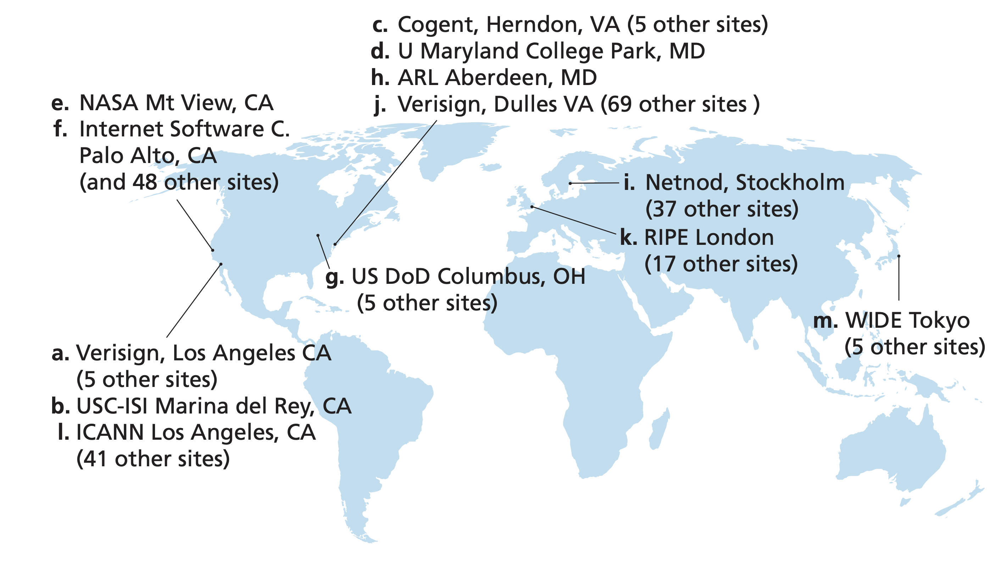
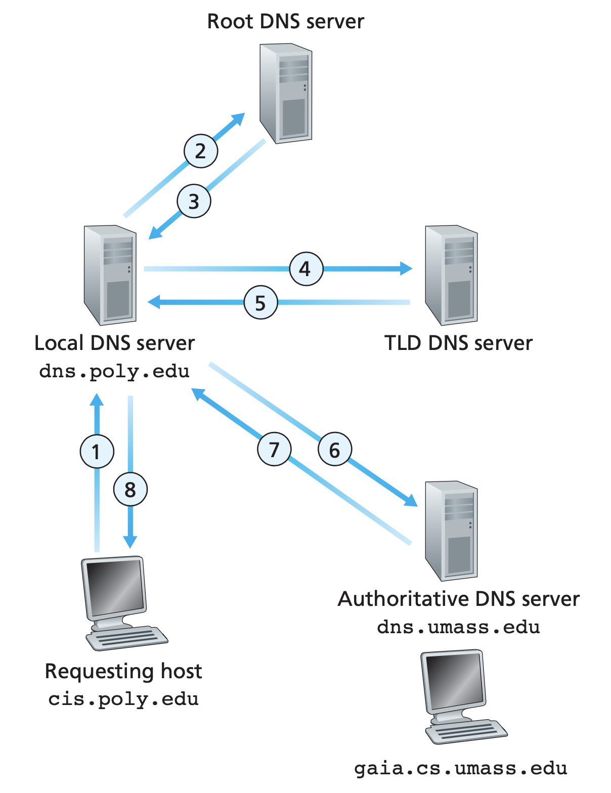
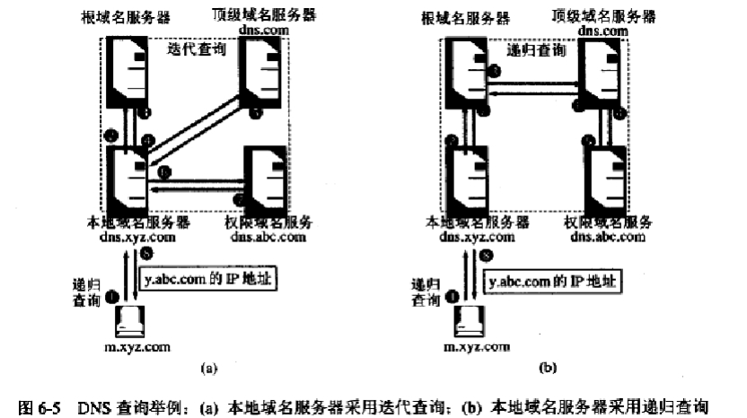

# Domain Name System

### 1. Why DNS

As we known, the [IP address](../http/http.md) is a 32-bits binary number, usually represented by dotted-decimal notation. Even so, the notation is still not friendly to human beings. Hence we invent **domain name**, and build a system that maps domain name to IP address, that is, the **domain name system(DNS)**.

When the user tries to access the domain name in application layer (such as browser or ssh), computer queries the DNS system to map the domain name into its corresponding IP address, prepared for the TCP connection in next step.

So why bother to do the conversion? Why don't we just throw [RFC 791](https://tools.ietf.org/html/rfc791) (and its updates) away and use the user friendly domain name as new IP address? This is not a good idea since

- User friendly almost always inferres computer unfriendly. IP address is fix-sized binary, easy to process, while domain name contains with complex characters set (see [RFC 3492](https://tools.ietf.org/html/rfc3492) and [RFC 5891](https://tools.ietf.org/html/rfc5891) for the URL unicode support) can be the performance and bandwidth killer in network communication.
- It's not realistic to replace all the current network devices, you can see how hard this is from the progress of IPv6.


### 2. Structure of Domain Name

##### # Components

A domain name contains **labels** seperating by dot. For example, the domain name `www.google.com` contain three labels:

| www | . | google | . | com |
| :-----------: | :--------------: | :-----------: | :-----------: | :-----------: |
| Third Level Domain |  | Second Level Domain |  | Top Level Domain |

The domain name is a layered structure, the rightmost is the **top level domain(TLD)**, and from right to left there are second level domain, third level domain, and so on. Each layer of domain name is managed by the managInement organization of upper level. The top level domain name is managed by **Internet Corporation for Assigned Names and Numbers(ICANN)**.

The hierarchy of domain name is not relavent of the physical location and the IP address of hosts. The domain name system is independent.


##### # Top Level Domain

There are three types of top level domains:

1. Infrastructure top-level domain (arpa). This is reserved for reverse domain name resolution.==TODO: What's this?==
2. Country code top-level domains (ccTLD). The ccTLD are the two-letter ISO country codes (with some exceptions). Based on the hierarchy of domain name system, the [second level domain](## Second Level Domain) names are regulated by the country itself.
3. Generic top level domains (gTLD). Such as `com`, `org`.


##### # Second Level Domain

The second level domain name in China includes 34 distinct domain names, each for one province, and 6 type domain names, which is the same as the regulation of top level domain name, while some countries will pick different forms, for example, Japan set the second level domain name to two characters:

| 2nd Domain in China | 2nd Domain in Japan |             Description             |
| :-----------------: | :-----------------: | :---------------------------------: |
|         ac          |         ac          |       scientific institution        |
|         com         |         ed          |             corporation             |
|         edu         |         go          |       educational institution       |
|         gov         |         ne          |             government              |
|         net         |         ne          | network service, information center |
|         org         |         or          |       non-profit organization       |

Register second domain name is peritted, like `revector.cn`. Since the DNS has added supports to most of the Unicode characters, some Chinese domain names have been registered in top level domain, like "中国", "公司", "网络", while few websites use them in practice.


### 3. Domain Name Resolution

##### # Domain Name Server

The simplest solution of resolution (from domain name to IP address) is to maintain a complete mapping table named `hosts`, this is how [ARPANET]() do, and this file is still kept in modern operating system as the local cache of DNS system. In early decades, GFW applied [DNS pollution]() as one method to block forbidden websites, which can be easily bypassed by change the local file `hosts` into actual mapping.

However, since there are so many hosts in the entire Internet and the network structure varies day by day, it's not unrealistic to implement DNS as a local file, or use a few fixed servers to response DNS requests. Instead, it is designed as a distributed query system. 

The DNS servers are designed a hierarchic system corresponding to the hierarchy of domain names. The top level servers are **root name server**, which manage DNS of entire network, then **top level name server(TLD server)**, which manages one of the top level domain, and then are the hierarchy of **authoritative domain name servers**.

There are 13 **logical** root domain name servers, denoted as A~M.



The topology of authoritative name servers is determined by the institution manages that domain. For example, if one company applied for the domain name `abc.com`, to make the Internet know where its domain name and its subdomain names are, the company should equip a DNS server to provide resolution service. All the domains under one authoritative DNS server constructs a **zone**.


##### # Domain Name of Domain Name Server

Name servers are servers, which have there own domain names as well, while the interpretations of domain name hierarchy is not applied to them. For example, the domain name of root A is `a.root-servers.net` and the gltd server domain name `a.gltd-servers.net`.


##### # DNS Lookup: Iterative vs Recursive

The **DNS lookup** always starts from the commuication between client and **local DNS server**. In both form of DNS query, we only communicate with local DNS server.

After the local DNS server accept the DNS query, there are two approaches to do DNS query: iterative or recursive.

Local domain name server first sends DNS query to root DNS server, who will tells the local DNS server where to find the corresponding TLD DNS server(that is, the IP address of it), then it requests, the TLD DNS server tells 

The iterative DNS lookup



接着, 本地域名服务器向根域名服务器发送DNS request报文, 根域名服务器并没有闲心完全接手本地域名服务器的任务(她每天要处理那么多的请求), 只是告知它下一步应该去问哪一个顶级域名服务器及其IP地址, 于是本地域名服务器接着向所提供的顶级域名服务器发请求, 它同样也只是告知它下一步应该去文哪一个权限域名服务器及其IP地址(请注意, 在没有缓存机制的情况下, 一直到这里, DNS解析都不可能完成, 因为没有域名是只含有一个顶级域名的, 至少都要含有一个二级域名, 因此所有DNS解析都至少要到权限域名服务器才可能解决), 最后, 本地域名服务器向对应的权限域名服务器发起询问, 权限域名服务器则告知它解析得到的IP地址, 最后, 本地域名服务器再将得到的IP地址告知应用程序. 

现在我们讨论一下上面这个查询过程中的责任分配: 首先, 客户端应用程序向本地域名服务器提出申请, 而作为回答者(responser)的本地域名服务器并不知道答案, 于是本地域名服务器就成了一个新的请求者(requester), 去问另外的回答者, **直到查询到了结果后**再告知客户端应用程序, 这一“帮人帮到底”的查询机制我们叫做**递归查询**, 在这个两层结构中, 递归体现得并不明显, 我们考虑一下如果整个流程都采用递归查询会是什么结果: 当本地域名服务器收到请求以后, 向根域名服务器查询, (到这里都和之前一样)这时, 根域名服务器决心帮server帮到底, 并不直接扔给本地域名服务器一个下一步查询目标, 而是直接去访问这个查询目标, 即顶级域名服务器, 接着, 顶级域名服务器也亲自去访问权限域名服务器, 最后得到一个结果, 向上传回到根域名服务器, 根域名服务器再将结果回传到本地域名服务器, 最后本地域名服务器将结果回传到应用程序. 容易发现, 这实际上是一个五层的递归过程. 



而我们开头所介绍的请求到达本地域名服务器以后所采取的查询方式则称为迭代查询. 在迭代查询中, 查询对象告知的是查询者下一步要查询的目标, 而不是直接告知其结果. 

事实上, 本地域名服务器既可以采取迭代查询方式, 也可以采取递归查询方式, 这取决于本地域名服务器的设定, 但应用较广泛的是迭代查询(所以我们最先介绍这一方式). 


##### # `dig` Command

`dig`, domain information groper, is a cli tool to make DNS lookup manually. 

```shell
> dig www.google.com

; <<>> DiG 9.10.6 <<>> www.google.com
;; global options: +cmd
;; Got answer:
;; ->>HEADER<<- opcode: QUERY, status: NOERROR, id: 9678
;; flags: qr rd ra; QUERY: 1, ANSWER: 1, AUTHORITY: 0, ADDITIONAL: 0

;; QUESTION SECTION:
;www.google.com.			IN	A

;; ANSWER SECTION:
www.google.com.		300	IN	A	31.13.92.35

;; Query time: 6 msec
;; SERVER: 133.133.5.1#53(133.133.5.1)
;; WHEN: Tue Oct 20 23:19:39 CST 2020
;; MSG SIZE  rcvd: 48
```


##### # 具备多级结构的权限域名服务器

在谢希仁的教材中并没有明确给出多级权限域名服务器是采取迭代查询还是递归查询的方式, 可以想象, 如果公司希望自己所管理的权限域名服务器对外具备一定的不可见性, 那么设计一个在多级权限域名服务器内部的递归查询对于隐藏自己的与server结构无疑是有益的, 但是DNS server究竟有没有必要被隐藏是一个问题(避免针对DNS的DDoS?), 何况这样做会增加负担, 因此从原理上猜测来看, 在权限域名服务器中仍然使用和本地域名服务器不断交互的迭代查询方式是比较靠谱的. 请进一步查找相关的资料来证明或证否以上内容.

实际上我们会发现, 由于权限域名服务器结构本身就并不是由协议确定而是由公司自己确定的, 因此即使协议规定了公司内部应该采用迭代查询, 和本地域名服务器进行逐级沟通, 公司也完全可以拒绝这个方法, 把下面的域名服务器隐藏起来, 装作自己管理所有域名的样子和本地域名服务器进行沟通.

DNS报文的格式

DNS报文使用的传输层协议是UDP, 首部有12字节(96bit).


### 4. DNS Cache Strategy

使用缓存是减小无用重复的网络流量的一个重要策略. 理论上讲在DNS解析的任何一个组件中都可以使用缓存, 但我们这里只讨论在本机和本地域名服务器上使用的缓存.

先讨论本地域名服务器上的缓存, 其中可以直接储存有域名到IP地址的映射, 也可以储存DNS服务器到IP地址的映射(至少可以减少一部分的迭代查询步骤, 这个缓存策略尤其可以减轻根域名服务器的负担). 由于域名的映射并不是一成不变的, 缓存应当设定一定的有效时间, 但域名的改变频率一般很低(对于Web应用, 还有HTTP中的重定向作为保险措施), 因此有效时间也没有必要设置得太短, 一般情况下有效时间的数量级是2天(这在计算机中已经是一个很长的时间了, 动态主机配置协议DHCP的默认有效期只有2h). 在缓存过期之后, 就必须重新走正常的查询步骤. 域名服务器在回答查询请求时同时也应当给出缓存的建议时间值, 显然, 增加这个时间值可以减小网络开销, 而减小这个时间值则可以使得缓存中所维护的DNS映射表更新、精确.

本机中同样有必要维护一个缓存, 保存经常访问的映射对于加快访问速度显然是有价值的. 值得注意的是, 缓存的更新有时候并不是被动的, 许多主机在开机的时候就会**主动**地从本地域名服务器上下载它所维护的缓存表. 这实际上启示我们一个有趣的思路: 我们可以完全**合法地得到所有连接到本地域名服务器上的主机所曾经访问过的域名**, 如果我们能够控制这台本地域名服务器, 就可以根据这个列表来设置DNS劫持的目标(DNS劫持的有关内容见下面一小节)

我们这里有一个问题: 现代操作系统中的本机缓存和hosts文件似乎并没有什么关系, 那么修改hosts文件和本机缓存的优先级何者更高呢? 


### 5. DNS Attack

在众多针对DNS的攻击手段中, 最著名的一类手法是DNS劫持, 除此之外, 有中国特色的DNS缓存污染是早期GFW得以实现的重要手段之一, 另外还有一类最近发生的比较暴力的攻击手法, 即针对于域名服务器的DDoS攻击, 由于DNS在网络中的重要基础作用, 这类攻击能够有效瘫痪一个很大的网络(下面将会给一些已经发生的实例), 实际上DNS所带来的安全问题完全就是人类的懒惰所带来的结果, 如果人们能够记忆IP地址, 那么DNS的问题也就不会存在.


##### # DNS Redirection

**DNS劫持(DNS hijacking)**又称为**DNS重定向(DNS redirection)**, 是指这样一种攻击技术: 攻击者是用某种手段将域名解析过程中的报文拦截下来, 然后发给请求者一个指向错误地址的报文, 最终达到将计算机用户引向一个错误的页面结果的攻击. 由于目前Web前端所能够实现的功能越来越丰富, 在前端输入的数据也越来越敏感, 一旦用户被引导到了错误的页面, 则很有可能输入敏感信息, 从而造成信息泄露; 另一方面, 攻击者还可以诱使用户在页面上下载某些恶意文件, 从而对用户计算机造成破坏...等等, 总之一旦引到了黑页上能搞的事情是非常多的.

上述定义没有明确告诉我们的事情是:DNS报文的劫持究竟发生在DNS解析过程的哪一个阶段? 例如, 是从本机到本地域名服务器的阶段被拦截, 直接返回了一个错误的映射, 还是从本地域名服务器到根域名服务器的阶段被拦截, 返回了一个错误的顶级域名服务器的映射, 然后再利用错误的顶级域名服务器将DNS请求引导到错误的权限域名服务器, 最终使得本地域名服务器得到一个错误的映射(甚至将其加入缓存? ), 或者可以稍微简化一下: 拦截从本地域名服务器到顶级域名服务器的请求, 然后引导到错误的权限域名服务器? 进一步简化则是: 拦截从本地域名服务器到权限域名服务器的映射? 

一般来说, 上层本地域名服务器与大的DNS服务器的报文通讯是很难拦截的(但似乎并不是完全不可能, 上述三个机制很可能是GFW完成cache pollution的原理), 因此最普遍的拦截是发生在用户机到本地域名服务器之间的, 尤其是在用户端, 由于安全措施薄弱从而网络配置很容易被修改, 实现控制主机、控制无线路由器均可以完成DNS劫持攻击.


##### # DNS Cache Pollution

在第4小节我们提到, 本地域名服务器上储存着DNS缓存表, 如果这个缓存表产生的过程都是符合基本法的那固然很好, 但问题在于这个缓存表中**某一些的项目的可能是针对本地域名服务器的DNS劫持的结果**, 甚至是本地域名服务器缓存中的项目直接被修改了, 这时候我们就称DNS的缓存受到了**污染**(pollution)或者说**中毒**(poisoning). 这时候用户就会被引导向错误的缓存页面.

区分一下劫持和污染两个行为: 劫持是拦截了报文或是控制了服务器, 是一种比较主动的攻击手段, 而污染则是针对于缓存的, 相对来说只要躺着等到满足条件的报文来就可以了, 相对比较被动. 但**劫持是污染的一种实现方式**.

DDoS Attacks on DNS Servers

这并不是什么新鲜的攻击手段, 只是一般的DDoS目标在于瘫痪掉特定的网站, 其指向性一般是非常明确的, 而针对DNS服务器搞DDoS一方面攻击面太广, 而且高层的DNS服务器平时就承受着大量流量, 对它们进行DDoS的流量需求显然也非常高, 因此这方面的攻击比较少出现, 但


### 6. Relation Between Domain Name and URL

首先我们应当知道: 本质上看, 域名只是IP的替代物, 二者在通信中所起到的作用是完全等效的. URL统一资源定位符是一种访问互联网上一切资源的方式, 对于不同的协议类型有着不同的语法描述, 而IP显然是定位资源的一个非常有效的手段, 因此**大部分的URL语法都包含IP作为组件, 并且可以由域名所替代**. 例如, 使用HTTP协议的资源的URL语法写作`http://<host>:<port>/<path>?<query>#<frag>`

这里的`<host>`就是IP地址或域名. 平常在浏览器中输入URL时, 由于`http`默认使用80端口, 默认访问`index.html`或者其他默认页面, 因此port可以和path都可以不写, 浏览器有时候也会省略掉所使用的协议名称, 因此最后在框框中可能只显示出一个光秃秃的域名, 但应当警醒: 域名和URL是不同的概念.


