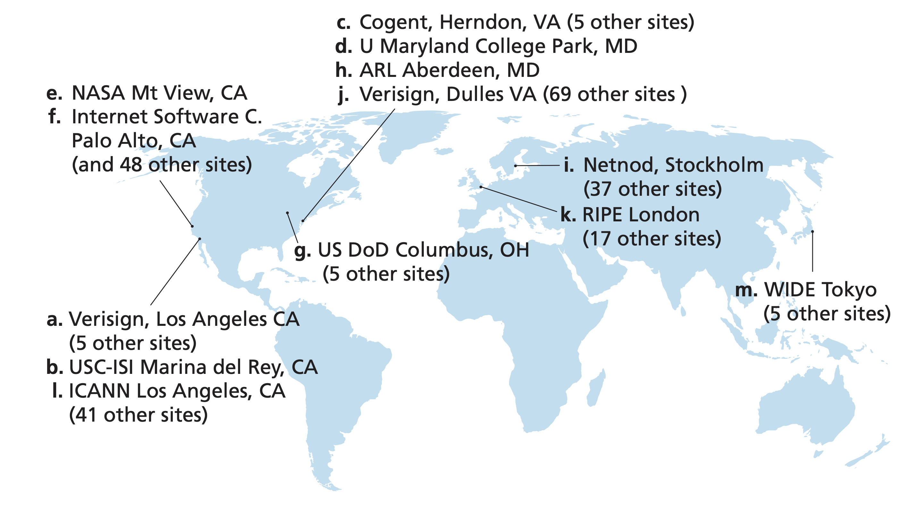
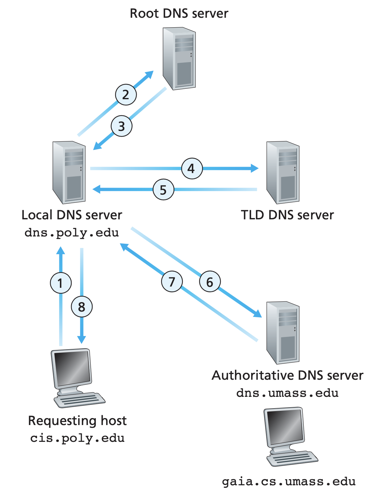

# Domain Name System

### 1. Why DNS

As we known, the [IP address](file:///Users/rex/Library/Mobile Documents/com~apple~CloudDocs/skill/notes/engineering_science/computer_science/computer_network/network_layer/ip_address/ip_address.md#historial-classification) is a 32-bits binary number, usually represented by dotted-decimal notation. Even so, the notation is still not friendly to human beings. Hence we invent **domain name**, and build a system that maps domain name to IP address, that is, the **domain name system(DNS)**.

When the user tries to access the domain name in application (such as browser or ssh), computer queries the DNS system to map the domain name into its corresponding IP address, prepared for the establishment of TCP connection in next step.

So why bother to do the conversion? Why don't we just throw [RFC 791](https://tools.ietf.org/html/rfc791) (and its updates) away and use the user friendly domain name as new IP address to name each server? This is not a good idea since

- User friendly almost always inferres computer unfriendly. IP address is fix-sized binary, easy to interpret and process, while domain name might contain complex characters set (see [RFC 3492](https://tools.ietf.org/html/rfc3492) and [RFC 5891](https://tools.ietf.org/html/rfc5891) for the URL unicode support), which can be the performance and bandwidth killer in network communication.
- It's not realistic to replace all the current network devices, you can see how hard it is from the progress of IPv6.

Domain name, as name of service, is a component in URL:

```
<protocol>://<host>:<port>/<path>
```

where the `<host>` field can be expressed by domain name or IP address.


### 2. Structure of Domain Name

##### # Components

A domain name contains **labels** seperating by dot. For example, the domain name `www.google.com` contain three labels:

| www | . | google | . | com |
| :-----------: | :--------------: | :-----------: | :-----------: | :-----------: |
| Third Level Domain |  | Second Level Domain |  | Top Level Domain |

The domain name is a layered structure, the rightmost is the **top level domain(TLD)**, and from right to left there are second level domain, third level domain, and so on. Each layer of domain name is managed by the managInement organization of upper level. The top level domain name is managed by **Internet Corporation for Assigned Names and Numbers(ICANN)**.

The hierarchy of domain name is not relavent of the physical location and the IP address of hosts. The domain name system is independent.


##### # Top Level Domain

There are three types of top level domains:

1. Infrastructure top-level domain (arpa). This is reserved for reverse domain name resolution.==TODO: What's this?==
2. Country code top-level domains (ccTLD). The ccTLD are the two-letter ISO country codes (with some exceptions). Based on the hierarchy of domain name system, the [second level domain](## Second Level Domain) names are regulated by the country itself.
3. Generic top level domains (gTLD). Such as `com`, `org`.


##### # Second Level Domain

The second level domain name in China includes 34 distinct domain names, each for one province, and 6 type domain names, which is the same as the regulation of top level domain name, while some countries will pick different forms, for example, Japan set the second level domain name to two characters:

| 2nd Domain in China | 2nd Domain in Japan |             Description             |
| :-----------------: | :-----------------: | :---------------------------------: |
|         ac          |         ac          |       scientific institution        |
|         com         |         ed          |             corporation             |
|         edu         |         go          |       educational institution       |
|         gov         |         ne          |             government              |
|         net         |         ne          | network service, information center |
|         org         |         or          |       non-profit organization       |

Register second domain name is peritted, like `revector.cn`. Since the DNS has added supports to most of the Unicode characters, some Chinese domain names have been registered in top level domain, like "中国", "公司", "网络", while few websites use them in practice.


### 3. Domain Name Resolution

##### # Domain Name Server

The simplest solution of resolution (from domain name to IP address) is to maintain a complete mapping table named `hosts`, this is how [ARPANET]() do, and this file is still kept in modern operating system as the local cache of DNS system. In early decades, GFW applied [DNS pollution]() as one method to block forbidden websites, which can be easily bypassed by change the local file `hosts` into actual mapping.

However, since there are so many hosts in the entire Internet and the network structure varies day by day, it's not unrealistic to implement DNS as a local file, or use a few fixed servers to response DNS requests. Instead, it is designed as a distributed query system. 

The DNS servers are designed a hierarchic system corresponding to the hierarchy of domain names. The top level servers are **root name server**, which manage DNS of entire network, then **top level name server(TLD server)**, which manages one of the top level domain, and then are the hierarchy of **authoritative domain name servers**.

There are 13 **logical** root domain name servers, denoted as A~M.



The topology of authoritative name servers is determined by the institution manages that domain. For example, if one company applied for the domain name `abc.com`, to make the Internet know where its domain name and its subdomain names are, the company should equip a DNS server to provide resolution service. All the domains under one authoritative DNS server constructs a **zone**.


##### # Domain Name of Domain Name Server

Name servers are servers, which have there own domain names as well, while the interpretations of domain name hierarchy is not applied to them. For example, the domain name of root A is `a.root-servers.net` and the gltd server domain name `a.gltd-servers.net`.


##### # DNS Lookup: Iterative vs Recursive

The **DNS lookup** is a process always starts from the commuication between client and **local DNS server**. In both form of DNS query, we only communicate with local DNS server.

After the local DNS server accept the DNS query, there are two approaches to do DNS query: **iterative lookup** or **recursive lookup**.

Local domain name server first sends DNS query to root DNS server, who will tells the local DNS server where to find the corresponding TLD DNS server(that is, the IP address of it), then it sends request to the TLD DNS server, who will tells the DNS server where to find the authoritative DNS server. Now the authoritative DNS server, or the interface of servers, returns the IP address to local DNS server. After receiving the resolution result, the local DNS server will use it as the answer to the client.

If iterative lookup is applied, the local DNS server takes all the responsibilities to finish the entire lookup, while the recursive lookup is different: each DNS server only do one request/response. Identically, the client server sends requests to the local domain name server, and the local DNS server sends request to root, and then, root DNS server takes the responsiblity, and send request to TLD DNS server, and TLD DNS server sends requests to authoritative DNS server. Then the response messages return back through the requests chain.

The lookup approach depends on the setting on local DNS server, which usually set to be iterative.




##### # `dig` Command

[`dig`](), formally named **domain information groper**, is a cli tool to create and track DNS lookup process. Domain name servers, DNS records cache, and many relavent information can be achieved by `dig`.

```shell
> dig www.google.com

; <<>> DiG 9.10.6 <<>> www.google.com
;; global options: +cmd
;; Got answer:
;; ->>HEADER<<- opcode: QUERY, status: NOERROR, id: 9678
;; flags: qr rd ra; QUERY: 1, ANSWER: 1, AUTHORITY: 0, ADDITIONAL: 0

;; QUESTION SECTION:
;www.google.com.			IN	A

;; ANSWER SECTION:
www.google.com.		300	IN	A	31.13.92.35

;; Query time: 6 msec
;; SERVER: 133.133.5.1#53(133.133.5.1)
;; WHEN: Tue Oct 20 23:19:39 CST 2020
;; MSG SIZE  rcvd: 48
```


### 4. DNS Message

The exchange between client and server or between servers use the same format. DNS might be encapsulated in UDP(when the package is less than 512 Bytes), while use TCP for larger message. Known port 53 is used for DNS communication.


### 5. DNS Cache

We introduce the normal cache-free DNS lookup steps above. As in all other computer system architecture components, the spatial and temporal locality of operation makes cache an efficient component to reduce repetitive traffic. We'll discuss the cache used in localhost and local domain name server here.

Two types of cache can be kept in local domain name server:

- Mapping from domain name to IP address, which can be used to response the client immediately.
- Mapping from DNS server to IP address, which can be used to reduce the request count of iterative requests.

A **TTL(time to live)** field should be assigned to the cache to provides fresh checking mechanism, which can be adviced by the authoritative domain name server (but each name server itself determines whether to accept the advice, of course). Nowadays 10-15 minutes TTL is recommended for most Web applications. After the cache expired, the local domain name server takes the normal request steps again. Apparently, the increase of TTL reduce network cost and speedup DNS lookup process, while decrease it makes the update faster when we reset the DNS resolution.

The caches mapping from domain name to IP address are also maintained by localhost (`hosts` in new decade!). If permitted, the host can even download the caches holding by the local domain name servers, which makes it able to see all the domain names requested by other hosts connected to the same local domain name sever. ==TODO: check whether this is applied in public network.==


### 6. DNS Attack

<u>Introduce three methods of attack on DNS: DNS hijacking, DNS pollution, and DDoS on DNS.</u>


##### # DNS Redirection

**DNS hijacking** or **DNS redirectoin** is the attack that intercept DNS message during DNS lookup and modify it to a message points to wrong(malicious, normally) IP address, which might leads to any information leaking or malicious executables download, anything a malicious website could do.

Theorectically, the DNS hijacking might taken place in any step during DNS lookup (client<->local, local<->root, local<->tld, local<->authoritative). Normally the communication between client and local name server is the most vulnerable, while in some large scale DNS hijacking the communication to those global DNS servers might also become the targets.


##### # DNS Cache Pollution

If the DNS caches in DNS servers are modified to wrong IP address (by any means), we say the DNS cache is **polluted** or **poisoned**. There are multiple methods to modifiy the cache, the simplist one is control the server the edit the cache as a text file, or hijack the request from local to global name servers to make the server cache wrong address unwittingly.


##### # DDoS on DNS Servers

DDoS on DNS Servers are rare, since the normal DDoS attack targets to specific companies while the scope of influence is too broad for DDoS on DNS servers. Also it requires too much traffic since the DNS servers are designed to support high concurrency by nature.