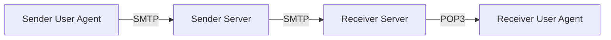
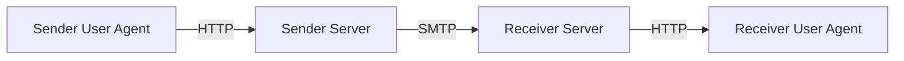

# Mail Related Protocol

##### # Mail Transportation Mechanism

Four entities are referred in the process of mail transfering: proxy of sender, sender mail server, proxy of receiver, and receiver mail server.

在邮件传输过程中, 一般涉及到四个实体: 发送方用户代理(运行在用户机器上的邮件程序)、发送方邮件服务器、接收方邮件服务器以及接收方用户代理. (当然, 这两对实体是对等的, 发送方和接收方的身份是可以互相交换的, 下面我们将会看到, 理论上对于邮件发送来说发送方邮件服务器这个实体并不是必要的, 但是出于许多原因实践中一般都不会将其取消)这里的邮件服务器就是我们平常@后面写的那串东西, 比如腾讯的qq.com, 新浪的sina.com等等. 

它们之间的交流方式如下: 用户代理在接受了用户的发件命令后, 与发送方邮件服务器建立TCP连接, 以**简单邮件传输协议(Simple Mail Transfer Protocol, SMTP)**交换报文, 这里, 用户代理是SMTP协议客户端, 而发送放方邮件服务器是SMTP协议服务器; 发送方邮件服务器接收到邮件以后, 当资源空闲时(因为邮件服务器上可能还有来自其他用户代理的邮件在排队)与接收方邮件服务器以SMTP协议传输报文, 这里, 发送方邮件服务器成为了SMTP客户端, 而接收方邮件服务器则是SMTP服务器. 到这里, 用户的邮件已经被传输到了接收方邮件的服务器上. 当接收方用户代理读取邮件时, 向接收方邮件服务器发起**邮局协议第三版(Post Office Protocol Version 3, POP3)**请求, 接收方服务器通过POP3协议将邮件内容传输到接受方用户代理上. 上述过程表示如下(箭头表示数据流动方向): 

我们不禁要问: 是否可以取消两个服务器的中转, 直接在发送方用户代理和接收方用户代理之间建立SMTP连接呢? 答案是否定的, 我们知道建立连接必然要求两台主机都处于开机状态, 而电子邮件要求对方即使在关机状态下也可以在下次登录时收到邮件, 因此是不可行的, 另外让接收方用户代理在上线时运行SMTP服务(浪费CPU资源)也是不太合适的. 那么我们可否取消一些环节? 例如取消发送方服务器, 使得发送方用户代理直接发信到接收方服务器? 这个理论上倒是可行, 张小龙创立的用户代理Foxmail就是这么做的, 然而尴尬的是出于反病毒和反垃圾邮件的考量有一些接收方服务器是拒绝接收不来自发送方服务器的邮件的, 所以实践中最广泛应用的还是上述的4实体模型. 

不过现在随着WWW的发展, 一种新的建立在HTTP上的邮件传输方式已经大范围取代了上述方式, 在新模型中, 用户代理与服务器之间的报文交流以HTTP协议的方式实现: 

这样就可以了. 不需要了解太多协议细节(除非以后有这方面的大expliot). 

