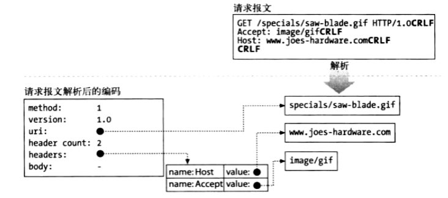

# HTTP

### 1. World Wide Web

##### # Introduction

**万维网(World Wide Web, WWW, 简称为Web)**指的是一个由**链接(link)**互相联系起来的**分布式超媒体(distributed hypermedia)**系统, 其概念核心是链接, 也就是在一个文档中含有指向其他文档的跳转(即所谓的“超媒体”), 特别地, 一段含有指向其他文本的跳转的文本则称为**超文本(hypertext)**. 超文本是万维网的基础.

万维网的概念是在1989年提出来的, 它的产生使得互联网得以走进非专业人士的使用范围(因为所有文档被关联起来, 只需要点击就可以访问所需要的资源, 这一点在搜索引擎被开发出来以后显得更加明显). 为了建构这样一个系统, 需要解决三个问题:

1. 万维网的资源非常之多, 如何采用一种记号实现名字到资源之间的映射?

2. 应该采用怎样的协议实现万维网客户端—服务器的交互?

3. 如何使得不同计算机、不同平台都能够同等地访问万维网上的资源? 

上述三个问题的解决方案分别是[URL](), HTTP和[HTML]().


##### # Static Document and Dynamic Document

直接由HTML手工写成的文档我们称为**静态文档(static document)**, 因为它们一旦被写成就保持不变, 每一次浏览器访问都会得到相同的结果. 静态文档的编写人员并不需要编程知识就可以写出漂亮的网页(因为HTML本质上是一个标记语言). 显然, 这并不适用于某些快速变化的数据内容, 因此我们开发出了**动态文档(dynamic document)**技术.

动态文档并不像静态文档一样静静地蜷缩在服务器的一角, 等待浏览器的访问并将自己交出去. 动态文档的内容是在浏览器访问的时候才由应用程序临时生成的, 这样就可以向浏览器端反馈最新的情况. 值得注意的是, 对于动态文档, 我们需要一个应用程序来接受浏览器输入的参数, 并且根据这些参数生成相应的HTML文档反馈给浏览器, 而规定这些内容(输入数据如何提供给应用程序、动态文档如何创建、输出结果如何使用等等)的标准被称为**通用网关接口(Common Gateway Interface, CGI)**标准, 这个执行数据接受和HTML生成的程序被称为**CGI程序**.

CGI这个名字的确有些奇特, 至少不像“超文本传输协议HTTP”那样显然, 我们解释一下: 其实这不是什么偏正结构, 是三个独立的短语. 这里的"Common"指的是这个标准可以适用于任何程序设计语言, “Interface”则是指协议设计好了一些封装起来的模块供程序设计语言调用, 而中间的“Gateway”这个词有点意思, 我们知道网关是用于连接两个使用不同协议的网络实体的, 这里使用这个词是因为CGI程序在执行过程中可能需要访问其他的服务器资源(使用相同或不同协议的), 因此其行为类似于一个gateway.

值得注意的是, 静态文档和动态文档仅仅在服务器端有区别, 浏览器并不能区分这二者, 因为它们都只是传输回一个HTML文档.


##### # Server Push and Active Document

无论是静态文档还是动态文档, 一旦其被传输到客户端, 信息就完全固定下来, 成了静态的HTML页面, 如果需要使本地的内容持续更新, 则可以采取一些技术, 随着HTML5标准的推进, 这些技术在现在都已经不再使用, 并且在搜索引擎上也很少找到, 因此这里不再介绍有关**服务器推送(server push)**和**活动文档(avtive document)**的内容, 包括已经淘汰的Java Applet.


### 2. HTTP Message

万维网是一个超媒体系统, **超文本传输协议(HyperText Transport Protocol, HTTP)**定义在客户端和服务器之间交换超文本的语法, 二者之间通过交换报文的方式来实现通信, 其中由客户端发送给服务器的报文称为**请求报文(request message)**, 用于请求服务器给自己发送某些资源, 或者在服务器上执行某些命令, 而服务器发送给客户端的报文则是**响应报文(response message)**, 返回客户端所申请的资源, 或者返回命令的执行情况.

学习HTTP的核心内容就是要能手写req/resp报文(当然也要清楚拿到的报文中的每一个字段的意义), 这在网络工程中是非常关键的, 因而熟悉报文的格式是必须的. 下面我们将以报文的字段学习为线索, 叙述目前在HTTP中采用的部分重要技术, 其中最关键的两个部分是**缓存策略(cache strategy)**和**连接管理(connection management)**, 而在req首部中可以采取的**方法(method)**和resp首部中所返回的**状态码(status code)**也是我们学习的关键.


##### # Format of HTTP Messag

无论请求报文还是响应报文都由**起始行(start line)**、**首部(headers)**和**实体的主体部分(entity-body)**三个部分构成, 其中两类报文中的起始行是必须的, 首部和主体都并非必须(但一般对于响应报文而言, 不给出首部和主义的响应显然是毫无意义的, 请求报文倒是的确可以写的非常简洁)请求报文中的startline由方法、目标URL和HTTP版本号三个部分构成, 而响应报文中的startline由HTTP版本号、状态码和原因字符串三个部分构成.

```http
method  request-URL  http-version

headers
entity-body
```

```http
http-version  status-code reason-phrase

headers
entity-body
```

值得注意的是, 语法规定了headers必须总是以一个空行结束, 即使在没有主体部分的情况下也是如此.

两种报文中起始行的关键信息在于req中的`method`和resp中的`status`, 一个是客户端告诉服务器该做什么事情, 另一个则是服务器告诉客户端发生了什么事情.

req报文起始行的最后一个词和resp报文起始行的第一个词给出了所使用HTTP的版本号(这也是两类报文起始行唯一重复出现的词), HTTP的版本号被设计为由**主要版本号**和**次要版本号**两个部分构成`HTTP/<major>.<minor>`

请求报文起始行的第二个词`request-URL`声明了请求访问资源的URL, 可以采用绝对或相对URL. 写相对URL时其`base`需要在headers中使用`host`字段规定.


##### # HTTP Method

根据是否会在服务器上产生影响, req报文中的动作可以分为安全方法和非安全方法两类, 安全方法包括GET,HEAD和OPTIONS, 它们只会获取服务器上的资源(或服务器所支持的方法), 而不会对资源本身造成改变, 非安全方法包括POST, PUT, DELETE和TRACE. 下面我们将对这7个方法进行具体介绍.


##### # Status Code

status-code告知客户端发生了什么事情, 它被规定为3位十进制数, 目前的状态码类型被分为5大类, 以1~5开头, 因此只需要看状态码的首位数字大致上就可以判定发生了什么事情, 其中已经定义的范围只占到了所分配范围的一小部分, 一些重要且常见的状态码(下面所给出的10个)是值得记忆的.

| 范围    | 已定义范围 | 意义类型   |
| ------- | ---------- | ---------- |
| 100~199 | 100,101    | 信息提示   |
| 200~299 | 200~206    | 成功       |
| 300~399 | 300~305    | 重定向     |
| 400~499 | 400~417    | 客户端错误 |
| 500~599 | 500~505    | 服务器错误 |


| status code | default reason phrase | Description                                                  |
| :---------: | :-------------------: | ------------------------------------------------------------ |
|     200     |          OK           | 执行成功, 返回所请求的资源                                   |
|     302     |         Found         | 资源已经被转移, 不在这个URL里了, 但我们为你提供了该资源现在的URL并且附在了header的Location字段中 |
|     304     |     Not Modified      | 服务器进行了缓存判定, 并且告诉计算机中所储存的缓存还没有过期, 可以继续使用, 不必从我这里拿资源了 |
|     400     |   Bad Request Error   | req报文中存在语法错误                                        |
|     401     |     Unauthorized      | 未授权, 需要输入用户名和密码才可以访问                       |
|     403     |       Forbidden       | 理解你的请求, 但是禁止访问(Understand but not Allowed)       |
|     404     |       Not Found       | 没有找到对应的URL, 通常这个命令也会携带一个实体, 以便于客户端的应用程序提供给用户看, 因此404并不意味着没有实体 |
|     406     |    Not Acceptable     | 服务器无法提供客户端所能够接受的MIME类型(在Accept字段中给出的)现代浏览器一般不会发生这类错误, 因为其Accept字段一般都设定成/, 即能够接受一切MIME类型 |
|     500     | Interval Server Error | 服务器发生了不可预知的错误                                   |
|     503     |  Server Unavailable   | 服务器目前不可用, 可以稍后再访问试试                         |
状态码后面紧跟的原因短语表示对状态码的解释说明, 该参数只对人类使用者有意义, 并且可以随意改动(但一般都使用的是状态码默认的对应说明短语, 例如200一般都写成OK, 写成failed虽然不会影响浏览器的处理结果但是实在很不标准), 计算机只会对status code进行处理. 上面表格中所提供的原因短语是HTTP/1.1标准所建议采用的原因短语.

以下我们将更详细地讨论状态码的更多细节内容.


##### # 100/417

信息性状态码是在HTTP/1.1协议引入的, 实际上对其应用价值目前还存在较大的争议, 下面我们来详细考察一下这部分状态码的作用.

我们考虑这样一种情况: 某些时候服务器可能出于一些原因拒绝接受某个报文(可能是因为报文主体太大, 或者出现了其他服务器无法处理的情况), 这无疑浪费双方的网络资源, 因此客户端可以选择先“试探”一下服务器是否会接受报文, 这时只需要先把主体部分保存下来, 只发送报文的起始行和首部部分, 并且在首部中添加一个Except: 100 Continue字段,  告知服务器“如果你可以接受的话, 我接下来将发送该报文的实体部分”, 如果服务器可以接受, 则返回给客户端一个100 Continue状态码, 接着客户端就可以继续发送主体部分, 如果服务器不接受, 则返回给客户端一个417 Expectation Failed状态码, 客户端收到以后就不应该继续发送这个报文.

上面所叙述的双方的交流过程是很理想的, 但是实际的网络环境中总会出现各种各样的复杂问题, 例如, 如果客户端长时间没有收到服务器的100 Continue状态码, 是否应该直接发送报文? 答案是肯定的. 如果服务器在发送响应之前就收到了主体部分, 就说明上面这一情况发生: 客户端已经没有耐心直接发送了主体部分, 这时, 如果服务器是准备发送100的, 那么此时就不必再发送100了, 直接把主体部分接受下来并且发送最终处理的状态码即可(例如200 OK), 但如果服务器是准备发送417的, 这就说明服务器并不愿意接受它, 就算发过来了也只能扔掉.

有些设计不良的服务器会不合时宜地胡乱发送非预期的100 Continue(即使客户端根本就没有发送相应的Except要求), 这并不是不可能出现的, 因而是客户端应用程序员应当考虑的情况, 合理的做法是将这些100都忽略掉.

另外值得注意的是, 由于现在还有部分应用程序使用的是较早的HTTP/1.0版本, 这些应用程序并不知道要如何处理100请求, 考虑以下两种情况: 1.1client--1.0server和1.0 client--1.1server. 如果一个1.1的客户端向1.0的服务器发起了试探请求(即在headers中加入Except: 100 Continue字段)会发生什么? 我们注意到Expect首部实际上在HTTP/1.0版本中就已经存在了, 但1.0版本中100 Continue这个字段是不合法的, (如果服务端应用程序遵守标准来设计的话)服务器对于任何自己无法满足的(包括自己无法理解的)Expect都应该返回一个417, 因此客户端就可以知道服务器不愿意接受这个报文.

1.0 client--1.1server的情况是比较奇怪的, 既然客户端没有发出100 Expect, 服务器也不应该给出100状态码, 因此这种情况只会存在于上面提到的“设计不良的、乱发100的server”, 1.0客户端收到这种不明觉厉的状态码最好的处理方式就是扔掉.

有代理存在的情况如何呢? 如果一个proxy收到了客户端发来的一个含有100期望的请求, 这时候它需要对下一跳服务器的版本进行考察: 如果下一跳服务器是支持HTTP/1.1的, 那么它可以直接转发这个请求, 但如果明确知道下一跳服务器是不支持HTTP/1.1的, 它就可以代替服务器向客户端返回一个417 Expectation状态码, 以免去代理和服务器之间通信的麻烦; 代理似乎也可以采取另一个方法: 向客户端返回一个100状态码(假装这是服务器发的), 然后将客户端兴冲冲发来的主体部分再转发给服务器. 但这种奇怪的做法会产生很大的问题: 我们知道Except 100是用来检验的, 那么如果服务器发送了100, 就意味着它**一定**会接受这个后续报文, 但实际上这个100只是proxy对客户端的“欺骗”, 如果服务器实际上并不能接受这个报文而将其丢掉了(并且返回一个错误码, 代理并不处理这个错误码), 客户端受到错误码必然会很困惑: 明明你都给了100为什么还不能接受? 面对这种垃圾的“热心肠”代理实现, 客户端应用程序员可能就不得不考虑在收到了100后却仍然被服务器拒收报文的可能.

如果代理并不知道下一跳服务器是否支持HTTP/1.1, 那么最好还是将报文原样转发出去, 然后再将收到的100或是417发送给客户端, 这时候有趣的事情在于: 代理收到了报文之后就可以通过这里的100判断出下一跳服务器是必然支持HTTP/1.1的, 因此就可以在状态表中对下一跳服务器的信息进行更新, 但如果收到的是417, 则代理就并不清楚这是因为下一条服务器理解但拒绝接收, 还是根本就不理解, 因此无法从中获得有关下一跳服务器的信息(但可能可以从报文的其他部分中获得, 毕竟报文内容是很丰富的, 不仅仅只有状态码).

从以上讨论中我们可以发现, 代理维护一个关于下一跳服务器的状态表是十分有用的.

上面所讨论的代理都是被动地接受100期望, 有些代理甚至还会**主动将报文添加上100期望**和服务器通信, 这时候代理一般都只代表HTTP/1.0或之前的客户端(因为如果代理知道客户端的版本号高于HTTP/1.1却没有添加100期望, 那就说明客户端并不希望进行试探, 自己再自作多情试探是一个很没有必要的做法, 但HTTP/1.0之前的却不一样, 它们不知道现在1.1以后版本所具备的先进技术, 一个很大的报文会浪费大量得的网络资源, 因此“我有必要为网络资源的节约利用负起责任”), 这种代理有着高度的社会责任感, 但应当注意在实现时不要将收到的100 Continue状态码错发给了客户端, 以免引起不必要的麻烦.


##### # 301 HTTP/1.0: Redirect and 302 Redirect

301 Moved Permanently和302 Found都是在浏览器试图通过某一个URL GET资源时, 服务器告知客户端“这个资源不在这里”, 并且在Location中给出另外一个URL以供访问.

提供重定向的意义是显见的, 由于搜索引擎的索引具有滞后性, 因此一旦网页被移动到一个新的地址, 那么搜索引擎中所抓取的原先的URL就失效了, 用户在访问这个资源时只能收到一个404 Not Found(包括用户收藏夹中的网页也是一样), 导致网站白白丧失了流量, 这显然是站长不愿意看到的, 因此需要提供重定向的支持.

301和302的区别在于其所表示的意义不同: 301表示“这个资源已经被**永久**转移走了”, 而302则表示这个跳转只是临时的. 实际上对于浏览器用户来说, 这两种跳转并没有什么区别, 都是地址栏中的URL突然变成了另外一个, 浏览器一般也不会因为以前收到了301, 就对用户输入的被301过的地址在本地直接进行处理, 那么二者区别的实在性在哪里体现呢? 目前二者只在搜索引擎收录的过程中体现去差异.

对于301来说, 搜索引擎既然知道资源已经完全被移走, 就没有必要再收录这个URL, 因此所收录的URL和资源都是重定向后的, 而对于302, 搜索引擎认为这个跳转只是暂时的, 因此虽然爬的是新URL中的资源, 但收录的却还是原来的URL. 这就使得302状态码提供了**URL劫持**的可能, 如果有人弄了一个新的URL B使其302到URL A, 然而搜索引擎在摘录URL B时, 显示的虽然是A的内容, 保存的却是B的URL, 这就导致A的内容白白给B作了引流, 自己却丧失了原本可以获得的流量. 因此搜索引擎对302跳转是很讨厌的, 如何避免URL劫持也是搜索引擎需要解决的一个问题.


##### # HTTP/1.1: 302, 303, 307

如果一个GET请求收到了302的回复, 那么只需要对新URL重新发起GET就可以了.

HTTP/1.0规范规定: 如果一个POST请求收到了302回复, 则应该到新URL中去发送一个**GET**. 而HTTP/1.1规范规定: 服务器应当对POST请求和GET请求作出不同的状态码回复, 对于POST请求的重定向使用303状态码, 而对于GET请求的重定向要使用307状态码.

现在假设我是一个HTTP/1.1服务器, 收到了一个需要做重定向的请求, (注意req报文的起始行已经给出了客户端所使用的HTTP版本号是1.0还是1.1, 因此client版本判定是一个非常simple事情), 对于1.0版本的客户端, 无论是GET重定向还是POST重定向都只需要发送302状态码, 而对于1.1版本的客户端, 由于它可以理解303和307的区别, 因此需要对临时的GET重定向发送307状态码(对永久的GET重定向仍然发送301), 而对POST重定向发送303状态码. 这表明了302实际上就只在HTTP/1.0客户端才可能出现, 因此我们可以利用所收到的重定向状态码来判断客户端的HTTP版本号.

由此我们容易体会到一件事情: 向下兼容是个大坑.

对于500错误码我们有一个问题: 在使用shadowsock挂PAC模式时有时会出现Internal Privoxy Error. 这是为什么? 


##### # Connection Management

##### # Cache Strategy


##### # Evolution of HTTP

HTTP/1.0标准的文档为RFC 1945

HTTP/1.1最初的RFC的版本是1997年1月发布的RFC2608, 后来在1999年6月发布2616取而代之, 在2014年则又重述了其中语义不清的部分, 将HTTP/1.1标准划分为7230~7235五个文档.

HTTP/0.9

HTTP/0.9是最早的HTTP版本, 这个版本号显然是后来人们开发出HTTP/1.0以后才人为加上的, 表示这是一个很原始、很粗糙的版本. HTTP/0.9的报文格式和之后的版本有很大的差异, 在其req报文中只有方法名称和目标URL, 下面的部分全部都没有, 相当于只是一个后来版本的起始行去掉了版本号, 而其resp报文只有主体部分(entity-body), 没有起始行和首部. 因此其格式大致是这样的

```http
method  request-URL
```

```http
entity-body
```

这样简洁的报文格式显然无法完成后来HTTP所支持的大部分功能, 很快就被废弃了. 现在基本上不会有谁再使用HTTP/0.9协议写应用程序. 相反, 为HTTP/0.9C/S提供兼容反而会导致一系列的问题, 有时会引起安全问题.

但作为HTTP协议的草稿, 0.9版本显然是有其历史意义的, 从报文格式的演化来看, 0.9版本中两类报文的组分都被新协议采取了, 在新协议中req和resp报文的格式变得非常类似.

HTTP/1.1

【首部】

首部(headers)由零个或多个键值对构成, 键和值之间由冒号(或者是冒号+空格)分开, 不同首部占据则不同的行. headers与主体之间由CRLF分隔. 

【主体】

主体没有特定的固定格式, 可以是由任意形式的数据所构成的数据块. 


### 3. Cookie

我们知道HTTP连接是一种**无状态(stateless)**的连接, 也就是说服务器不会记住曾经访问过它的客户端, 只是简单地将其作为一个全新的连接进行处理, 这样做减轻了服务器的负担并且使得协议容易实现, 但是这确实会带来一些不便, 例如, 对于一些需要登录的网站, 客户每一次重新的打开网站就必须重新登录一次, 而无法保持其登录状态.

为了解决这个问题, HTTP设计了Cookie机制, 当客户端发送一个(某种希望服务器记住它的)请求时, 服务器在响应报文首部中添加一个`set-cookie`字段, 客户端收到这个字段并保存到自己维护的cookies文件当中, 当客户端下一次进入这个网站时, 只需要在请求报文首部中添加一个Cookie字段, 就可以告知服务器自己的身份信息, 从而实现了服务器记住客户端身份的功能.

然而Cookie会带来许多安全问题, ==TODO: ADD Security Problems of Cookies in Security Part.==


### 5. HTTP Server

HTTP使用Client/Server结构, 服务器是请求的接受者, 当客户端向服务器发起一个请求时, 服务器通常需要进行以下7个步骤的操作: 


以下详述在这几个过程中所涉及的具体技术.


##### # Connection Establishment and Authority Mechanism

当客户端向服务器发起连接请求时, 服务器可以接受之并将其加入自己维护的连接列表当中(一个服务器通常都需要与众多的客户端建立连接). 服务器可以**随意**拒绝或者关闭连接, 但一般不会乱来, 通常是由于客户端IP地址是未经认证的, 或者是已知的恶意客户端, 服务器才会拒绝连接.

在建立连接时服务器很容易从IP数据包种提取出源IP地址, 有些时候服务器可以采用一种称为**反向DNS**(reserve DNS)的技术从根据IP地址解析出客户端的**主机名**, 但是一般不会这么做, 因为反向DNS的查询通常都要耗费很长时间.

如果对仅仅得到主机名不满意, 还希望得到用户名(username), 以便于对同一台主机上的不同用户进行识别, 则可以使用**ident协议**. 如果客户端支持ident协议的话, 则会在其113端口上监听ident request, 服务器建立到113端口的连接并发送询问请求, 希望得到与HTTP连接对应的用户名, 客户端则返回包含有自己用户名的相应.

ident协议通常只用在可信任的组织内部, 在公共因特网中, 出于安全的考量通常的PC机都不会支持ident协议. 因此在某些含有ident字段的日志格式(例如Apache的日志, 其第二个字段就是ident字段)中, ident字段通常仅仅是一个连字符"-".

由于服务器需要同时处理很多客户端的连接请求, 因此通常会采取多进程(多线程)和复用I/O的技术手段, 我们下面考虑四种情况.

单线程、不复用I/O的服务器每一次只能处理一个请求, 在当前的请求处理完毕后才能够处理下一个, 而在此过程中的所有连接都会被忽略, 这显然会导致严重的性能问题, 只适用于低负荷的服务器以及像type-o-serve这样的诊断工具.

多线程、不复用I/O的服务器


##### # Request Message Receiving

由于请求报文的格式是固定的, 服务器只需要根据各个字段的意义将报文解释出来就可以了, 注意由于网络随时可能出现延迟, 因此服务器在接受报文时有必要分配一块内存作为缓冲区域, 直到收到足以进行解析的数据为止.

某些服务器使用便于操作的数据结构来储存报文, 这称为报文的**内部表示法**, 例如




### 6. Proxy

##### # Definition

Proxy is an entity between client and server, transferring package bewteen. Proxy works like the server for the client, while like the client for the server. Hence a proxy must implement both the functions.


##### # Private Proxy and Common Proxy

If the proxy is specialized to the one client, its the **private proxy**, otherwise its **public proxy**. The proxy can monitor/change all the data flowed passing by, hence we shall avoid using public proxy when encryption is needed. Physically, the private proxy bulit in the public server is not really "private".


##### # Difference between Proxy and Gateway

Proxy and gateway both connect two entities in the network. The proxy connects two entities using same protocol (for example, HTTP proxy, connects two entities using HTTP protocol), while the gateway connects two entities using different protocols (for example, HTTP/POP gateway, or HTTP/E-mail gateway), by which we cloud use browser to send/receive e-mail.

容易发现, 对于两个使用相同协议的实体而言, 代理并非必须的, 取消代理, 换成一个直连链路不影响它们的通信; 但对于使用不同协议的实体来说, 实现协议转化的网关则至关重要, 否则它们无法通信. 

不过另一方面, 代理和网关之间的界限有时候也并不那么清晰. 由于客户端和服务器所使用的协议版本可能有所不同, 因此代理有些时候也需要做一些协议转换工作, 有时候代理甚至还实现了一些网关的功能, 例如FTP协议、SSL协议等等. 


##### # Function of Proxy

我们知道proxy可以监视并修改所有流过它的网络流量, 因此代理可以起到许多非常强大的功能. 

一个比较简单的应用就是黄色网站过滤. 如果我们在客户端浏览器和Internet之间安上一个代理, 并且其能识别其中属于黄色站点的IP地址, 那么代理就能够拒绝属于此类IP的访问(直接丢包), 从而实现万恶的绿色上网功能. (这里有一个值得讨论的问题: 我们知道在解析DNS的时候也是需要向DNS server发DNS request的, 那么代理能否存在于客户端和DNS服务器之间, 从而在DNS解析阶段就直接实现过滤呢? 还是说代理只能作用于HTTP协议而不能作用于DNS? 请进一步明确)


##### # Forward Proxy and Reverse Proxy

通常, 作为client的浏览器在设置代理时, client清楚这个代理的存在, 知道自己是在借助一个中间实体访问server, 但是server则不知道, 它只是把代理当做client, 像这种客户端知道而服务器不知道的代理, 我们称为**正向代理(forward proxy)**.

server方面则可以采取一种称为**反向代理(reverse proxy)**或称为**替代物(surrogate)**的技术, 这项技术使得当client试图访问server上的某个资源时, 实际上接受应答的是反向代理, 是它代替服务器和客户端进行交互.

正向代理和反向代理差异的关键之处在于是C/S体系的哪一方主动设置并对另一方透明的. 正向代理的作用包括

1. 身份隐藏. 正向代理(在攻击中)最重要的一个作用在于对服务器隐藏访问者(客户端)的真实身份, 从而在服务器上无法直接得到访问者的IP, 这样, 只要正向代理的安全性可以得到保证(例如抓一堆肉鸡), 则攻击者的IP就是安全的.  值得注意的是FP和VPN之间的区别(其实我也不是很懂)
2. 限访绕过和加速. 


### 7. Cache

缓存是可以自动保存常见文档副本的HTTP设备.

当客户端向缓存发送一个请求时, 可能会出现以下几种情况: 

1. 缓存中有响应报文的副本, 并且副本没有过期, 可以直接把缓存发送给客户端, 这种情况称为**缓存命中(cache hit)**.
2. 缓存中有响应报文的副本, 但是副本已经过期, 必须对副本进行**再验证(revalidation)**, 向服务器发送一个请求检验自己的副本和新的文档是否一致, 如果一致, 则把报文发送给客户端, 这种情况称为**再验证命中(revalidate hit)**或**缓慢命中(slow hit)**; 而如果新的文档和原来的相比已经发生了改变, 则缓存需要从服务器中下载新文档并转发给客户端, 这种情况称为**再验证未命中(revalidate miss)**; 更糟糕的是服务器如果服务器文档已经被删除, 服务器返回404 Not Found相应, 则缓存也会删除其副本.
3. 缓存中没有相应报文的副本, 将请求报文转发给服务器, 下载相应并转发给客户端, 这种情况称为**缓存未命中(cache miss)**.


**缓存的新鲜度检测机制**

保质期首部`Cache-control, Expires`

服务器在响应报文中常常会给文档设定一个过期的时间, 以便于网络上的缓存实体判断报文的有效期从而能够有效地进行新鲜度检测, 在缓存文档过期之前, 缓存可以以任意频率使用这些副本, 而一旦过期就必须重新与服务器联系. 

**Expires**首部是在HTTP/1.0+版本中规定的, 它指定了一个过期的绝对时间(**格林尼治标准时间GMT**); 而在HTTP/1.1中则使用相对时间(以秒为单位)的**Cache-control**首部. 后者的时间是相对于服务器生成该文档时间(被写入了**Date**首部中)的偏移量. 考虑到兼容性, 许多站点在响应报文中同时写了两个首部. 


服务器再验证

当缓存收到客户端的请求, 发现对应的响应报文已经过了保质期, 就必须要向服务器进行核对, 这个过程称为**服务器再验证**, 向服务器询问文档内容是否发生了变化. 如果发生了变化, 则缓存必须获得一份新的副本, 覆盖旧文档并发送给客户端; 如果没有发生变化, 则缓存只需要获得一份**新的首部**, 首部中包含有新的Date和保质期数据, 并且替换旧文档中的首部. 


### 10. Historical Sideway of HTTP

##### # HTTP-NG

HTTP最初只是被设计来作为访问分布式服务器上的多媒体资源的一个协议, 但在不断的发展中HTTP已经逐渐成为了各种远程访问操作的统一载体, 原来的HTTP被注入了各种不同的扩展功能, 这些发展已经远远超出了最初协议设计者的预料. 

在这样的背景下, 1997年夏天W3C启动了一个新项目, 希望构筑一个新的HTTP版本, 以解决HTTP在发展中存在的一些问题, 这个版本被称为**HTTP下一代系统**(**HTTP-NG**). 虽然该项目小组现在已经解散, 拟定的方案大概也不会再得到应用(现在比较热的是HTTP2.0方案), 但我们(也许)仍然可以从HTTP-NG的思路中挖掘一些对于现有问题的可能解决方案.

HTTP-NG的核心思想是将HTTP协议进一步模块化, 并自下而上地划分为三层, 就像网络体系结构那样: **报文传输层(message transport layer)**、**远程调用层(remote invocation layer)**和**Web应用层(Web application layer)**.

报文传输层专注于考虑报文的有效传输, 不考虑报文的含义, 并且可以支持多种底层的协议栈, 不仅仅局限于传统HTTP所要求的TCP协议, 从而可以更灵活地在多种环境中应用HTTP. NG工作组的大部分精力都放在开发报文传输层的协议**WebMUX协议**上, 该协议可以**复用一条TCP连接**, 从而**并行**地传输多条报文, 从而对以不同速度产生和消耗的报文进行高效的分组, 提高报文传输的效率. 

远程调用层提供一个通用的请求/相应框架, 使得客户端能够通过此框架远程调用服务器操作的接口. 

Web应用层是实现应用程序逻辑的层次. 


