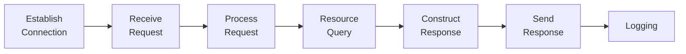

# HTTP

### 1. World Wide Web

##### # Introduction

The **world wide web** is a distributed hypermedia system linked by the **links**. Those texts contain links points to other texts called **hypertext**. Those media contain links points to other media called **hypermedia**.

Three problems arised for the web:

1. How to create bijection beween name and the resource in Web?
2. How to implement the C/S communication?
3. How to make computer with different structure hierarchy access the resources on the Web identically?

URI, HTTP and [HTML](/Users/rex/Library/Mobile Documents/com~apple~CloudDocs/skill/notes/engineering_science/computer_science/programming/frontend/html/html_intro/html_intro.md) are proposed to solve the three problems. This document introduce HTTP, to be more specific, HTTP/1.1 for most of the properties, which is the. The evolution of HTTP protocol specification will be introduce in [Evolution of HTTP](#evolution-of-http).


##### # Static Document and Dynamic Document

**Static document** is the static hard-coded HTML file, which will return same HTML for all requests, while **dynamic document** is dynamically generated when handling the request.

There are two approaches to create dynamic web site nowadays: **server rendering** and **client rendering**. Normally a web page is rendered by the filling **template** with data. Server rendering fill the data in server/client side respectively.

Pros and Cons of these two approaches:

|      |          Server Rendering           |           Client Rendering           |
| ---- | :---------------------------------: | :----------------------------------: |
| Pros |    Only one request for one page    | Reduce the HTML size through network |
| Cons | The entire HTML size might be large |    Multiple requests for one page    |


### 2. HTTP Message

##### # Introduction

**Hypertext Transport Protocol(HTTP)** specifies the C/S interface about transporting hypertext by **messages** interchange. The message from client to server is **request message**, to request some resource. The message from server to client is **response message**, to return the resource requested.


##### # HTTP Message

Both the request and response message construct of  three parts: **start line** (necessary), **headers** (optional) and **entity-body** (optional). The start line of request message contains **method**, **request URL** and **HTTP version**. For the response message its HTTP version, **status code** and **reason phrase**.

The request URL can be absolute or relative (the base should be set in header field `host`).

```http
method  request-URL  http-version
headers

entity-body
```

```http
http-version  status-code  reason-phrase
headers

entity-body
```

Note that he HTTP headers must end with an empty line (CRLFCRLF), even through the entity-body is empty.


### 3. HTTP Method

Nine methods are designed for HTTP requests, which can be classified by whether it changes the resouces on the server(we say it is **safe**): `GET`, `HEAD`,  `OPTIONS` and `CONNECT` are safe, since it does not change the resource on the server, while `POST`, `PUT`, `DELETE`, `TRACE` and `PATCH` are not.

**Idempotence** represents whether an identical request can be made once or several times in a row with the same effect while leaving the server in the same state. It's different from safety, the safe method might be non-idempotent(`CONNECT`), and the unsafe method might be idempotence(`PUT`, `DELETE`, `TRACE`). 

| HTTP Methods | Safety | Idempotence |
| :----------: | :----: | :---------: |
|     GET      |  YES   |     YES     |
|     HEAD     |  YES   |     YES     |
|   OPTIONS    |  YES   |     YES     |
|   CONNECT    |  YES   |     NO      |
|     POST     |   NO   |     NO      |
|     PUT      |   NO   |     YES     |
|    DELETE    |   NO   |     YES     |
|    TRACE     |   NO   |     YES     |
|    PATCH     |   NO   |     NO      |

Note that these propery classifications applied to the functions of methods defined protocol. Server side might break the rules frequently in read world (For example, those sites only use `GET` to perform all CRUD).


### 4. HTTP Status Code

##### # Status Code Classification

**Status code** notify client with how the request has been processed. It's a decimal with 3-digits. The first digit shows the type of status code:

|  Range  | Defined  |     Type     |
| :-----: | :------: | :----------: |
| 100~199 | 100, 101 | Information  |
| 200~299 | 200~206  |   Success    |
| 300~399 | 300~305  | Redirection  |
| 400~499 | 400~417  | Client Error |
| 500~599 | 500~505  | Server Error |


##### # Utility Description

|   status code   |                    default reason phrase                     | Description                                                  |
| :-------------: | :----------------------------------------------------------: | ------------------------------------------------------------ |
|       200       |                              OK                              | Success. The interpretation of success depends on the reqeust method. |
| 301/302/307/308 | Moved Permanently/Found/Temporary Redirect/Permanent Redirect | The resource is moved to somewhere else, we provide the new URL in `Location` header. |
|       304       |                         Not Modified                         | The cache is fresh.                                          |
|       400       |                      Bad Request Error                       | Syntax Error in request message.                             |
|       401       |                         Unauthorized                         | Username & Password required.                                |
|       403       |                          Forbidden                           | Understand but not Allowed.                                  |
|       404       |                          Not Found                           | Requested URL not found.                                     |
|       406       |                        Not Acceptable                        | The server is unable to provide the MIME type that client excepted in header `Accept`. |
|       500       |                    Interval Server Error                     | Unexpected error in server                                   |
|       503       |                      Server Unavailable                      | Not available for now, try it latter.                        |
The following reason pharse is the descriptive comment text of status code, which will not be processed, hence can be set at will.


##### # 200 OK

As mentioned, the interpretation of success depends on the reqeust method.

| Request Method | Interpretation of 200                                        |
| -------------- | ------------------------------------------------------------ |
| `GET`          | An entity corresponding to the requested resource is sent in response. |
| `HEAD`         | The entity-header fields corresponding to the requested resource are sent in the response without any message-body; |
| `POST`         | An entity describing or containing the result of the action. |
| `TRACE`        | An entity containing the request message as received by the end server. |


##### # 201 Created and 202 Accepted

`201-created` indicates the request has been fulfilled and resulted in a new resource being created. The newly created resource can be referenced by the URI(s) returned in the entity of the response, with the most specific URL for the resource given by a `Location` header field.

As required by [RFC 2068#10.2.2](https://tools.ietf.org/html/rfc2068#section-10.2.2), the server MUST create the resource before returning 201 status code, otherwise use `202-accepted` instead if it the request has been accepted but not actually completed. Although accepted, `202-accepted` does not gurantees whether the request will eventually be acted.


##### # Redirection: 301, 302, 303, 307, 308

HTTP provides three categories of redirections, temporary, permanent, and special:

- Temporary redirects during site maintenance or downtime.
- Permanent redirects to preserve existing links/bookmarks after changing the site's URLs, progress pages when uploading a file, etc.
- Special redirections includes 300 Multiple Choice (Not used in common hence we omit this here) and 304 Not Modified (will be introduced in the cache mechanism).

All of the four status codes indicate a redirection and the destination URL will be provided in the response header `Location`. 301 Moved permanently and 308 Permanent Redirect **redirect permanently**, 302 Found, 303 See Other, and 307 Temporary Redirect **redirect temporarily**.

The redundancy of redirection codes comes from historical reason, 301, 302 and 303 are introduced in HTTP/1.0, some agents implement 301 and 302 to change the protocol from others to GET after redirection (although the protocols are not intended to require so), hence 307 and 308 are intoduced in HTTP/1.1 to reduce ambiguity. On the contrary, 303 See Other is intended to change the protocol from others to GET, normally used to redirect after a PUT or a POST, so that refreshing the result page doesn't re-trigger the operation.

There is no difference for the user or even browser when processing those redirection: request the provided new URL again, that is, the only difference of the four status codes is the semantics. The search engine (ideally) will merge the information of those permanent redirected pages into new URL, while those temporarily are kept.

This interpretation of temporary redirection provides possibility to construct URL hijacking: If we intentionally "temporary" redirects the URL-2 to URL-1, then the search engine will consider the traffic belongs to URL-2 instead of the actual content provider.

Refer to [HTTP Redirect Codes for RESTful Services](https://tools.ietf.org/id/draft-hunt-http-rest-redirect-00.html), the historical status code 301 and 302 SHOULD NOT BE USED in modern websites.


##### # Exceptation Mechanism: 100 Except and 417 Expectation Failed

HTTP/1.1 introduce the exceptation mechanism, which allows the client to ask whether the server is willing to process the request by sending only the startline and headers beforehand.

The client, with uncertainty, sends only startline and headers, add `Except: 100 Cotinue` on the header, if the server accepts the request (for now, based on the received headers), it returns `100 Continue` status code to encourage client to send the entire message, otherwise `417 Expectation Failed` status code should be given to tell the client abort subsequent sending.

Although this process seems ideal, many problems arise in complex network environment, especically the existence of transparent proxies inside network, which leads to the backward compatibility problem, the solution of many problems are specified in [RFC7231](https://tools.ietf.org/html/rfc7231#section-5.1.1), while some other are still undefined behaviours:

For the client:

- Shall the client send request message if `100 Continue` is not received for a long time?

    > A client that sends a 100-continue expectation is not required to wait for any specific length of time; such a client MAY proceed to send the message body even if it has not yet received a response.
    >
    > Furthermore, since 100 (Continue) responses cannot be sent through an HTTP/1.0 intermediary, such a client SHOULD NOT wait for an indefinite period before sending the message body.

- Shall the client abort the request if `417 Expectation Failed` is received?

    Answering to this problem seems to be simple: Don't send since that's what the status code tells, but:

    > A client that receives a 417 (Expectation Failed) status code in response to a request containing a 100-continue expectation SHOULD repeat that request without a 100-continue expectation, since the 417 response merely indicates that the response chain does not support expectations (e.g., it passes through an HTTP/1.0 server).

For the server:

- Shall the server sends `100 Continue` if it has already received the entire message?

    > A server MAY omit sending a 100 (Continue) response if it has already received some or all of the message body for the corresponding request, or if the framing indicates that there is no message body.

For the proxy:

- What should a proxy do when it receive a `Expect: 100 Continue` header?

    > A proxy MUST, upon receiving an HTTP/1.1 (or later) request-line and a complete header section that contains a 100-continue expectation and indicates a request message body will follow, either send an immediate response with a final status code, if that status can be determined by examining just the request-line and header fields, or begin forwarding the request toward the origin server by sending a corresponding request-line and header section to the next inbound server.  If the proxy believes (from configuration or past interaction) that the next inbound server only supports HTTP/1.0, the proxy MAY generate an immediate 100 (Continue) response to encourage the client to begin sending the message body.


### 5. Connection Management


### 6. Evolution of HTTP

##### # HTTP/0.9: One Line Protocol

HTTP/0.9 is the first version of HTTP, the version number is assigned after HTTP/1.0 is introduced to distingulish it from new version.

`GET`, as the only supported method, followed by the path(not URL, as both the protocol, server, and port are unnecessary once connected to the server), constructs the entire request message:

```http
GET /page.html
```

The response message contains only pure HTML page, no status code, no type header, only HTML contained.

There is no necessary to provide backward compatibility to the HTTP/0.9 nowadays.


##### # HTTP/1.0

See [RFC 1945](https://tools.ietf.org/html/rfc1945).


##### # HTTP/1.1

HTTP/1.1 releases its first specification [RFC 2068](https://tools.ietf.org/html/rfc2068) in January 1997, which is obsoleted by [RFC 2616](https://tools.ietf.org/html/rfc2616) in June 1999, and then it is devided into [RFC7230](https://tools.ietf.org/html/rfc7230), [RFC7231](https://tools.ietf.org/html/rfc7231), [RFC7232](https://tools.ietf.org/html/rfc7232), [RFC7233](https://tools.ietf.org/html/rfc7233), [RFC7234](https://tools.ietf.org/html/rfc7234), [RFC7235](https://tools.ietf.org/html/rfc7235) after 15 years in June 2014.


##### # HTTP/2

==TODO: Add HTTP/2 features==


##### # HTTP/3

The next major version of HTTP, HTTP/3, will use [QUIC]() instead TCP/TLS for the transport layer portion.


### 7. Cookie

We've known that HTTP is designed to be stateless connection, that is, in the protocol's perspective the server will not remember whether a client is an old friend or a new one, which leads to some inconvience as the Web developed as more and more complex. For example, stateless makes it is nearly impossible for login: the user has to log in each time for any new requests that requires authentication.

Cookie is introduced to solve this problem: When the client sends some request and wish itself to be memorized, server appends `Set-Cookie` in response header and client stores it in the local `cookies` file. Next time the client requests the same server, it use the `Cookie` in request header to tell the server the identity of client.

Security and privacy problems are also introduced as Cookie.


### 8. HTTP Server

Normally the HTTP server process a request by the following steps:




##### # Connection Establishment

Server accepts and add the client to the connection list when connection request from client arrives. The server might refuse the connection for multiple reason:

- The client is identified as a malicious client.
- The client establishes too many connection in a short time (identified as DDoS).
- The client does not pass the authorization.

The typical model about how the server to handling request in the server's operating system is described as: The server mantains one or multiple listener processes/threads to receive requests, once the request arrives, it is first accepted by one listener process/thread, then a process-fork-and-exec/thread-creation process is executed, a new process/thread is created to process the request and terminated after compete processing.

Multiple information from client can be achieved if the server wishes. Except IP address, the **reserve DNS** technique makes it possible to resolute the host name from IP address, but this costs a lot of time hence is not proceed normally. **Identification Protocol(ident)** provides a method to get the username from client, the client must listen ident request on 113 port. Identically this is not used normally since most of the host does not open and listen for ident on public Internet, only used in trustable local network. This explained why the `ident` field in some server logging information (such as Apache's) is always a hyphen `-`.


### 9. HTTP Proxy

##### # Definition

Proxy is a network entity between client and server, transferring packages bewteen. Proxy works like the server for the client, and like the client for the server. Hence a proxy must implement both the functions.

```
Client <---> Proxy <---> Server
```


##### # Private Proxy and Common Proxy

If the proxy is specialized to the one client, its the **private proxy**, otherwise its **public proxy**. The proxy can monitor/change all the data flowed passing by, hence we shall avoid using public proxy when encryption is needed. Physically, the private proxy bulit in the public server is not really "private".


##### # Difference between Proxy and Gateway

Proxy and gateway both connect two entities in the network. The difference is: proxy connects two entities using same protocol (for example, HTTP proxy, connects two entities using HTTP protocol), while the gateway connects two entities using different protocols (for example, HTTP/POP gateway, or HTTP/E-mail gateway), by which we could use browser to send/receive e-mail. This indicates that the proxy can be transparent in the network, and if we just take the proxy away the communication will still work, but not work for gateway.

As most of other conceptual specifications in computer network, in the line blurs between proxy and gateway. For example, for the client and server who support different versions of HTTP, some protocol transformation might be done by the process, and some proxy even implement functions of gateway.


##### # Function of Proxy

Proxy can monitor and convert all the data flows it, hence we can utilize proxy to implement powerful functions:

- Website filter. The proxy between client and server is able to monitor the destination the client try to access, hence it can simply drop the message or pretend as the real server and response with 5xx when the destination is in the blocked list.


##### # Forward Proxy and Reverse Proxy

Based on the transparency, we can classify proxies as two types: if the proxy is set by the client and transparent to the server, it is a **forward proxy**, otherwise if it is set by the server and transparent to the client, it is a **reverse proxy** or **surrogate**.

The functions of forward proxy includes:

1. Identity hiding. By accessing through a forward proxy, the client can prevent the server from getting its real IP address and other network information.


### 10. Historical Sideway of HTTP

##### # HTTP-NG

W3C establish **HTTP-NG(HTTP Next Generation)** project to solve the problems arised as the HTTP developed and extended. The core idea of HTTP-NG is layering HTTP into three layers:

- Web Application Layer. This layer is where the application logic lies.
- Remote Invocation Layer. This layer aim to provide a general-purpose request/response interface framework.
- Message Transport Layer. This layer foucs on the transmission of message, regardless of the interpretation.

The most work of HTTP-NG working group is developing the messgae transport layer protocol **WebMUX**, which allows a TCP connection to be reused and transmit multiple messages on one connection to improve performance.


