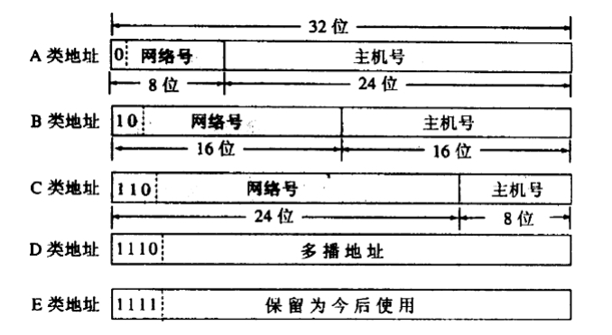

# IP Address

##### # Structure of IP Address

Naming is necessary for communication, which is called **IP address** in the network layer. IPv4 sets the IP address as 32-bit. The traditional design devides the IP address as **network address** and **host address**, which represents the network and the host respectively, the host connects into the same network should be distributed as the same address.

We use the **dotted-decimal notation** to represent the 32-bit binary:

```
11000000 10101000 00000001 00000001 <-> 192.168.1.1
```

As the entity connecting two different network, a router must holds two different IP addresses for the two ports, the network address is the network addresses be connected by the router respectively. Specially, when two routers are connected by one cable directly, we can omit the distribution of IP addresses on both edges to save IP addresses resource. Now this cable is a special network called **unnumbered network** or **anonymous network**.


##### # Historical Classification

In the traditional design, IP address is divided into five types, type A, B, C are unicast addresses, type D is multicast addresses, and E is left for the future.

| IP Address Type | Network Address Length | Host Address Length | Head Bits |
| :-------------: | :--------------------: | :-----------------: | :-------: |
|        A        |           8            |         24          |     0     |
|        B        |           16           |         16          |    10     |
|        C        |           24           |          8          |    110    |
|        D        |           /            |          /          |   1110    |
|        E        |           /            |          /          |   1111    |



