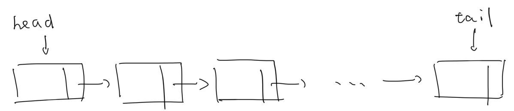

[TOC]

# Linear List

### 1. Introduction

##### # Basic Concepts

A **Linear List** is the limited sequence of datas $a_1, a_2, a_3, ..., a_n$ with same type, noted as $(a_1, a_2, a_3, ..., a_n)$. The number of elements called the length of linear list, and the linear list with zero-length called empty list.

Customarily we can call the element of liner list as **Node** or **Record**. `Node ` usually be used in the practical programming where we define the element as a `struct `. Based on the definition of linear list, all the records must share the same data type, it can be a simple type like `int`, `char`, or complex `struct` and `object`. In the complex case, the column of datas are named **Field** or Domain. This naming convention is similar to the cases in Database.


##### # ADT Operations Definition

The **Abstract Data Type** is defined by the possible operations affected on the data type. We'll illustarte the opeartions on linear list here.

> 1. Properties
>
>    - Count the length of linear list.
>
>    - Determine whether the linear list is empty.
>
>      
>
> 2. Iteration
>
>    - Print all the elements in the linear list.
>
>    - Sort the linear list based on one or more records of the elements.
>
>      
>
> 3. Search
>
>    - Find the value of `i`th element.
>
>    - Find the location(subscript) of the first element with value $v$.
>
>      
>
> 4. Insertion/Deletion
>
>    - Insert the new element before(after) `i`th element.
>
>    - Delete the element on the `i`th position.
>
>    Combined with the value search function, we can implement the function that insert element before element with specific value `v`, and delete element with specific value `v`.
>
>    
>
> 5. Data Structure Interaction
>
>    - Join multiple linear list into one.
>    - Divide one linear list into multiple.


##### # Classification

There're two types of most frequently-used storage strategy of linear list: **Sequence List (Array)** and **Linked List**.

The sequence list stores all the records in the continuous memory, which guranteed all the elements of the sequence list can be found by simple offsets operation. E.G. If each element cost `s` bytes, and we allocates the first record of list in address `[a, a+s)`, the `i`th record will be store and find at address `[a+i*s, a+(i+1)*s)`. This implies a simple fact, that we can access an element without iterating the elements before it, this feature of access is named **Random Access**. Apparently, with the help of a simple `for` loop we're able to get all the elements of sequence list.

The other approach to storage linear list is linked list. Linked list values the `next` relationship between nodes, who determines to storage the address of next address with an extended field besides the data field. This implies that we can't read some data in the middle of the linked list directly, we have to interate everything from the beginning, so the linked list only support **Sequential Reading**. Once we know where the first element is, through the interation of `next` operation we cloud always get all elements on the list.



Normally, the general linear list structure won't limit the subscripting, insertion and deletion operation, these operations are allowed to act on any place in the linear list, while there're two type of special linear list which limit these operations, make them can only operate in the specific place: **Stack** and **Queue**.

Stack can be consider as a bunch of heaped books, you can only remove the book on the top of the stack, added new book on the top of the stack, and read the topmost book's content only. This limitation implies that the element which was first added to the stack will be the last to be removed. This feature of stack is usually emphasized as "**First In, Last Out**", or **FILO**.

Queue is the same as the queue when you go to Disneyland or the most popular restaurant in the city, you can only add person into the tail of the queue, and remove person from the beginning of the queue, i.e. add/remove element in different edge. It's totally different from stack beacuse it add/remove things in the same edge. As the result, the first element which is pushed into the queue will also be the first to get out of the queue, which is usually emphasized as "**First In, First Out**", or **FIFO**.

==TODO: Draw the graph to illustrate the classification of linear list==

We'll first illustrate the implementation of general array and linked list, as well as the basic variants of them, followed the construction of stack/queue by both the array or linked list, and showed some applicaitons of these data structures.

==TODO: Draw the graph to illustrate the notes sequence==

The further detailed properties and the implementation of these types of structure will be illustrate in the specific sections.


### 2. Array

##### # Implementation

The sequential list, or array, is supported by almost all of programming language. The following code illustrate the method to declare a new array with type `int`:

```c
#define MAX 100
int list[MAX];
int n;
```

One property that worth noting is that the array structure itself doesn't contain the information about "where it ends", and "how long it is" also, unless it's the `char` array and you're using the string literal to implement the declaration like `char str[]="hello"`, in which case the complier will adding a tailing `\0` to mark the end of char array, while in the general case this is not supported. The array, are essentially, a continuous memory block, with no special care and attention, and we call the first address "the name of array".

This makes it difficult to determine where the iteration on an array should end with, E.G. we'd like to write a function `max` to get the max element of an `int` array:

```c
void max(int nums[]){
    int max = nums[0];
    for(int i=1; i<length_of_nums; i++)
        max = max > nums[i] ? max : nums[i];
}
```

As no "End Singal" is specified, we're not able to find out the `length_of_nums` through the array itself. One solution of this is to give another variable to pass through it:

```c
void max(int nums[], int length_of_nums);
```

That is why we usually use a independent variable `n` to record the length of array.


##### # Operations and Complexity Analysis

We've implemented (1)iteration, (2)element search, (3)insert, (4)delete and (5)array join operations of general linear list by array storage in [array_operations.c](array_operations.c).

Here we illustrate the complexity analysis of subscripting, insert and delete.

The element access, or subscripting process only cost constant $O(1)$ complexity.

This insertion operation before the `i`th location require `n-i` elements to move one step to the succedent element, which requires the constant time. Give the probability of insertion $p_i$ on each index $i$, we can calculate the mathematical expectation of the operation:
$$
\overline T = \sum_{i=0}^n p_i(n-i), \qquad \sum_{i=0}^n p_i = 1
$$
If the frequency of insertion operation is uniform distributed in different subscript, that is, $p_i$ is a constant, then
$$
\begin{align}
\overline T
&= \sum_{i=0}^n p_i(n-i) \\
&= p_i\sum_{i=0}^n(n-i) \\
&= p_i\sum_{i=0}^n i \\
&= \cfrac{1}{n+1}\cdot\cfrac{n(n+1)}{2} \\
&= \cfrac{n}{2}
\end{align}
$$
which implies that the time complexity of insertion operation is $O(n)$, and the deletion operation also required $\cfrac{n}{2}$ elements to move, share the same time complexity $O(n)$ as insertion.

Further content about array storage will be introduced in the independent topic [Array](Array).


### 3. Linked List

##### # `struct node`

Based on the definition, a linked list is a group of nodes that stores not only data but the pointer points to the next node, it's convience to use the `struct` in C to implement this concept:

```c
struct node {
    char data;
    struct node* node;
}
typedef struct node Node;
typedef Node* Node_ptr;
const int NODE_SIZE = sizeof(Node);
```

Inside the struct definition we use the `struct node*` to represent the pointer points to the the same type as itself. The later lines about `typedef` and `const` will simplify the implementation of initialization and construction operations of linked list, which will be illustrated later.

To create a new node, the memory allocation function `malloc` is used to specify a memory block with size `NODE_SIZE` to be our struct `Node`, and we encapsulated this process into a function, as if this is a class construction:

```c
Node_ptr new_node(char data){
	Node_ptr node = malloc(NODE_SIZE);
    node->data = data;
    return node;
}
```


##### # Sentinel Node

To avoid some problems caused by the operations assoicated with the first element, we'll add an special empty element to be the `head` or `tail` node in some cases which is usually called the **Sentinel Node** or **Dummy Node**, as the result, the actual meaningful first/last element will be the next/previous element of `head/tail` element. Since sentinel `head` is used more frequently than sentinel `tail`, we'll only talk about the sentinel `head` in this illustration.


The structure of the sentinel head is the same as normal element, and the data field of it will be set as a meaningless value which won't appear in the meaningful data. E.G. We can set data field of the sentinel as `0` if the normal datas are guaranteed to be positive or visible character.

This feature(speciality of data field) allows sentinel to mark the start of the refined linked list structure like circular linked list. In this case if the sentinel with special data field is not provided, it's not possible for a program to tell weather it has reached the beginning of linked list.

The specific comparison between with and without sential head will be introduced in an independent research document [Sentinel Head In The Linked List: Investigation](Sentinel Head In The Linked List: Investigation). An extra empty `head` is **ALWAYS** added in most of our implementations of initialization and construction, including **ALL** the (singly/doubly)(linear/circular) linked list.


##### # Initialization

Finally we're going to combine nodes into linked list. Two approaches of initializations are introduced here: The **Append Way** and the **Prepend Way**. The append way, as it is named, appends new snode in the end of the linked list, while the prepend way inserts new element into the start of linked list.

```c
/* linked list initializaiton: append way */
// We'll use an array to be the data source of the linked list, to avoid the direct interaction to input/output stream.

Node_ptr new_linked_list(char data_src[], int length){
    Node_ptr head = new_node(0);
    Node_ptr cur = head;
    
	for(int i=0; i<length; i++){
		Node_ptr suc_node = new_node(data_src[i]);
        cur->next = suc_node;
        cur = cur_next;
    }
    
    cur->next = NULL;
    
    return head;
}
```

Since we have to return the `head` element of linked list, we have to store the `head` element in the beginning and define another pointer `cur` to trace as the list grows. Besides, in the software engineering's perspective, a variable named as `head` is obviously not used for iteration, so another `cur` is required anyway XD.

```c
/* linked list initialization: prepend way */

Node_ptr new_linked_list(char data_src[], int lenght){
    Node_ptr head = new_node(0);
	head->next = NULL;
    
	for(int i=0; i<length; i++){
        Node_ptr suc_node = new_node(data_src[i]);
        suc_node->next = head->next;
        head->next = suc_node;
    }   
 
	return head;    
}
```

As noticed, the append way requires the cursor keeps to move to the last element, while in the prepend way the pointer just "wait" in the head and let the linked develop naturally, no even a single redundant variable is added. Although this approach seems more elegant, the sequence of the linked list will be **REVERSE** of the original inputs' sequence.


##### # Operations and Complexity Analysis

We'll implement (1)iteration, (2)element search, (3)insertion, (4)deletion, and (5)join operations of linked list in [linked_list_operations.c](linked_list_operations.c).

Then we illustrate the complexity analysis of subscripting, insert and delete here.

If the distribution of search target is uniformed, the subscripting process will costs $\cfrac{n}{2}$ operations of dereference to find the next element, which illustrates that the time complexity of element search is $O(n)$. The insertion and deletion operation only require two repointing at most, which is $O(1)$.

We should notice the time complexity difference of operations between array and linked list. The array is preferred if one requires more subscripting than modification, while the linked list is preferred if one requires more modification than subscripting.

 

##### # Cursor Implementation


##### # Combination Of Array And Linked List


### 4. Enhanced Linked List

##### # Doubly Linked List

It's trivial for linked list to find the next element, but to find the precedent it costs $O(n)$, the comlexity is the same to find a unknown element. The precedent relation is not natural supported by singly linked list.

Another pointer field points to the previous node solves this problem:

```c
struct node {
    char data;
    struct node* prev;
    struct node* next;
}
```

Most of the codes about doubly linked list is similar to the singly linked list, since the repointing processes during `initialize/insert/delete` processes are easy to construct by one with an Apple Pencil, we'll not emphasize this operations here in the formal notes for the conciseness, the codes and illustrations will be placed in [doubly_linked_list.c](doubly_linked_list.c).

Doubly linked list is used by many operating system to manage programs and dynamic objects. One of the detection evasion strategy of rootkits is to unlinked themselves from the list. [[REF]](https://en.wikipedia.org/wiki/Linked_list#Doubly_linked_list)


##### # Circular Linked List


##### # Doubly Circular Linked List


### 5. Stack

[stack.c](stack.c)


### 6. Queue

##### # Queue Structure

Use two pointers that point to the `head` and `tail` of queue respectively.

There's two presentation method of queue, one use the `head` pointer points to the address of actual head of queue directly, or use the `head` pointer. The codes are in [queue.c](queue.c).

One problem of this implementation called **False Full**. Notice that the `tail` pointer never moved forward, when the `tail` moved to the `MAXN` pointer, although the old elements may be moved away, the `tail` doesn't receive this information but still consider the queue full. This is so-called the False Full phenomenon.

##### # Ring Queue

To aviod false full and the waste of memory, we create the **Ring Queue**, consider a segments of memory ring. In this solution the `head == tail` may because of full queue or empty queue. So we add an `is_full` tag to mark whether it's full or empty. [ring_queue.c](ring_queue.c)

##### # Void Node Solution

One more mark variable and `if` statement increase the complexity and time cost in ring_queue solution.

