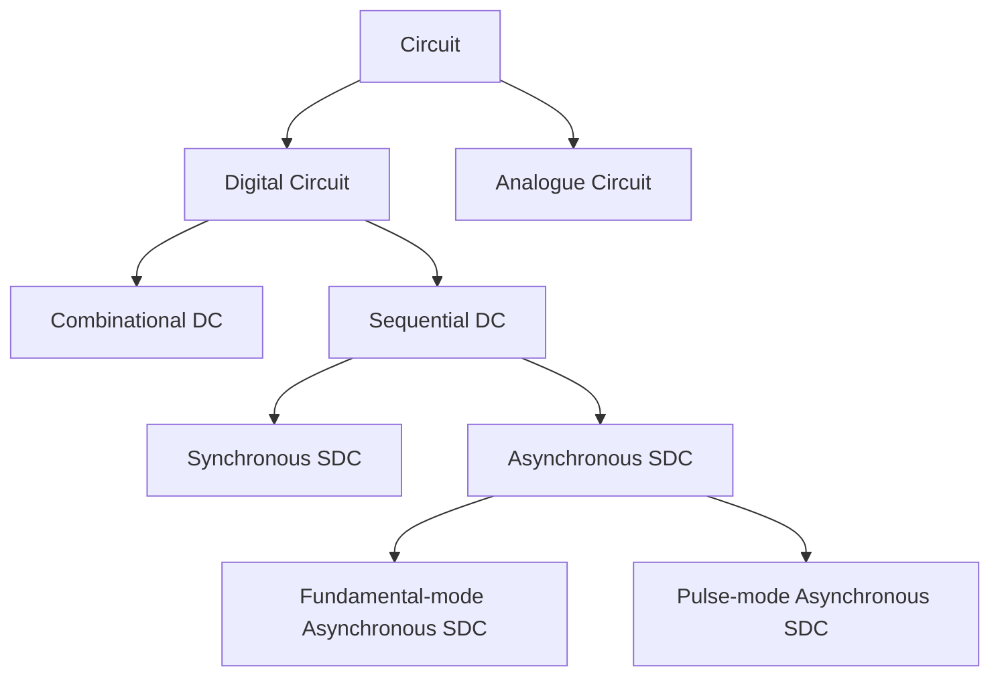

# Introduction

### Classification of Circuits

There're two kinds of circuit: digital and analogue. Same as the terminology the signal processing class, the input/output status of digital circuit is boolean: can only be 0/1, but the IO of analogue circuit can be continous. Based on this feature, the toolkits we process this two are also different: We use **[Boolean Algebra](Boolean Algebra)** to design as the theoretical tool to design digital circuit, and usual calculus to design analogue circuit. Since this is a digital circuit course, we'll only talk about DC in the following classifications, while most of them can be also applied in the AC.

Based on whether the output rely on the historical input, there're memoryless **[Combinational Digital Circuit](Combinational Logic Circuit)** and **Sequential Digital Circuit**.

### Circuit Analysis and Design

### Procedure of Circuit Analysis

- STEP1: Determine what type of the circuit is(refer the tree)
- STEP2: Chunk the complex circuit to small function unit
- STEP3: Analysis each unit, expressed it(based on 5 methods) if necessary
- STEP4: Join all the units into a large scale

