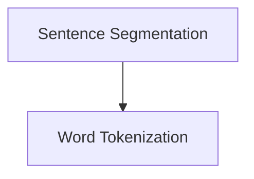

# Natural Language Processing

##### Basic Procedures

The following basic steps are included in natural language processing:

```mermaid
graph TB;

ss[Sentence Segmentation]
wt[Word Tokenization]
ss --> wt
```

