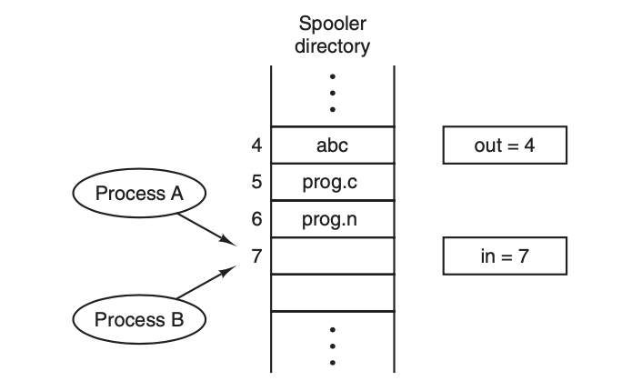
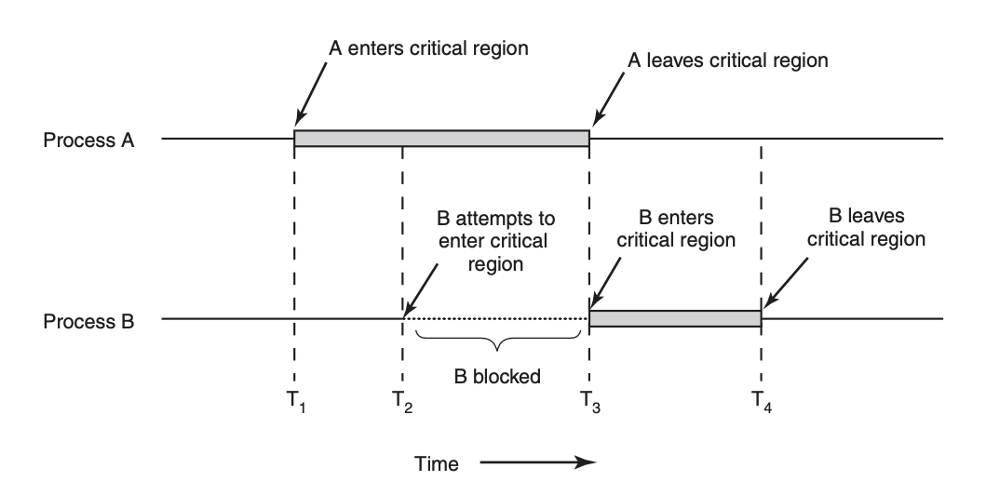

# Interprocess Communication

Some information must be passed among related but individual process, especically when it's necessary to gurantee the sqeuecne of execution. Hence, we'll introduce some technique to perform **Interprocess Comunication(IPC)** in this section.

### Background

##### Race Condition

In this section we'll introduce what is race condition and critical range, arised dued to the time-sharing and scheduling machanism of modern operating systm. We'll use the example from **spooler directionary**, which is a temporary queue that stores the names of files that need to be printed in an array for all processes in operating system, that is, the memory for this array is **shared** among all running processes.

The typical usage of this array is described like this: if a process wants to prints file, it must first read the next empty index `out`, put filename into the empty space, and `out++`.

Now consider two process A and B, process A wants to add a filename into the queue, so it reads the `out`, which is 7, coincidently (and going to be much more regular as the increasing core numbers), right after this reading is completed, operating system thinks this process runs too much time and transfer CPU time from A to B, B also wants to print file, so it also reads the next empty array index, which is **still** 7, and then put the filename into `spooler[7]`, and give the CPU back to process A, now, process A **DO NOT** know that `spooler[7]` has been writen by process B, it continues the task after reading `out`, that is, overwrite(not intentionally, of course) `spooler[7]` by new filename, and execute `out++`.

Obviously, this result is not what we want when process A and process B runs sequentially strictly. This situation, when the result of processes is determined by different scheduling sequence, usually occurs when two processes shared the same resource(memory, device, etc.) is named **race condition**.

##### Four Requirements of IPC solutions for Race Condition

Now we model the codes of the two process, defining the code blocks that using shared resources as **critical region**, then solution of the race condition is: Avoiding any two processes to enter critical region at the same time (for the same resource), called **mutual exclusion**. Four the problem occured in last section, the following graph shows the solution by blocking B when A has already in the critical regio:

Besides, some conditions are added to restrict the design IPC solutions. Formally we list the four most important conditions as following:

1. No two processes may be simultaneously inside their critical regions.
2. No assumptions may be made about speeds or the number of CPUs. (Actually, if this is under control, we will not need any algorithm for IPC at all...)
3. No process running outside its critical region may block any process.
4. No process should have to wait forever to enter its critical region.

### Implementation for Mutual Exclusion

##### Disabling Interrupts

The most simple solution for mutual exclusion is disabling any interrupts right after the process entered critical region until exiting. This is a hardware-level solution.

This solution **does work**, but absolutely not acceptable, for two reason:

- Never trust user process. Its dangerous to give the power of disabling interrupt to user process.
- Disabling only applied for the current CPU core. Other processes are still able to access shared resources by other cores.

Although, when the operating system process itself needs to take some operations it's adorable to disabling interrupts for several instructions.

##### Lock Variable

We might considering set a **lock variable** to mark whether any process is accessing the shared resource, but this makes the lock variable itself a shared resource, and the operation  of it will also arise the same problem as those resource locked.

