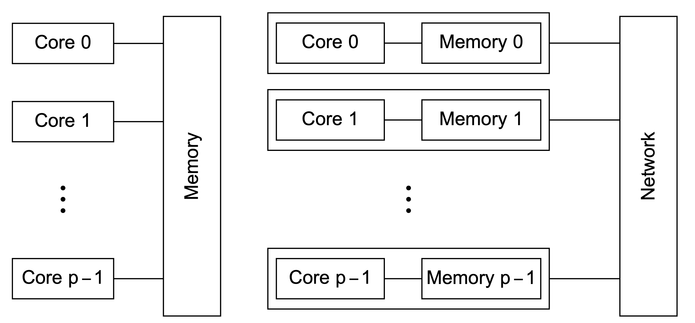

# Parallel Computing

##### Terminology

- Concurrent computing.
- Parallel computing.
- Distributed computing.


Two kinds of parallelism:

- **Data Parallelism**. Distribute 300 test paper into 3 TA, 100 test paper for each TA.
- **Task Parallelism**. Each TA corrects 1/3 of the questions for all test paper. Problems in task parallelism.

Example of parallelization. Adding $n$ numbers. The series version usually seems like

```c
int sum = 0;
for (i = 0; i < n; i++){
	x = func(i);
    sum += x;
}
```

And the pralllel version:

```c
int my_sum = 0;
int my_first_i = ...;
int my_last_i = ...;

for (int i = 0; i)
```


Two architecture of parallel system:

- **Shared Memory**. All the cores shrae the same memory, the synchronization can be achieve by the read/write of memory.
- **Distributed Memory**. This is usually called the **distributed computing**, commucating through the network.




Problems of Parallelism.

- **Communication**.
- **Load Balancing**.
- **Synchronization**.


##### Explicit Paralleling C

- **Message-passing interface (MPI)**
- **POSIX Threads (Pthreads)**
- OpenMP
- CUDA C

