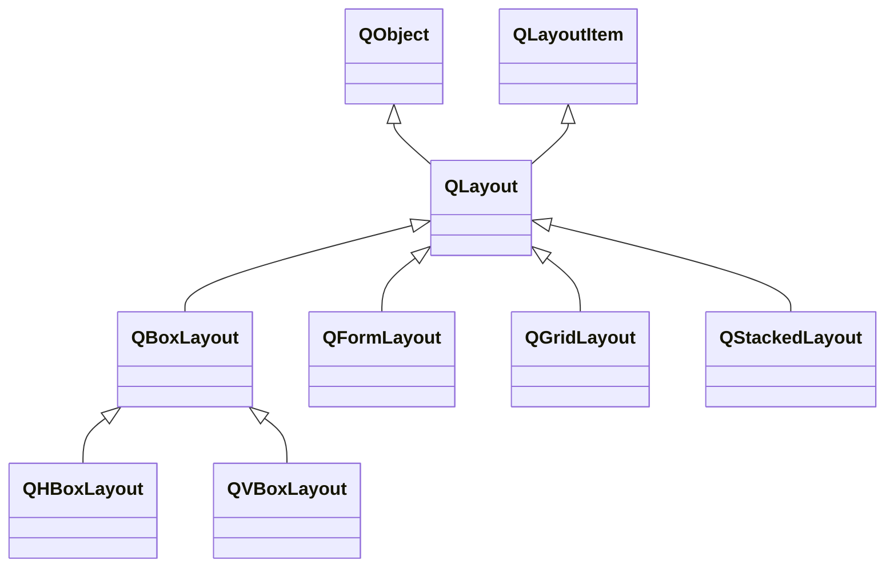

# Qt Layout

<u>Illustrate the class hierarchy and usage about layout classes of Qt. Examples using vbox, hbox and grid layout included.</u>

There are four common layout class for Qt: `QBoxLayout`, `QFormLayout`, `QGridLayout` and `QStackedLayout`, all of these are inherited from `QLayout`. Specially, `QBoxLayout` inherits `QHBoxLayout` and `QVBoxLayout`, we use these two instead of the parent class.

The `QHBoxLayout` and `QVBoxLayout` place widgets in one row/colum respectively, demonstrated in [qt_layout_hbox.cpp](qt_layout_hbox/qt_layout_hbox.cpp) and [qt_layout_vbox.cpp](qt_layout_vbox/qt_layout_vbox.cpp).

More generally, `QGridLayout` provides the power to place widgets based on $(x, y)$ gird coordinates system, and we can place one widget across multiple girds, demonstrated in [qt_layout_grid.cpp](qt_layout_grid/qt_layout_grid.cpp).

==TODO: Find what `QFormLayout` and `QStackLayout ` do==

==TODO: Find in which case we might use `QBoxLayour` directly==

