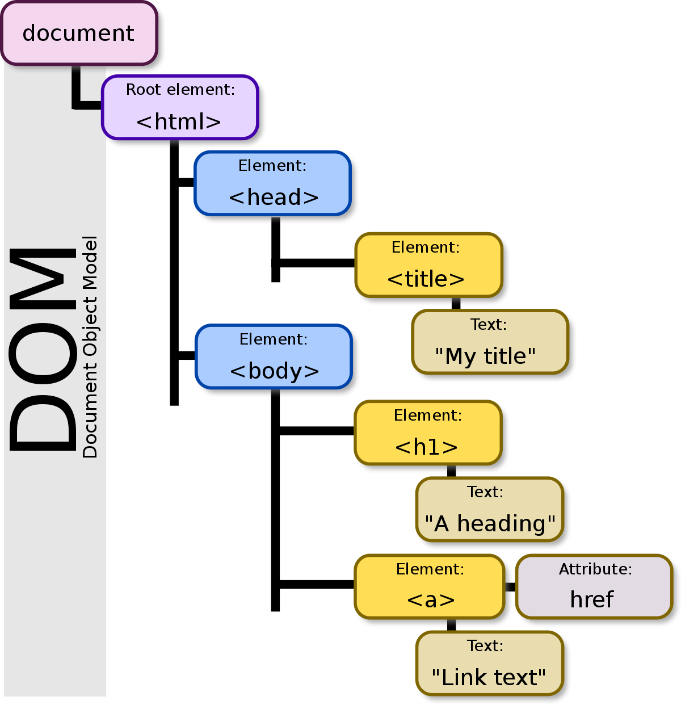

# Document Object Model

##### # DOM Definition

A HTML document is a tree of elements and text contents, and **Document Object Model(DOM)** represents each element as an object hence make the document an object tree, which provides a clear interface for modern programming langauge to process (most of the time, it's [JavaScript]()). When the HTML file is loaded, the corresponding DOM is constructed by browser.



The root of the entire DOM, which contains all elements of that HTML file, is `document` object.


##### # DOM Node Modification

To make modification to a HTML document, we must specify (1) which element and (2) what property to change and (3) to what value.

We use the `getelements?By` methods of node object to get the node objects with specical properties:

- `getElementById`
- `getElementsByClassName`
- `getElementsByTagName`
- `getElementsByName`

Since the ID of element is unique for the entire HTML document, `getElementById` returns the object with given ID directly, while the other three methods returns the object array.

You can invoke these methods to any node object, and to search the entire file, simply revoke those methods of `document` object.

Specically, when write JavaScript code inside label, we can use `this` to point to the current object. For instance

```html
<p onclick="this.innerHTML = 'Thank you!'"></p>
```

This change the content of current `<p>` when it is clicked.

For operation with more complexity, we can pass `this` object as a parameter into a function:

```html
<p onclick="hackMe(this)">Click to Hack!</p>
<script>
funciton hackMe(id) {
	id.innerHTML = "HACK!!!";
}
</script>
```

Since node is object, we can change the property of element by changing the JavaScript object. Formally, we access the property by `[node].[property_name]`, and change the property by `[node].[property_name] = [property_value]`. Specically, the `style` property will be automatically created as an object, by which we use `[node].style.[property_name]` to access and modify the style property.

The binding event can also be considered as a property, to access or bind some event to node, we simply use `[node].[event_name]`. Though straightforward, this approach is not common in JavaScript but adding the **event binding**. Refer to [html_event]() for the details.


##### # DOM Node Creation and Deletion

We can invoke the `createElement(tag)` and `createTextNode` method of `document` object to create element with empty content and the text content. Invoke the `appendChild` method of node to add child to it. For instance,


```html
<div id="div1"><p>first paragraph</p></div>
<script>
var div = document.getElementById("div1");
var p   = document.createElement("p");
var content = document.createTextNode("second paragraph");
p.appendChild(content);
div.appendChild(p);
</script>
```

`removeChild` method is provided to remove its child. Hence if we want to delete node itself, we must first get the parent node using `parentNode` method: `node.parentNode.removeChild(node)`.


