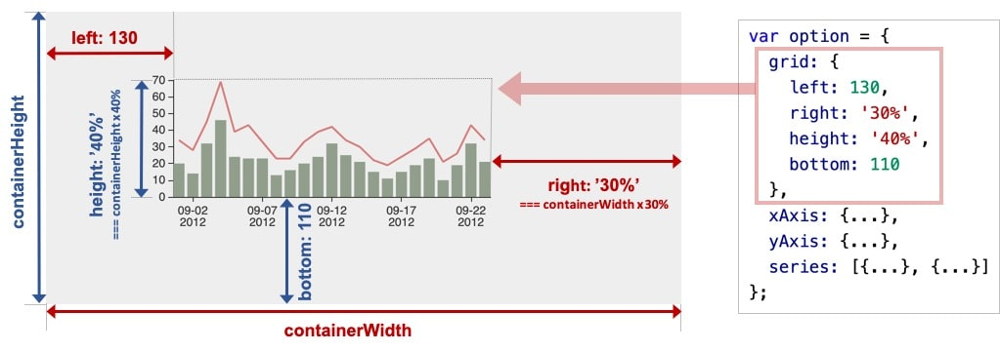

# Echarts

### 1. Configuration

Including `echarts` by CDN:

```html
<script src="https://cdn.bootcdn.net/ajax/libs/echarts/4.8.0/echarts-en.common.js"></script>
```


### 2. Basic Concepts and Framework

##### # Echarts Instance

我们可以使用一个DOM节点(通常用一个`div`)作为Echart的渲染容器, 在其上创建一个echarts实例. 每一个节点只能创建一个echarts实例.

```javascript
let container = document.getElementById('container');
let echart_instance = echarts.init(container);
```


##### # `component` and `option`

echarts实例中的各种图形内容称为组件`component`, 例如

|     Component Name      | Description                               |
| :---------------------: | ----------------------------------------- |
|     `xAxis, yAxis`      | $x, y$-axis in rectangular coordinates    |
| `angleAxis, radiusAxis` | $\theta, r$-axis in the polar coordinates |
|        `series`         | series, datas and their maps              |
|                         |                                           |

其中系列`series`是一种特殊的绘图组件, 我们将在单独的节点中详细描述其用法.  所有组件都以`option`对象的属性的形式予以注册. 同一类的组件构成一个数组.

```javascript
// echart instance initialization
let container = document.getElementById('container');
let echart_instance = echarts.init(container);

let option1 = {
    xAxis: [{...}, {...}],
    yAxis: [{...}, {...}],
    grid:  [{...}, {...}],
    series: [
        {type: 'line', data: [...]},
		{type: 'bar', data: [...]}
    ]
}

echart_instance.setOption(option1);
```

完成组件的注册以后就可以使用`setOption`方法按照给定的参数实际绘制所描绘的图表.


##### # `series`

echats中`series`表示一组数据以及它们所映射成的图. 一个系列至少包括以下三个要素:

- 一组数值`series[].data`.

- 图表类型`series[].type`. 例如折线图`line`, 柱状图`bar`, 饼图`pie`等等.

- 控制数值如何映射为图的参数.

举个例子

```javascript
let option = {
    xAxis: {
        data: [
            'Jan', 'Feb', 'Mar', 'Apr', 'May', 'Jun',
            'Jul', 'Aug', 'Sep', 'Oct', 'Nov', 'Dec'
        ]
    },
    yAxis: {},
    series: [{
        type: 'pie',
        center: ['65%', 60],
        radius: 35,
        data: [
            {name: 'XX', value: 52},
            {name: 'YY', value: 54},
            {name: 'ZZ', value: 42}
        ]}, {
            type: 'line',
            data: [34, 28, 45, 69, 39, 43, 33, 23, 23, 33, 39, 22]
        }, {
            type: 'bar',
            data: [20, 14, 32, 46, 24, 23, 23, 13, 16, 20, 24, 15]
        }
    ]
};
```

这里我们创建了三个`series`, 第一个`series`的三个要素体现为

- 数值`series[0].data: [{name: 'XX', value: 52}, ...]`
- 图表类型`series[0].type: 'pie'`规定了图形为饼图.
- 图形控制性参数`series[0].center: ['65%', 60], radius: 35`. 分别饼图的圆心和半径.


许多时候从数据库中取出的`data`被存在一个独立的结构中, 如果要手动分配到各个`serise`无疑稍显繁琐, 我们也可以将让`series`到独立的`dataset.source`结构中去获取数据:

```javascript
var option = {
    xAxis: {type: 'category'},
    yAxis: {},
    dataset: {
        source: [
            ['Jan', 34, 20, 'XX', 52],
            ['Feb', 28, 14, 'YY', 54],
            ['Mar', 45, 32, 'ZZ', 42],
            ['Apr', 69, 46],
            ['May', 39, 24],
            
        ]
    },
    series: [
        {
            type: 'pie',
            center: ['65%', 60],
            radius: 35,
            encode: {itemName: 3, value: 4}
        }, {
            type: 'line',
            encode: {x: 0, y: 1}
        }, {
            type: 'bar',
            encode: {x: 0, y: 2}
        }
    ]
};
```


##### # Component Locating

组建可以使用`top/down/height, left/right/width`系列属性来进行绝对定位, 绝对定位基于echarts容器DOM节点. 属性值可以是像素值或相对于容器的百分比. 注意以上两组属性每组最多只需要指定两个即可自动确定第三个.

右图给出了`grid`(直角坐标系底板)的定位实例.


##### # Coordinates System

许多图形通常都需要绘制在坐标系上, echarts支持以下的坐标系

| Coordinates System | Description |
| :----------------: | :---------: |
|                    | 直角坐标系  |
|                    |  极坐标系   |
|                    | 地理坐标系  |
|                    | 单轴坐标系  |
|                    | 日历坐标系  |

一个坐标系通常由多个组件协作构成, 例如直角坐标系由`xAxis/yAxis/grid`三种组件构成, 但没有特殊要求时我们不需要显式注册`grid`. 在下面这个例子中echarts会自动创建`grid`并且为`series`创建关联引用.

```javascript
var option = {
    xAxis: {},
    yAxis: {},
    series: {
        type: 'scatter',
        data: [
            [13, 44],
            [51, 51],
            [51, 32],
            [61, 19],
            [19, 33]
        ]
    }
}
```

当存在多个`yAxis`共享一个`xAxis`时, 我们则需要在`series`的属性中使用`yAxisIndex`来手动指定每一个`series`所对应的`yAxis`. 注意在这个例子中, 由于所需要的直角坐标底板只有一个, 我们仍然没有显式注册`grid`.

```javascript
var option = {
    xAxis: {
        data: ['Mon', 'Tue', 'Wed', 'Thu', 'Fri', 'Sat', 'Sun']
    },
    yAxis: [{
        {...},
    	{...}
    }],
    series: [{
        type: 'bar',
        data: [242, 344, 324, 475, 264, 467, 531],
        yAxisIndex: 0
    }, {
        type: 'line',
        data: [44, 51, 32, 19, 33, 24, 12]
        yAxisIndex: 1
    }]
};
```

最后, 一般地, 在复杂图形中我们通过`xAxisIndex, yAxisIndex, girdIndex`属性来将各个组件和系列联系到一起: 

==TODO: Complete the codes.==

```javascript
var option = {
    dataset = {source: [...]},
    gird: [
        {top: 40, bottom: '58'},
        {top: '58%', bottom: 40}
    ]
}
```


