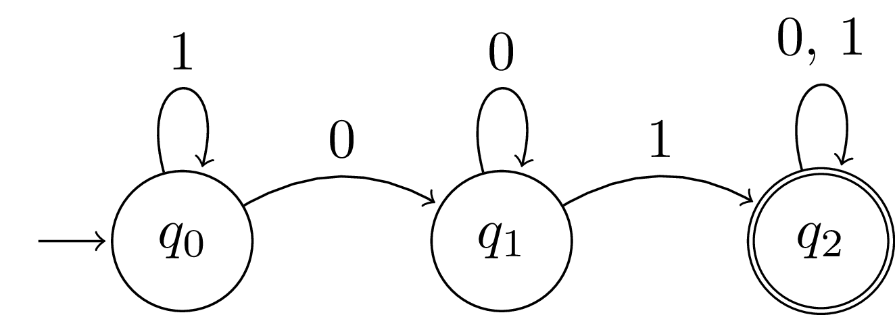

# Deterministic Finite Automaton

##### # DFA: Definition

A **deterministic finite automaton** is a five-tuple pair $A = (Q, \Sigma, \delta, q_0, F)$:

1. A finite set of states $Q$.
2. A finite set of input symbols $\Sigma$.
3. A start state $q_0 \in Q$.
5. A set of **final (accpeting) states** $F\sub Q$.
5. A **transition function** $\delta$ that takes a state and an input as arguments symbol and returns a state.

**Transition diagram** and **transition table** are two preferred notations for describing automata which provides better intuitive.

For instance, consider language
$$
L = \{\omega \mid x01y,~ x,y\in\{0, 1\}^* \}
$$
The five-tuple are $A = (\{q_0, q_1, q_2\}, \{0, 1\}, \delta, q_0, \{q_2\})$, where the $\delta$ can be given by
$$
\delta(q_0, 0) = q_1    \qquad
\delta(q_0, 1) = q_0    \qquad \\
\delta(q_1, 0) = q_0    \qquad
\delta(q_1, 1) = q_2    \qquad \\
\delta(q_2, 0) = q_2    \qquad
\delta(q_2, 1) = q_2    \qquad \\
$$

This can be simplified to transition table:

|       |  $0$  |  $1$  |
| :---: | :---: | :---: |
| $q_0$ | $q_1$ | $q_0$ |
| $q_1$ | $q_0$ | $q_2$ |
| $q_2$ | $q_2$ | $q_2$ |

and visualized as transition diagram:

