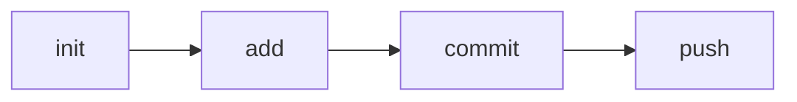

# Git

### 1. Core Workflow

##### # Core Workflow

The typical scenario in git workflow:



1. `git init` initialize the current dictionary into a git repository.
2. `git add [filename]` add make given files under version tracking. The added files will be at **stage**.
3. `git commit` submit the modifications in stage.
4. `git push` push the current repository into remote server. You need to configure the corresponding git repository on the server before `git push`.


##### # Status Query

Use `git status` to query the current status of git repository. There are several possible states:

1. Clean. The message looks like

    ```git
    On branch master
    Your branch is up to date with 'origin/master'.
    
    nothing to commit, working tree clean
    ```

2. There is change in working space but has not been staged.
3. All the change in working space has been staged.


