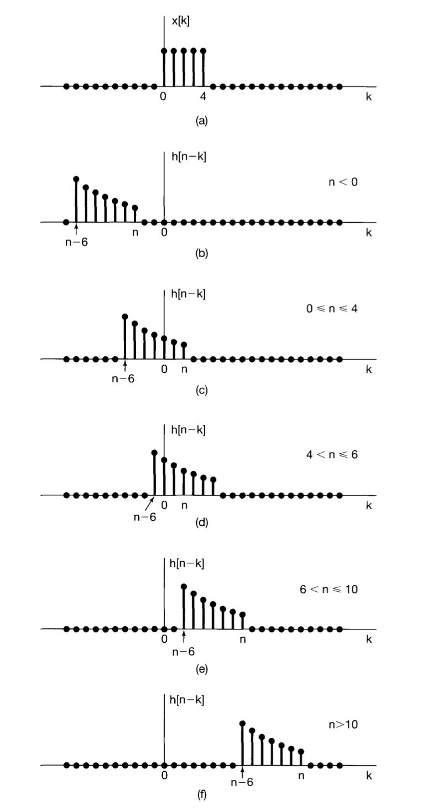

# Convolution

### Convolution Sum

##### # Impulse Representation

By ultilizing the **sifting property** of the unit impulse $\delta[n]$, we can represent any discrete signal by the combination of the function value in each point:

$$
x[n] = \sum_{k=-\infty}^{+\infty} x[k]\delta[n-k]
$$

The signal set of all time shifting of $\delta[n]$ is **orthogonal**:

$$
\delta[n-k]\delta[n-m] =
\left\{
\begin{array}{ll}
\begin{align}
& 1, ~~~~ k=m \\
& 0, ~~~~ k\neq m
\end{align}
\end{array}
\right.
$$

##### # Unit Impulse Sample Response 

The **unit impulse sample respone** $h_0[n]$, is defined as the response to the unit impluse **at** $n=0$, aka. $\delta[n]$. Generally, the notation $h_k[n]$ represents to the response to unit impluse at $n=k$. In the general case, those $h_k[n]$ are irrelevant with each other, while if the system is time-invariant, then the arbritary response $h_k[n]$ is simply the translation of $h_0[n]$. 

i.e. if the response of the impulse $\delta[n]$ in some LTI system $h_{0}[n]$ is 

$$
h_{0}[n] = 
\left\{
\begin{array}{ll}
	\begin{align}
		& 1, ~~~~ n = a, \\
		& 0, ~~~~ n \neq a,
	\end{align}
\end{array}
\right.
$$

then due to the **time-irrelevance** of system, the response to $\delta[n-k]$ (the impluse at $n=k$) must be

$$
h_{k}[n-k] = 
\left\{
\begin{array}{ll}
	\begin{align}
		& 1, ~~~~ n-k = a, \\
		& 0, ~~~~ n-k \neq a,
	\end{align}
\end{array}
\right.
$$

aka.

$$
h_{k}[n] = 
\left\{
\begin{array}{ll}
	\begin{align}
		& 1, ~~~~ n = a+k, \\
		& 0, ~~~~ n \neq a+k,
	\end{align}
\end{array}
\right.
$$

As noticed, the response moves towards the same direction and steps in $x$-axis.

Moreover, due to the **linearity** of system, if the impulse multiple some cofficient $c$, the response must also be the $c$ times. 

##### # Convolution Sum: Definition

Combining the impulse representation and the property of LTI system, we first represent the discrete into infinity sum:

$$
x[n] = \sum_{k=-\infty}^{+\infty} x[k]\delta[n-k]
$$

And due to LTI:

$$
y[n] = \sum_{k=-\infty}^{+\infty} x[k]h_0[n-k]
$$

which is defined as the **convolution sum** or **superposition sum** of $x[n]$ and $h[n]$, denoted as

$$
y[n] = x[n] * h[n]
$$

The convolution sum shows an important fact about the LTI system: the response to any input can be represented by the response to unit impulse sample.

Though the infinity sum seems scary, the idea of it is simple, take $n=1$ as an example:

$$
y[n] = \cdot\cdot\cdot + x[-1]h_{0}[n-(-1)] + x[0]h_{0}[n-0] + x[1]h_{0}[n-1] + x[2]h_{0}[n-2] + \cdot\cdot\cdot
$$

Why the value of response at $t=n$ is constructed by these items? Say, item $x[1]h_{0}[n-1]$, is the product of the value of input signal at time $t=1$, and, the response of the unit impulse at $n-1$, this is becasue of this signal $x[1]$ is activated in $n-1$ seconds before. The fact $k+(n-k) = n$ for each term in the sum reflects the simple fact: "Some event happened in time $k$ takes $n-k$ time to get the current time $n$".

##### # Computation of Convolution Sum

The definition of convolution sum requires the 

Steps of the computation of convolution sum:

1. Change of variable.

2. Reverse and translation. ("Convolute")

3. Product.

4. Sum.

Here an example is given to illustrate this process:

To actually do the computation by an intitutive approach, we use the "offset graph" technique, which is illustrated by the following example.

Example 1. Compute the convolution sum of the following two sequences:

$$
x[n] = 
\left\{\begin{array}{ll}\begin{align}
&1, ~~~~ 0\le n \le4 \\
&0, ~~~~ \mathrm{otherwise}
\end{align}\end{array}\right.
$$

and the unit response

$$
h[n] = 
\left\{\begin{array}{ll}\begin{align}
&\alpha^n, ~~~~ 0\le n \le6 \\
&0, ~~~~ \mathrm{otherwise}
\end{align}\end{array}\right.
$$

where $\alpha$ is some positive number.

### Convolution Integral

The convolution integral is the continous version of convolution sum,

##### # Computation of Convolution Integral

Steps of the computation of convolution integral is similar to the convolution sum:

1. Change of variable.

2. Reverse and translation.

3. Product.

4. Integrate.

### Property of Convolution

The property of convolution discussed in this section is appropriate for both the convolution sum and integral due to their isomorphism, we'll only provide proofs for the discrete case.

1. commutativity

$$
x[t] * h[t] = h[t] * x[t]
$$

> Proof. Based on the definition of convolution,
>
> $$
> x[n] * h[n] = \sum_{k=-\infty}^{\infty}x[k]h[n-k] = \sum_{k=-\infty}^{\infty}x[n-k]h[k] = h[n] * x[n]
> $$

Intutively, the convolution is no more than the sum of function $x[n], h[n]$, with all the sum of variables the same.

