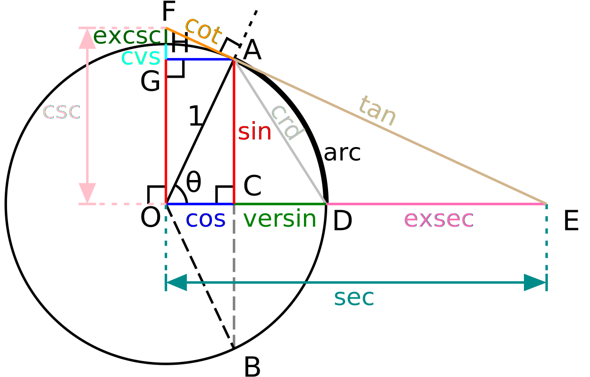

# Trigonometric Functions

### 1. Definition

##### # Definition in Right-angled Triangle

在直角三角形中,  基于相似性我们知道, 各个边的比值仅取决于锐角的角度, 我们定义一个角$\angle A$的对边与斜边之比值为$\angle A$的**正弦(sine)**
$$
\sin A = \frac{a}{c}
$$
定义$\angle A$的邻边与斜边之比值为$\angle A$的**余弦(cosine)**
$$
\cos A = \frac{b}{c}
$$
$\angle A$的对边与邻边之比为$\angle A$的**正切(tangent)**
$$
\tan A = \frac{a}{b}
$$
基于直角三角形定义的三角函数定义域只在锐角$\left(0, \dfrac{\pi}{2}\right)$范围内, 因而也称为**锐角三角函数(trigonometric functions of acute angle)**. 定义了锐角三角函数后, 由于锐角三角函数值可以被预先计算, 我们就可以在直角三角形中基于一条边和一个角度来确定其他的边角大小.

##### # Definition by Unit Circle

在平面直角坐标系中, 以原点为圆心, 单位长度为半径的圆称为**单位圆(unit circle)**. 对于端点在原点且始边与$x$轴的非负半轴重合的角$\alpha$, 其终边和单位圆交点$(x,y)$的纵坐标$y$定义为角$\alpha$的正弦$\sin\alpha$, 横坐标$x$定义为角$\alpha$的**余弦(cosine)** $\cos\alpha$, 纵横坐标之比$\dfrac{y}{x}$定义为角$\alpha$的**正切(tangent)** $\tan\alpha$. 

容易得到, 正弦函数和余弦函数的定义域为实数集$\mathbb{R}$, 值域均为$[-1, 1]$. 而正切函数的定义域为$\left\{ x \middle| x\neq k\pi + \dfrac{\pi}{2} \right\}$, 值域为$\mathbb{R}$.

##### # Definition by Series

现代三角学使用级数方法定义三角函数值
$$
\sin x
= \sum_{n=0}^\infty \frac{(-1)^nx^{2n+1}}{(2n+1)!}
= x - \frac{x^3}{3!} + \frac{x^3}{5!} - \frac{x^7}{7!} + \cdots
$$

$$
\cos x
= \sum_{n=0}^{\infty}\frac{(-1)^nx^{2n}}{(2n)!}
= 1 - \frac{x^2}{2!} + \frac{x^4}{4!} - \frac{x^6}{6!} + \cdots
$$

其中$x$的定义域延拓到全体复数$\mathbb{C}$.

##### # Graph

##### # Values

|          |            $\sin$            |            $\cos$            |       $\tan$        |
| :------: | :--------------------------: | :--------------------------: | :-----------------: |
|   $0$    |             $0$              |             $1$              |         $0$         |
| $\pi/12$ |  $\dfrac{\sqrt6-\sqrt2}{4}$  |  $\dfrac{\sqrt6+\sqrt2}{4}$  |     $2-\sqrt3$      |
| $\pi/8$  | $\dfrac{\sqrt{2-\sqrt2}}{2}$ | $\dfrac{\sqrt{2+\sqrt2}}{2}$ |     $\sqrt2-1$      |
| $\pi/6$  |        $\dfrac{1}{2}$        |     $\dfrac{\sqrt3}{2}$      | $\dfrac{\sqrt3}{3}$ |
| $\pi/4$  |    $\dfrac{\sqrt{2}}{2}$     |    $\dfrac{\sqrt{2}}{2}$     |         $1$         |

### 2. Property of Trigonometric Functions

##### # Relation Between Same Angles

根据定义容易得到以下两条性质: 
$$
\sin^2\alpha + \cos^2\alpha = 1, ~~~~ \tan\alpha = \dfrac{\sin\alpha}{\cos\alpha}
$$
根据以上两条性质可以得到一些常用的推论: 
$$
(\sin\alpha \pm \cos\alpha)^2 = 1 \pm 2\sin\alpha\cos\alpha = 1 \pm \sin2\alpha \\
\tan^2\alpha + 1 = \frac{1}{\cos^2\alpha} = \csc^2 \alpha
$$

##### # Deduction Formula

注意到$\alpha\pm 2k\pi$的终边与$\alpha$的终边重合, 因而有
$$
\sin(\alpha\pm 2k\pi) = \sin \alpha, ~~~~
\cos(\alpha\pm 2k\pi) = \cos \alpha, ~~~~
\tan(\alpha\pm k\pi) = \tan \alpha
$$
这意味着正弦函数和余弦函数的周期为$2k\pi$, 最小正周期为$2\pi$, 正切函数的周期为$k\pi$, 最小正周期为$\pi$.

基于单位圆关于$x$轴、$y$轴和原点$O$的对称性, 我们有
$$
\sin(-\alpha) = -\sin\alpha, ~~~~ \cos(-\alpha) = \cos\alpha, ~~~~ \tan(-\alpha) = \tan\alpha \\
\sin(\pi-\alpha) = \sin\alpha
$$
注意到三角函数的定义域都关于原点对称, 因此前三条诱导公式意味着正弦函数和正切函数是奇函数, 余弦函数是偶函数.

\3. 三角不等式

高中阶段有一个常见的锐角三角不等式: 对于第一象限角$x\in(0, \pi/2)$有

$$
\sin x < x < \tan x
$$
这个结论可以通过三角函数线和面积法(或直接求导)证明. 该不等式的重要意义之一在于, 作函数图像时应注意$\sin x$的图线在第一象限始终位于直线$y=x$之下, 第三象限则始终位于直线$y=x$之上. 

请注意我们在作诱导变形的时候想的完全不是上述公式, 而是:

1. $2\pi$随便加随便去.
2. 只有正弦函数才能直接取补角, 只有余弦函数才能直接去掉负号, 只有正切函数才能直接去掉一个$\pi$, 而其他的函数进行相应的变换必须添上负号.
3. 正余弦想要变成对方只要取余角就可以了, 但如果想通过从正余弦里扣掉$\pi/2$变异名的话, 请注意其中余变正是要加负号的(和求导时的情况一样). 

\5. 函数[img]

容易证明, 该函数定义域为[img], 值域为[img]

