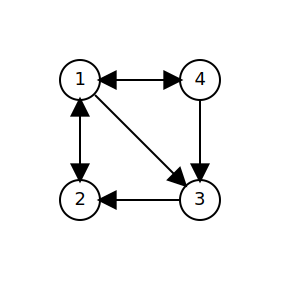

# Matrix

### 1. Matrix Definition

##### 1.1 Matrix Definition

由 $m \times n$ 个数排列成的 $m$ 行 $n$ 列的矩形数表称为 $m$ 行 $n$ 列矩阵, 简称 $m \times n$ 矩阵, 记作 $\boldsymbol{A}_{m \times n}$ , 通常也省略下标只记作 $\boldsymbol{A}$. 只有方阵能够计算行列式.

$$
\boldsymbol{A}=\left(\begin{array}{cccc}
a_{11} & a_{12} & \ldots & a_{1 n} \\
a_{21} & a_{22} & \ldots & a_{2 n} \\
\ldots & \ldots & \ldots & \ldots \\
a_{m 1} & a_{m 2} & \ldots & a_{m n}
\end{array}\right)
$$

这 $m \times n$ 个数称为矩阵的元素, 简称元. 数 $a_{i j}$ 位于矩阵 $\boldsymbol{A}$ 的第 $i$ 行第 $j$ 列, 称为矩阵 $\boldsymbol{A}$ 的 $(i, j)$元. 以 $a_{i j}$ 为 $(i, j)$ 元的矩阵又可以记作 $\left(a_{i j}\right)_{m \times n}$ 或 $\left(a_{i j}\right)$.

元素是实数的矩阵称为实矩阵, 是复数的矩阵称为复矩阵. 行数和列数都等于 n 的矩阵称为 $\boldsymbol{n}$ 阶矩阵或 $\boldsymbol{n}$ 阶方阵 $\boldsymbol{A}_{n \times n}$ , 简记作 $\boldsymbol{A}_{n}$ .

只有一行的矩阵

$$
\boldsymbol{A}=\left(\begin{array}{llll}
a_{1} & a_{2} & \ldots & a_{n}
\end{array}\right)
$$

称为行矩阵或行向量, 为避免元素之间的混淆, 行矩阵也记作

$$
\boldsymbol{A}=\left(a_{1}, a_{2}, \ldots, a_{n}\right)
$$

只有一列的矩阵

$$
\boldsymbol{B}=\left(\begin{array}{c}
b_{1} \\
b_{2} \\
\ldots \\
b_{m}
\end{array}\right)
$$

称为列矩阵或列向量, 事实上向量一般写成列向量的形式, 出于节省空间的目的印刷时尝尝利用转置符号来将列向量写作一行的形式

$$
\boldsymbol{B}^{\boldsymbol{T}}=\left(b_{1}, b_{2}, \ldots, b_{n}\right)
$$

除主对角线外的元素都是零的 $n$ 阶方阵

$$
\Lambda=\left(\begin{array}{cccc}
\lambda_{1} & 0 & \ldots & 0 \\
0 & \lambda_{2} & \ldots & 0 \\
\ldots . & \ldots & \ldots . & \ldots \\
0 & 0 & \ldots & \lambda_{n}
\end{array}\right)
$$

称为对角矩阵, 简称对角阵. 简记作

$$
\Lambda=\operatorname{diag}\left(\lambda_{1}, \lambda_{2}, \ldots, \lambda_{n}\right)
$$

对角线上元素都相等的对角矩阵称为纯量阵. 特别地, 对角线上元素都等于1的纯量阵称为单位矩阵 $\boldsymbol{E}_{\boldsymbol{n}}$, 简称单位阵.

##### 1.2 Matrix Interpretation

###### 1.2.1 矩阵作为线性方程组

两个矩阵的行数相等、列数也相等时, 称它们是同型矩阵. 如果对应两个同性矩阵的对应元素都相等, 则称这两个矩阵相等, 记作 $\boldsymbol{A}=\boldsymbol{B}$ . 元素都是零的矩阵称为零矩阵, 记作 $\boldsymbol{O}$ . 注意不同型的零矩阵是不同的.

对于非齐次线性方程组

$$
\left\{\begin{array}{c}
a_{11} x_{1}+a_{12} x_{2}+\cdots+a_{1 n} x_{n}=b_{1} \\
a_{21} x_{1}+a_{22} x_{2}+\cdots+a_{2 n} x_{n}=b_{2} \\
\cdots \\
a_{m 1} x_{1}+a_{m 2} x_{2}+\cdots+a_{m n} x_{n}=b_{m}
\end{array}\right.
$$

定义 $\boldsymbol{A}=\left(a_{i j}\right)$ 为系数矩阵,  $\boldsymbol{x}^{\mathbf{T}}=\left(x_{i}\right)$ 为未知数矩阵,  $\boldsymbol{b}^{\mathbf{T}}=\left(b_{i}\right)$ 为常数项矩阵, 将系数矩阵和常数项矩阵合并得到的矩阵 $\boldsymbol{B}$ 称为增广矩阵.

###### 1.2.2 矩阵作为线性变换

对于 n 个自变量 $x_{1}, x_{2}, \ldots x_{n}$ 和 m 个因变量 $y_{1}, y_{2}, \ldots y_{m}$ 之间的关系, 其中 $a_{i j}$ 是和 $x_{k}$ 无关的常数

$$
\left\{\begin{array}{c}
y_{1}=a_{11} x_{1}+a_{12} x_{2}+\cdots+a_{1 n} x_{n} \\
y_{2}=a_{21} x_{1}+a_{22} x_{2}+\cdots+a_{2 n} x_{n} \\
\cdots \\
y_{m}=a_{m 1} x_{1}+a_{m 2} x_{2}+\cdots+a_{m n} x_{n}
\end{array}\right.
$$

称为一个从 $x_{1}, x_{2}, \ldots x_{n}$ 到 $y_{1}, y_{2}, \ldots y_{m}$ 的线性变换. 线性变换的系数 $a_{i j}$ 构成一个矩阵, 称为系数矩阵. 线性变换和矩阵之间存在一一映射. 因此我们可以利用矩阵研究线性变换, 或利用线性变换解释矩阵的含义.  $m \times n$ 矩阵表示一个从 n 维空间到(不超过) m 维空间的线性变换, 特别地,  n 阶方阵代表一个(不超过) n 维空间中的线性变换. 例如二阶方阵

$$
\left(\begin{array}{ll}
1 & 0 \\
0 & 0
\end{array}\right)
$$

对应线性变换

$$
\left\{\begin{array}{l}
x^{\prime}=x \\
y^{\prime}=0
\end{array}\right.
$$

这表示一个平面内把向量 $\binom{x}{y}$ 变换为 $\binom{x \prime}{y_{\prime}}=\binom{x}{0}$ 的变换, 即在 x 轴上的投影变换.
矩阵

$$
\left(\begin{array}{cc}
\cos \varphi & -\sin \varphi \\
\sin \varphi & \cos \varphi
\end{array}\right)
$$

表示以原点为中心逆时针旋转 $\varphi$ 角的旋转变换.

###### 1.2.3 矩阵作为图

对于有向图, 可以 $a_{i j}$ 表示由顶点 $i$ 到顶点 $j$ 的箭头数量, 例如如图所示的有向图可表示为

$$
\boldsymbol{A}=\left(\begin{array}{llll}
0 & 1 & 1 & 1 \\
1 & 0 & 0 & 0 \\
0 & 1 & 0 & 0 \\
1 & 0 & 1 & 0
\end{array}\right)
$$

### 2. 矩阵的运算

##### 2.1 线性运算

设有两个 $m \times n$ (同型)矩阵 $\boldsymbol{A}=\left(a_{i j}\right)$ 和 $\boldsymbol{B}=\left(b_{i j}\right)$ , 两个矩阵的和 $\boldsymbol{A}+\boldsymbol{B}$ 规定为它们对应位置上元素之和, 即 $\boldsymbol{A}+\boldsymbol{B}=\left(a_{i j}+b_{i j}\right)$ . 只有当两个矩阵同型是才能进行加法运算. 容易证明矩阵的加法满足交换律和结合律.

数 $\lambda$ 与矩阵 $\boldsymbol{A}$ 的积记作 $\boldsymbol{\lambda} \boldsymbol{A}$ 或 $\boldsymbol{A} \boldsymbol{\lambda}$ , 规定为矩阵 $\boldsymbol{A}$ 每一个元素和 $\lambda$ 相乘所得新矩阵. 容易证明数乘矩阵满足结合律和两项分配律.

$-\boldsymbol{A}$ 称为矩阵 $\boldsymbol{A}$ 的负矩阵, 显然有 $\boldsymbol{A}+(-\boldsymbol{A})=\boldsymbol{O}$ , 规定矩阵的减法 $\boldsymbol{A}-\boldsymbol{B}=\boldsymbol{A}+(-\boldsymbol{B})$ . 矩阵的加减法和数乘运算统称为矩阵的线性运算.

##### 2.2 矩阵乘法

设 $\boldsymbol{A}=\left(a_{i j}\right)$ 是一个 $m \times s$ 矩阵,  $\boldsymbol{B}=\left(b_{i j}\right)$ 是一个 $s \times n$ 矩阵, 规定两个矩阵之积 $\boldsymbol{A} \boldsymbol{B}$ 是一个 $m \times n$ 矩阵 $\boldsymbol{C}=\left(c_{i j}\right)$ , 其中

$$
c_{i j}=\sum_{k=1}^{s} a_{i k} b_{k j}
$$

特别地, 一个 $1 \times s$ 行矩阵和一个 $s \times 1$ 列向量的积是一个一阶方阵, 也就是一个数

$$
c_{i j}=\left(a_{1}, a_{2}, \ldots, a_{s}\right)\left(\begin{array}{c}
b_{1} \\
b_{2} \\
\ldots \\
b_{s}
\end{array}\right)=\sum_{k=1}^{s} a_{k} b_{k}
$$

因此: 矩阵 $\boldsymbol{C}$ 的 $i, j)$ 元 $c_{i j}$ 可以视为 $\boldsymbol{A}$ 的第 $i$ 行和 $\boldsymbol{B}$ 的第 $j$ 列之积.

矩阵中必须注意的是矩阵相乘的顺序,  $\boldsymbol{A B}$ 称为 $\boldsymbol{A}$ 左乘 $\boldsymbol{B}$ , 而 $\boldsymbol{B} \boldsymbol{A}$ 称为 $\boldsymbol{A}$ 右乘 $\boldsymbol{B}$ , 左矩阵的列数必须等于右矩阵的行数. 当 $\boldsymbol{A} \boldsymbol{B}$ 有意义时 $\boldsymbol{B} \boldsymbol{A}$ 未必有意义, 当且仅当 $\boldsymbol{A}$ 是 $m \times n$ 矩阵且 $\boldsymbol{B}$ 为 $n \times m$ 矩阵时二者同时有意义, 并且两次相乘分别会得到 $m \times m$ 的方阵和 $n \times n$ 的方阵. 特别的, 同型方阵的乘法始终有意义, 并且交换相乘顺序以后得到的方阵是同型的.

矩阵乘法一般不满足交换律, 对于两个方阵 $\boldsymbol{A}$ 和 $\boldsymbol{B}$ , 如果 $\boldsymbol{A B}=\boldsymbol{B} \boldsymbol{A}$ , 则称两个方阵是可交换的.

两个矩阵都不为零矩阵的情况下可以相乘得到零矩阵, 因此从 $\boldsymbol{A B}=\boldsymbol{O}$不能得到 $\boldsymbol{A}=\boldsymbol{O}$ 或 $\boldsymbol{B}=\boldsymbol{O}$ 的结论.

矩阵乘法虽然不满足交换律, 但满足结合律和分配律.

特别地, 对于单位矩阵容易验证
$$
\boldsymbol{E}_{m} \boldsymbol{A}_{m \times n}=\boldsymbol{A}_{m \times n} \boldsymbol{E}_{n}=\boldsymbol{A}_{m \times n}
$$

或简写成
$$
E A=A E=A
$$

因此单位矩阵 $\boldsymbol{E}$ 在矩阵乘法中起到单位元的作用.

根据数乘的定义可知纯量阵可以写作数 $\lambda$ 和单位阵的积 $\lambda \boldsymbol{E}$ , 由 $(\boldsymbol{\lambda} \boldsymbol{E}) \boldsymbol{A}=\boldsymbol{A}(\boldsymbol{\lambda})=\lambda \boldsymbol{E}$ 可知纯量阵 $\boldsymbol{\lambda} \boldsymbol{E}$ 与矩阵 $\boldsymbol{A}$ 的积就相当于数 $\boldsymbol{\lambda}$ 与 $\boldsymbol{A}$ 的积．特别地, 当 $\boldsymbol{A}$ 为 n 阶方阵时有
