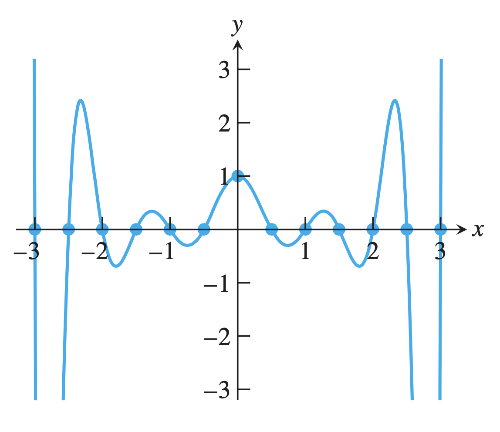

# Interpolation

### 1. Interpolation Introduction

For the continous function $f(x)$ defined in $[a,b]$, points $x_0, x_1, \ldots , x_n$ are $n+1$ different points in $[a,b]$, $\varPhi$ is some function class, if $\phi(x)\in\varPhi$ meets
$$
\phi(x_i) = f(x_i), \quad i=0,1,\ldots, n
$$
we say $\phi(x)$ is the **interpolation function** of $f(x)$ in $\varPhi$ about $x_0, x_1, \ldots, x_n$. 

Polynomial function is continuous in infinite degree of derivative, and its derivative/integral are easy to compute, hence we usually use the polynomial as the interpolation function.

### 2. Lagrange Interpolation

##### # Uniqueness of Interpolation Polynomial

The polynomial with $n$-degree
$$
P_n(x)
= \sum_{i=0}^n a_ix^i
= a_0 + a_1x + a_2x^2 + \cdots a_nx^n
$$
is determined by the $n+1$ coefficients $a_i(0\le i\le n)$. If $n+1$ points are given, the polynomial is determined by the equations

$$
\left\{\begin{array}{ll}
a_0 + a_1x_0 + a_2x_0^2 + \cdots + a_nx_0^n = f(x_0) & \\
a_0 + a_1x_1 + a_2x_1^2 + \cdots + a_nx_1^n = f(x_1) & \\
~~~~~~~~~~~~~~~~~~~~~~~~~~~~~~~~~~~\cdots \\
a_0 + a_1x_n + a_2x_n^2 + \cdots + a_nx_n^n = f(x_n)
\end{array}\right.
$$
To solve this equation, we compute its coefficient determinant, which happens to be the [Vandermonde determinant](/Users/rex/Library/Mobile Documents/com~apple~CloudDocs/skill/notes/formal_science/math/algebra/linear_algebra/determinant/Vandermonde_determinant/Vandermonde_determinant.md):
$$
V(x_0, x_1, \ldots, x_n) =
\begin{vmatrix}
1 & x_0 & x_0^2 & \cdots & x_0^n \\
1 & x_1 & x_1^2 & \cdots & x_1^n \\
\vdots & \vdots & \vdots & \ddots & \vdots \\
1 & x_n & x_n^2 & \cdots & x_n^n \\
\end{vmatrix}
= \prod_{0\le k\le i\le n}(x_i - x_j)
$$
For different $x_i, 0\le i\le n$, the value of determinant $\prod_{0\le k\le i\le n}(x_i - x_j) \neq 0$, hence there's one and only one solution. That is, the **interpolation polynomial is unique**.

##### # General Form of Lagrange Interpolation

This approach requires solving the equations, with complexity $O(n^3)$. Instead, it is possible to construct the polynomial directly from the points, one proven method is the Lagrange interpolation (the proof is omitted here):
$$
l_i(x)
= \prod_{j=0\\j\neq i}^n \frac{x-x_j}{x_i-x_j}
= \frac{(x-x_0)\cdots(x-x_{i-1})(x-x_{i+1})\cdots(x-x_n)}{(x_i-x_0)\cdots(x_i-x_{i-1})(x_i-x_{i+1})\cdots(x_i-x_n)}
$$

$$
L_n(x)
= \sum_{i=0}^n l_i(x)f(x_i)
= \sum_{i=0}^n \prod_{j=0\\j\neq i}^n \frac{x-x_j}{x_i-x_j}f(x_i)
$$
The **base function** are orthogonal:
$$
l_i(x_j) = \delta_{ij} =
\left\{\begin{array}{ll}
1,& i=j & \\
0,& i\neq j&
\end{array}\right.
$$

Refer to [Lagrange_interpolation.cpp](src__Lagrange_interpolation/Lagrange_interpolation.cpp) for the C++ implementation of Lagrange interpolation.

##### # Special Form of Lagrange Interpolation

Specically, For the linear Lagrange interpolation, we have
$$
L_1(x) = \frac{x-x_1}{x_0-x_1}f(x_0) + \frac{x-x_1}{x_0-x_0}f(x_1)
$$
The remainder term
$$
R(x) = f(x) - L_1(x) = \frac{f''(\xi)}{2!}(x-x_0)(x-x_1), ~~~~ \xi\in[a,b]
$$

> **Proof.** For $R(x) = f(x) - L_1(x)$, since $f(x_0) = L_1(x_0), f(x_1) = L_1(x_1)$, we have $R(x_0) = R(x_1) = 0$. Let
> $$
> R(x) = k(x)(x-x_0)(x-x_1)
> $$
> Construct the difference
> $$
> \Psi(t) = f(t) - L_1(t) - k(x)(t-x_0)(t-x_1)
> $$
> we have $\Psi(x_0) = \Psi(x_1) = \Phi(x) = 0$, without loss of generality, assume $x_0<x<x_1$, applying Rolle's theorem in section $[x_0, x]$ and $[x, x_1]$, we have $\Psi(\xi_1) = \Psi(\xi_2) = 0$, where $\xi_1\in[x_0, x], \xi_2\in[x, x_1]$. Applying Rolle's theorem to $\Psi'(t)$ in section $[\xi_1, \xi_2]$, we have $\Psi''(\xi)=0$, where $\xi\in[\xi_1,\xi_2]$.
>
> Substitute $t$ with $\xi$,
> $$
> \begin{align}
> f''(t) - 2!k(x) &= \Psi''(t) \\
> f''(t) - 2!k(x) &= 0 \\
> k(x) &= \frac{f''(\xi)}{2!}
> \end{align}
> $$
> That is,
> $$
> R(x) = f(x) - L_1(x) = \frac{f''(\xi)}{2!}(x-x_0)(x-x_1)
> $$

For the quadratic Lagrange interpolation, we have
$$
L_2(x) = \frac{(x-x_1)(x-x_2)}{(x_0-x_1)(x_0-x_2)}f(x_0)
+ \frac{(x-x_0)(x-x_2)}{(x_1-x_0)(x_1-x_2)}f(x_1)
+ \frac{(x-x_0)(x-x_1)}{(x_2-x_0)(x_2-x_1)}f(x_2)
$$
The remainder term
$$
R(x) = f(x) - L_1(x) = \frac{f^{(3)}(\xi)}{3!}(x-x_0)(x-x_1)(x-x_2),~~~~ \xi\in[a,b]
$$
Generally,
$$
R_n(x) = f(x) - L_n(x) = \frac{f^{(n+1)}(\xi)}{(n+1)!}\prod_{i=0}^n(x-x_i),~~~~\xi\in[a, b]
$$

> **Example**. To contsruct the function values table of $\sin x$ with 4-decimal precision, and the truncation error of linear interpolation shall be less than the rounding error, determine the maximum step length.
>$$
> \begin{align}
> |R(x)|
> &= \left| \frac{f''(\xi)}{2!}(x-x_{i-1})(x-x_i) \right| \\
> &= \left| \frac{\sin(\xi)}{2}(x-x_{i-1})(x-x_i) \right| \\
> &\le \frac{1}{2} |(x-x_{i-1})(x-x_i)| \\
> &\le \frac{1}{2} \left|\left( \frac{x_{i-1}+x_i}{2}-x_{i-1}\right) \left( \frac{x_{i-1}+x_i}{2}-x_i\right) \right| \\
> &= \frac{1}{8}|(x_{i-1}-x_i)(x_i-x_{i-1})| \\
> &= \frac{h^2}{8} \le \frac{1}{2}\times 10^{-4}
> \end{align}
> $$
> Hence $h\le 0.02$.

### 3. Newton's Interpolation

##### # Difference Quotient

Define the $k$-th difference quotient recursively as
$$
f[x_0, x_1, \ldots, x_k] = \frac{f[x_1, x_2, \ldots, x_k] - f[x_0, x_1, \ldots, x_{k-1}]}{x_k - x_0}
$$
Specially, the 1st, 2nd and 3rd difference quotients are
$$
f[x_0] = f(x_0)
$$

$$
f[x_0, x_1] = \frac{f(x_1)-f(x_0)}{x_1-x_0}
$$

$$
f[x_0, x_1, x_2] = \frac{f[x_1, x_2] - f[x_0, x_1]}{x_2 - x_0}
$$

##### # Property of Difference Quotient

Property 1. The $k$-th difference quotient $f[x_0, x_1, \ldots, x-k]$ can be expressed as the linear combination of  $f(x_0), f(x_1), \ldots, f(x_k)$:
$$
f[x_0, x_1, \ldots, x_k] = \sum_{i=0}^k \frac{f(x_i)}{\displaystyle\prod_{j=0\\j\neq i}^{k}(x_i-x_j)}
$$
Property 2. For any permutations $i_0, i_1, \ldots, i_k$ of $0,1,\ldots, k$, we have
$$
f[x_0, x_1, \ldots, x_k] = f[x_{i_0}, x_{i_1}, \ldots, x_{i_k}]
$$
Property 3. If $f(x)$ has the $(n-1)$-th continous derivative and $f^{(n)}(x)$ exists,
$$
f[x_0, x_1, \ldots, x_k] = \frac{f^{(n)}(\xi)}{n!}
$$

> **Example**. Compute $f[1,2,3,4]$ and $f[1,2,3,4,5]$ for the function $f(x) = 10x^3 - 100x + 1$.
> $$
> \begin{align}
> & f[x_0, x_1, x_2, x_3] = \frac{f^{(3)}(\xi)}{3!} = 10 \\
> & f[x_0, x_1, x_2, x_3, x_4] = \frac{f^{(4)}(\xi)}{4!} = 0
> \end{align}
> $$

In practice, there are two approaches to compute the difference quotient, one is compute directly from property 1, and the other is compute recursively based on the definition, a difference quotient table can be constructed for this propose:

|   $i$    |  $x_i$   | $f(x_i)$ | $f[x_{i-1}, x_i]$ | $f[x_{i-2}, x_{i-1}, x_i]$ | $f[x_{i-3}, x_{i-2}, x_{i-1}, x_i]$ |          | $f[x_0, x_1, \ldots, x_i]$ |
| :------: | :------: | :------: | :---------------: | :------------------------: | :---------------------------------: | -------- | -------------------------- |
|   $0$    |  $x_0$   | $f(x_0)$ |                   |                            |                                     |          |                            |
|    1     |  $x_1$   | $f(x_1)$ |   $f[x_0, x_1]$   |                            |                                     |          |                            |
|    2     |  $x_2$   | $f(x_2)$ |   $f[x_1, x_2]$   |     $f[x_0, x_1, x_2]$     |                                     |          |                            |
|    3     |  $x_3$   | $f(x_3)$ |   $f[x_2, x_3]$   |     $f[x_1, x_2, x_3]$     |       $f[x_0, x_1, x_2, x_3]$       |          |                            |
| $\vdots$ | $\vdots$ | $\vdots$ |     $\vdots$      |          $\vdots$          |              $\vdots$               | $\ddots$ |                            |
|   $n$    |  $x_n$   | $f(x_n)$ | $f[x_{n-1}, x_n]$ | $f[x_{n-2}, x_{n-1}, x_n]$ | $f[x_{n-3}, x_{n-2}, x_{n-1}, x_n]$ | $\ldots$ | $f[x_0, x_1, \ldots, x_n]$ |

##### # Newton's Interpolation

The $n$-th newton's interpolation formula (the proof is omitted):
$$
\begin{align}
N_n(x)
&= f(x_0) + \sum_{k=1}^n f[x_0, x_1, \ldots, x_k]\prod_{i=0}^{k-1}(x-x_i)
\\
&= f[x_0] + f[x_0, x_1](x-x_0) + f[x_0, x_1, x_2](x-x_0)(x-x_1) + \cdots \\
&~~~~~~~~~~~~~~+ f[x_0, x_1, \ldots , x_n](x-x_0)(x-x_1)\cdots(x-x_{n-1})
\end{align}
$$
Reminder term
$$
\begin{align}
R_n(x)
&= f[x, x_0, x_1, \ldots, x_n](x-x_0)(x-x_1)\cdots(x-x_n) \\
&= \frac{f^{(n+1)}(\xi)}{(n+1)!}(x-x_0)(x-x_1)\cdots(x-x_n)
\end{align}
$$

Refer to [Newton_interpolation.cpp](src__Newton_interpolation/Newton_interpolation.cpp) for the C++ implementation of Newton's interpolation.

Refer to the [unqiueness of interpolation polynomial](#uniqueness-of-interpolation-polynomial), the Netwon's interpolation shall be the same as the Lagrange interpolation, but the Netwon's form make it easier for the incrementally computing: when a new point arrives, we will not be required to compute all the terms from the head but only one new term.

### 4. Hermite Interpolation

##### # Hermite Interpolation Introduction

If the interpolation requires not only the the function value itself but also its derivatives (for some points and orders), it's called **Hermite interpolation** or **osculating polynomial interpolation**.

For instance, if the function value and first derivative of $x_0, x_1$ are given: $f(x_0)=y_0, f(x_1)=y_1, f'(x_0)=m_0, f'(x_1)=m_1$, by solving the equations
$$
\left\{\begin{array}{ll}
H_3(x_0) = a_0 + a_1x_0 + a_2x_0^2 + a_3x_0^3 = y_0  \\
H_3(x_1) = a_0 + a_1x_1 + a_2x_1^2 + a_3x_1^3 = y_1  \\
H'_3(x_0) = a_1 + 2a_2x_0 + 3a_3x_0^2 = m_0 \\
H'_3(x_1) = a_1 + 2a_2x_1 + 3a_3x_1^2 = m_1 \\
\end{array}\right.
$$
we have
$$
\begin{align}
H_3(x) =& \left( 1 + 2\frac{x-x_0}{x_1-x_0} \right)\left( \frac{x - x_1}{x_0 - x_1} \right)^2 y_0 + \left( 1 + 2\frac{x-x_1}{x_0-x_1} \right)\left( \frac{x - x_0}{x_1 - x_0} \right)^2 y_1
\\
&+ (x-x_0)\left(\frac{x-x_1}{x_0-x_1}\right)m_0 + (x-x_1)\left( \frac{x-x_0}{x_1-x_0} \right)m_1
\end{align}
$$

and the remainder term
$$
R_3(x) = \frac{f^{(4)}(\xi)}{4!}(x-x_0)^2(x-x_1)^2, \quad \xi\in[x_0, x_1]
$$

##### # Hermite Interpolation of Difference Quotient Form

For the given $(x_i, f(x_i), f'(x_i)), i = 0, 1, \ldots, n$, define the sequence $z_{2i} = z_{2i+1} = x_i$, $i = 0, 1, \ldots, n$:
$$
z_0 = x_0, z_1 = x_0, z_2 = x_1, z_3 = x_1, \ldots, z_{2n} = x_n, z_{2n+1} = x_n
$$

Let

$$
\begin{align}
\left\{\begin{array}{ll}
f[z_{2i-1}, z_{2i}] = \dfrac{f(z_{2i}) - f(z_{2i-1})}{z_{2i} - z_{2i-1}},  & i = 1, 2, \ldots, n \\
f[z_{2i}, z_{2i+1}] = f'(x_i), & i = 0, 1, \ldots, n
\end{array}\right.
\end{align}
$$

We get the Hermite interpolation in the form of difference quotient:

$$
H_{2n+1}(x) = f[x_0] + \sum_{k=1}^{2n+1}f[z_0, z_1, \ldots, z_k](x-z_0)\cdots(x-z_{k-1})
$$

> **Example**. Given $f(x_0), f(x_1), f(x_0)$, construct quadratic interpolation polynomial $H(x)$.
>
> **Method 1**. Construct the difference quotient table:
>
> | $i$  |   $z_i$   | $f(z_i)$ |      $f[z_{i-1}, z_i]$      |                  $f[z_{i-2}, z_{i-1}, z_i]$                  |
> | :--: | :-------: | :------: | :-------------------------: | :----------------------------------------------------------: |
> |  0   | $z_0=x_0$ | $f(z_0)$ |                             |                                                              |
> |  1   | $z_1=x_0$ | $f(z_1)$ |   $f[z_0, z_1] = f'(x_0)$   |                                                              |
> |  2   | $z_2=x_1$ | $f(z_2)$ | $f[z_1, z_2] = f[x_0, x_1]$ | $f[z_0, z_1, z_2] = \dfrac{f[x_0, x_1] - f'(x_0)}{x_1 - x_0}$ |
>
> Hence the quadratic interpolation polynomial
> $$
> H(x) = f(x_0) + (x-x_0)f'(x_0) + \frac{f[x_0, x_1] - f'(x_0)}{x_1-x_0}(x-x_0)^2
> $$
>
> and the remainder term
> $$
> R(x) = \frac{f'''(\xi)}{3!}(x-x_0)^2(x-x_1), ~~~~\xi\in[x_0, x_1]
> $$
> **Method 2**. Let $H(x) = c_0 + c_1(x-x_0) + c_2(x-x_0)^2$, solve the equations
> $$
> \left\{\begin{array}{ll}
> H(x_0) = f(x_0) \\
> H'(x_0) = f'(x_0) \\
> H(x_1) = f(x_0) + (x_1-x_0)f'(x_0) + c_2(x_1-x_0)^2 = f(x_1)
> \end{array}\right.
> $$
> We have
> $$
> \left\{\begin{array}{ll}
> c_0 = f(x_0)  \\
> c_1 = f'(x_0) \\
> c_2 = \dfrac{f(x_1) - f(x_0) - (x_1-x_0)f'(x_0)}{(x_1-x_0)^2}
> \end{array}\right.
> $$
> Hence
> $$
> H(x) = f(x_0) + (x-x_0)f'(x_0) + \frac{f(x_1)-f(x_0)-(x_1-x_0)f'(x_0)}{(x_1-x_0)^2}(x-x_0)^2
> $$

### 5. Segmented Interpolation

##### # Runge Phenomenon

The value of high order polynomial is unstable, the shape polynomial might oscillate in a wide range in order to fit the given points, which is named as **Runge phenomenon**:

> **Example**. Interpolate $f(x) = \dfrac{1}{1+12x^2}$ at evenly spaced poitns in $[-3, 3]$:
>
> 

##### # Segmented Interpolation Steps

To avoid Runge's phenomenon, the **segmented interpolation** is introduced. We devide the interpolation interval into multiple small intervals, and simply apply Lagrange or Newton's method (or other complex methods) to each interval, since there will be less points in each interval, the degree of interpolation polynomial must be reduced.

The critical disvantage of segmented interpolation is that, the derivatives of function is discontinuous in the edge of interval. The [spline interpolation](#spline-interpolation), however, add constraints to the polynomials in segments, to add continuity of the edges.

### 6. Spline Interpolation

##### # Spline Interpolation Introduction

Given the $n+1$ points
$$
f(x_i) = y_i, 0\le i\le n
$$
We say $S(x)$ is **cubic spline interpolation function** of $f(x)$, if $S(x)$ is a cubic polynomial in each interval $[x_i, x_{i+1}]$ and the second derivative of $S(x)$ in $[a, b]$ in continuous. Since humans can hardly tell the discontinuity of third level derivative, the cubic spline interpolation are widely applied in industry.

To construct the cubic spline polynomial, we denote the cubic polynomials in each small interval as
$$
S(x) = a_ix^3 + b_ix^2 + c_ix + d_i, ~~~~ i= 0, 1,\ldots, n-1
$$

The coefficients of all the polynomials must be determined by at least $4n$ conditions(equations), the function value gives $n$ equations, and we enforce the zero, first, and second derivatives of adjacent interval continuous:
$$
\left\{\begin{array}{ll}
S_{i-1}(x_i) = S_i(x_i)  \\
S'_{i-1}(x_i) = S'_i(x_i)  \\
S''_{i-1}(x_i) = S''_i(x_i)
\end{array}\right.
$$

Now there are $n + (3n -3) = 4n-2$ equations in total, hence $4n - (4n -2) = 2$ more boundary conditions must be given to get the spline function.

We discuss how to construct the spline function with second derivatives or first derivatives in addition to the function values in each points given.

##### # Spline Function Expressed by Second Derivatives

Denote $M_i = f''(x_i),~~i = 0, 1, \ldots, n$. We construct the spline function from the second derivatives of points.

Since the spline function is cubic in particular interval, the second derivative of it is linear function:
$$
S''(x) = \frac{x-x_{i+1}}{x_{i}-x_{i+1}}M_i + \frac{x-x_{i}}{x_{i+1}-x_{i}}M_{i+1}
$$

Denote $h_i = x_{i+1} - x_i$:
$$
S''(x) = \frac{x_{i+1}-x}{h_i}M_i + \frac{x-x_{i}}{h_i}M_{i+1}
$$
Integrate this twice:
$$
\begin{align}
& S'(x) = \frac{-(x_{i+1}-x)^2}{2h_i}M_i + \frac{(x-x_{i})^2}{2h_i}M_{i+1} + c \\
& S(x) = \frac{-(x_{i+1}-x)^3}{6h_i}M_i + \frac{(x-x_{i})^3}{6h_i}M_{i+1} + cx + d
\end{align}
$$
To simplify the final expression, we use the form $(x_{i+1}-x)$ and $(x-x_i)$ to represent the linear component:
$$
S(x) = \frac{-(x_{i+1}-x)^3}{6h_i}M_i + \frac{(x-x_{i})^3}{6h_i}M_{i+1} + C(x_{i+1}-x) + D(x-x_i)
$$
Substitute $S(x_i) = y_i, S(x_{i+1}) = y_{i+1}$, we have
$$
C = \frac{y_i}{h_i} - \frac{h_iM_i}{6}, ~~~~
D = \frac{y_i+1}{h_i} - \frac{h_iM_{i+1}}{6}
$$
Hence
$$
\begin{align}
S(x) =
&\frac{(x_{i+1}-x)^3M_i + (x-x_i)^3M_{i+1}}{6h_i} + \frac{(x_{i+1}-x)y_i + (x-x_i)y_{i+1}}{h_i} \\
&- \frac{h_i}{6}[(x_{i+1}-x)M_i - (x-x_i)M_{i+1}], ~~~~ x\in[x_i, x_{i+1}], i = 1, 2, \ldots, n
\end{align}
$$
and utilize condition of first derivative $S'_{i-1}(x_i) = S'_i(x_i)$ we have
$$
\mu_iM_{i-1} + 2M_i + \lambda_iM_{i+1} = d_i, ~~~~i = 1, 2, \ldots, n-1
$$
where 
$$
\left\{\begin{array}{ll}
h_i = x_{i+1} - x_i \\
\lambda = \dfrac{h_i}{h_i + h_{i-1}} \\
\mu_i = 1 - \lambda_i \\
d_i = 6y[x_{i-1}, x_i, x_{i+1}]
\end{array}\right.
$$
Now there are $n-1$ equations with $n+1$ variables ($M_0, M_1, \ldots, M_n$), as mentioned before, two more boundary conditions are required to get the final solution. We give two kinds of boundary conditions, as the example:

(1) Given $M_0 = f''(x_0), M_n = f''(x_n)$. Now there are only $n-1$ variables left, the equations is
$$
\begin{bmatrix}
2 & \lambda_1\\
\mu_2 & 2 & \lambda_2 \\
& \ddots & \ddots & \ddots \\
& & \mu_{n-2} & 2 & \lambda_{n-2} \\
& & & \mu_{n-1} & 2
\end{bmatrix}
\begin{bmatrix}
M_1 \\
M_2 \\
\vdots \\
M_{n-2} \\
M_{n-1}
\end{bmatrix}
=
\begin{bmatrix}
d_1 - \mu_1M_0 \\
d_2 \\
\vdots \\
d_{n-2} \\
d_{n-1} - \mu_{n-1}M_n
\end{bmatrix}
$$
(2) Given $S'(x_0)=m_0, S'(x_n) = m_n$, we get two more equations:
$$
\begin{align}
& 2M_0 + M_1 = \frac{6}{h_0}(y[x_0, x_1] - m_0) = d_0 \\
& M_{n-1} + 2M_n = \frac{6}{h_{n-1}}(m_n - y[x_{n-1}, x_n]) = d_n
\end{align}
$$
Now the equations become
$$
\begin{bmatrix}
2 & 1\\
\mu_1 & 2 & \lambda_1 \\
& \mu_2 & 2 & \lambda_2 \\
& & \ddots & \ddots & \ddots \\
& & & \mu_{n-1} & 2 & \lambda_{n-1} \\
& & & & 1 & 2
\end{bmatrix}
\begin{bmatrix}
M_0 \\
M_1 \\
M_2 \\
\vdots \\
M_{n-2} \\
M_{n-1}
\end{bmatrix}
=
\begin{bmatrix}
d_0 \\
d_1 \\
d_2 \\
\vdots \\
d_{n-1} \\
d_n
\end{bmatrix}
$$

>  **Example**. Given the points
>
> |  $x$   |  1.1   |  1.2   |  1.4   |  1.5   |
> | :----: | :----: | :----: | :----: | :----: |
> | $f(x)$ | 0.4000 | 0.8000 | 1.6500 | 1.8000 |
>
> Let $M_0 = M_3$, construct the $M$ Relationship of cubic spline function and compute $f(1.25)$.
> $$
> \begin{align}
> & h_0 = x_1 - x_0 = 0.1 \\
> & h_1 = x_2 - x_1 = 0.2 \\
> & h_2 = x_3 - x_2 = 0.1 \\
> & \lambda_1 = \frac{h_1}{h_1+h_0} = 0.6667 \\ 
> & \lambda_2 = \frac{h_2}{h_2+h_1} = 0.3333 \\
> & \mu_1 = 1 - \lambda_1 = 0.3333 \\
> & \mu_2 = 1 - \lambda_2 = 0.6667 \\
> & d_1 = 6y[x_0, x_1, x_2] = 5 \\
> & d_2 = 6y[x_1, x_2, x_3] = -55  \\
> \end{align}
> $$
>
> Since $M_0 = M_3$, we have
> $$
> \begin{bmatrix}
> 2 & 0.6667 \\
> 0.6667 & 2
> \end{bmatrix}
> \begin{bmatrix}
> M1 \\
> M2
> \end{bmatrix}
> =
> \begin{bmatrix}
> 5 \\
> -55
> \end{bmatrix}
> $$
>
> The solution $M_1=13.125, M_2=-31.875$, hence the cubic spline function is
>
> $$
> S(x) =
> \left\{\begin{array}{ll}
> -32.875 + 83.1875x - 72.1875x^2 + 21.875x^3, x\in[1.1, 1.2] \\
> 69.725 - 173.3125x + 141.5625x^2 - 37.5x^3, x\in [1.2, 1.4] \\
> -178.95 + 359.5625x - 239.0625x^2 + 53.125x^3, x\in[1.4, 1.5]
> \end{array}\right.
> $$
>
> $f(1.25) \approx S(1.25) = 1.0336$.
>

##### # Spline Function Expressed by First Derivatives

Given points $(x_i, y_i), i=0, 1, \ldots, n$ and $S'(x_i) = m_i, i=0,1,\ldots,n$, we have
$$
\lambda_i m_{i-1} + 2m_i + \mu_i m_{i+1} = c_i, ~~~~ i = 1,  2, \ldots, n-1
$$
where
$$
\begin{align}
& h_i = x_{i+1} - x_i \\
& \lambda_i = \frac{h_i}{h_i+h_{i-1}} \\
& \mu_i = 1 - \lambda_i \\
& c_i = 3(\lambda_iy[x_{i-1}, x_i] + \mu_iy[x_i, x_{i+1}])
\end{align}
$$

With two boundary conditions added, we get
$$
\begin{align}
S(x) = &\left( 1 + 2\frac{x-x_i}{x_{i+1}-x_i} \right)\left( \frac{x-x_{i+1}}{x_i-x_{i+1}} \right)^2y_i + (x-x_i)\left( \frac{x-x_{i+1}}{x_i-x_{i+1}} \right)m_i \\
&+ \left(1 + 2\frac{x-x_{i+1}}{x_i-x_{i+1}} \right)\left( \frac{x-x_i}{x_{i+1}-x_i} \right)y_{i+1} + (x-x_{i+1})\left(\frac{x-x_i}{x_{i+1}-x_i}\right)^2m_{i+1} \\
& \quad x\in [x_i, x_{i+1}], i = 1, 2, \ldots, n

\end{align}
$$

### 7. Bézier Curves

==TODO: Complete Topic: Bézier Curves==

