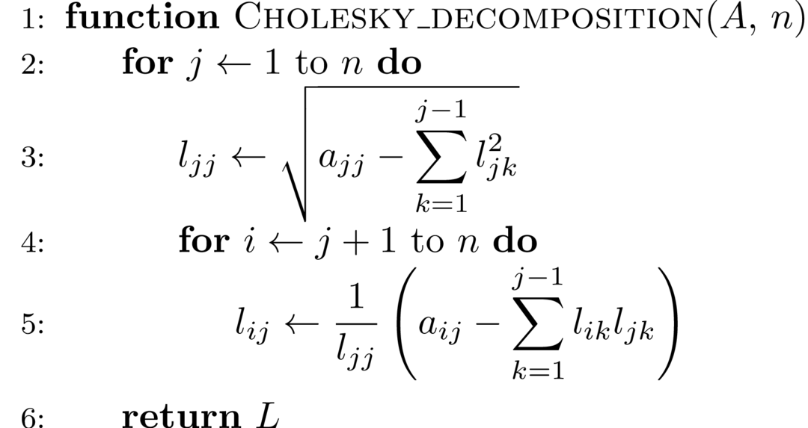

# Linear Equations Solving

$$
\newcommand{\norm}[1]{\left\lVert#1\right\rVert}
\newcommand{\b}{\boldsymbol}
\newcommand{\bx}{\b{x}}
\newcommand{\by}{\b{y}}
\newcommand{\bb}{\b{b}}
\newcommand{\bf}{\b{f}}
\newcommand{\bg}{\b{g}}
\newcommand{\w}{\widetilde}
\newcommand{\wL}{\w L}
\newcommand{\wU}{\w U}
\newcommand{\pp}[2]{\frac{\partial #1}{\partial #2}}
\newcommand{\o}{\overline}
$$

### 1. Linear Equation Solving by Elimination

We've kown that the equations with $n$-variables
$$
\left\{\begin{array}{ll}
a_{11}x_1 + a_{12}x_2 + \cdots + a_{1n}x_n = b_1  \\
a_{21}x_1 + a_{22}x_2 + \cdots + a_{2n}x_n = b_2  \\
\cdots \\
a_{n1}x_1 + a_{n2}x_2 + \cdots + a_{nn}x_n = b_n  \\
\end{array}\right.
$$

can be written in matrix form $A\bx = \bb$
$$
\begin{bmatrix}
a_{11} & a_{12} &\cdots& a_{1n}  \\
a_{21} & a_{22} &\cdots& a_{2n}  \\
\vdots & \vdots &\ddots & \vdots \\
a_{n1} & a_{n2} &\cdots& a_{nn}
\end{bmatrix}
\begin{bmatrix}
x_1 \\
x_2 \\
\vdots \\
x_n
\end{bmatrix}
=
\begin{bmatrix}
b_1 \\
b_2 \\
\vdots \\
b_n \\
\end{bmatrix}
$$

where $A$ is **coefficient matrix**, $\bb$ is **constant vector**, and $\bx$ is **solution vector**.

[Cramer's rule](https://en.wikipedia.org/wiki/Cramer's_rule) guarantees that for coefficient matrix $A$ with $\det A \neq 0$, the solution exists and is unique:
$$
x_i = \frac{D_i}{D}, \quad i = 1, 2, \ldots, n
$$

where $D_i$ can be generated by replacing the $i$-th column of coefficient matrix $A$ with constant vector $\bb$.

Although Cramer's rule plays an important role in thoery of linear equations, the time complexity $O(n!\times n)$ of computing determinant makes it not acceptable to apply Cramer's rule in large scale of linear systems.

##### # Gaussian Elimination

**Gaussian elimination**, instead, applies [elementary row operation]() to augmented matrix $\begin{bmatrix}A & b\end{bmatrix}^T$. It converts the matrix into an upper triangular matrix, after these operations, the equation can be easily solved by substituting (bottom-up). The time complexity of this approach is $O(n^3)$.

The Gaussian elimination requires

$$
\Delta_k =
\begin{vmatrix}
a_{11} & a_{12} &\cdots& a_{1k}  \\
a_{21} & a_{22} &\cdots& a_{2k}  \\
\vdots & \vdots &\ddots & \vdots \\
a_{k1} & a_{k2} &\cdots& a_{kk}
\end{vmatrix}
\neq 0
$$

for any $k \lt n$. While the solution exists only requires $\det A \neq 0$. This indicates that Gaussian elimination cannot be applied to some solvable functions with $a_{kk}^{(k-1)} = 0$ during the elimination. Besides, the round-off error will increase for small $a_{kk}^{(k-1)}$.

##### # Gaussian Elimination with Column Pivoting

To overcome the flaw of Gaussian elimination, the column pivoting operation for each iteration in elimination is proposed. Formally, for each $k = 1, 2, \ldots, n-1$, we search for the element with maximal absolute value $|a_{m,k}^{(k-1)}|$ within $|a_{k,k}^{k-1}|, |a_{k+1,k}^{k-1}|, \ldots |a_{n,k}^{k-1}|$, then we swap row $k, m$ before elimination.

We can solve any linear equations with $\det A \neq 0$ with column pivoting. Since the total time complexity of comparison is $O(n^2)$, the time complexity of Gaussian elimination with column pivoting is still $O(n^3)$.

##### # Gauss-Jordan Elimination

Gaussian elimination execute substitution process right after the matrix is converted to upper triangular matrix, while we can do further elimination to convert it into a diagonal matrix, which is called **Gauss-Jordan elimination**.

### 2. Linear Equation Solving by Matrix Decomposition

##### # Relation between Line Operation and Matrix Decomposition

An elementary line operation is equivalent to multiply a elementary matrix. The process of Gaussian elimination is equivalent to multiply a matrix $T$ to $A$, results in a upper triangular matrix:
$$
TA = U
$$

Multiply $L = T^{-1}$ on both sides:
$$
A = LU
$$
where
$$
L = T^{-1} =
\begin{bmatrix}
1 \\
l_{21} & 1  \\
\vdots & \vdots &\ddots \\
l_{n1} & l_{n2} & \cdots & 1
\end{bmatrix}
$$
can be proved to be a lower triangular matrix. The form $A = LU$ indicates that we devide the matrix $A$ into the multiplication of two matrixes $L$, $U$. where $L$ and $U$ are lower and upper triangular matrix respectively. Equivalently, we can also decompose $A$ as $A=UL$.

Since you can move the coefficients from one matrix to another, there are infinite decompositions of form $A=LU$. If $L$ is contrainted to be the unit lower triangular matrix, that unique decomposition is called **Doolittle decomposition**. If $U$ is contrainted to be the unit upper triangle matrix, that unique decomposition is called **Crout decomposition**.

Besides, there are other forms of decomposition such as $A = LDM^T$, where the $L, M$ is lower triangular matrix (hence $M^T$ is upper triangular matrix), and $D$ is diagonal matrix. Specially, if $A$ is a positive definite matrix, we have $M = L$, $A = LDL^T$, this is what we called **$LDL^T$ decomposition** or **refined Cholesky decomposition**. Let $P = L\sqrt D$ we have $A = PP^T$, which is called **Cholesky decomposition**.

The matrix is decomposed into two or three triangular/diagonal matrixes after decomposition, which can be easily solved by substitution. Note that decomposition process is independent of $\bb$. Hence if there are multiple equations with same $A$ but various $\bb$, this approach reduces the time complexity by cancelling the repetative processing of $A$.

##### # LU Decomposition

Compare elements to determine the matrix after Doolittle decomposition:

$$
A = \begin{bmatrix}
a_{11} & a_{12} &\cdots& a_{1n}  \\
a_{21} & a_{22} &\cdots& a_{2n}  \\
\vdots & \vdots &\ddots & \vdots \\
a_{n1} & a_{n2} &\cdots& a_{nn}
\end{bmatrix}
=
\begin{bmatrix}
1 \\
l_{21} & 1  \\
\vdots & \vdots &\ddots \\
l_{n1} & l_{n2} & \cdots & 1
\end{bmatrix}
\begin{bmatrix}
u_{11} & u_{12} &\cdots & u_{1n}  \\
       & u_{22} &\cdots & u_{2n}  \\
	   &        &\ddots & \vdots \\
       &        &       & u_{nn}
\end{bmatrix}
$$

$$
a_{11} = \sum_{r=1}^n l_{1r}u_{r1} =
\begin{bmatrix}
1 & 0 & \cdots & 0 \\
\end{bmatrix}
\begin{bmatrix}
u_{11} \\
0 \\
\vdots \\
0
\end{bmatrix}
= \sum_{r=1}^1 l_{1r}u_{r1} = u_{11}
$$

$$
a_{1j} = \sum_{r=1}^n l_{1r}u_{rj} =
\begin{bmatrix}
1 & 0 & \cdots & 0 \\
\end{bmatrix}
\begin{bmatrix}
u_{1j} \\
u_{2j} \\
\vdots \\
0
\end{bmatrix}
= \sum_{r=1}^1 l_{1r}u_{rj} = u_{1j}
$$
Hence $a_{ij} = u_{1j}$, $j=1,2, \dots, n$.

$$
\begin{align}
a_{kj}
&= \sum_{r=1}^n l_{kr}u_{rj} =
\begin{bmatrix}
l_{k1} & l_{k2} & \cdots & l_{k,k-1} & 1 & 0 & \cdots & 0 \\
\end{bmatrix}
\begin{bmatrix}
u_{1j} \\
\vdots \\
u_{jj} \\
0 \\
\vdots \\
0
\end{bmatrix} \\
&= \sum_{r=1}^n l_{kr}u_{rj}
= \sum_{r=1}^{k-1} l_{kr}u_{rj} + u_{kj}
\end{align}
$$

Now we have the algorithm for Doolittle decomposition:

Refer to [https://github.com/revectores/revector](https://github.com/revectores/revector) for the C++ implementation of Doolittle decomposition.

Refer to [https://github.com/revectores/LU-decomposition-impls](https://github.com/revectores/LU-decomposition-impls) for some parallelized Doolittle decomposition implemented in C.

Similarly, the algorithm of Crout decomposition:

Refer to [https://github.com/revectores/revector](https://github.com/revectores/revector) for the C++ implementation of Crout decomposition.

##### # Decomposition of Positive Definite Matrix

As mentioned above, we have Cholesky decomposition $A = LL^T$ for positive definitive matrix

In practice we often decompose as form $A = LDL^T$ instaed to remove square root computation.

> **Proof**. To prove the existence of $LDL^T$ decomposition, we first apply Doolittle decomposition to matrix and extract the diagonal line of $U$:
> $$
> \begin{align}
> A = LU
> &= \begin{bmatrix}
> 1 \\
> l_{21} & 1  \\
> \vdots & \vdots &\ddots \\
> l_{n1} & l_{n2} & \cdots & 1
> \end{bmatrix}
> \begin{bmatrix}
> u_{11} & u_{12} &\cdots & u_{1n}  \\
>        & u_{22} &\cdots & u_{2n}  \\
> 	   &        &\ddots & \vdots \\
>        &        &       & u_{nn}
> \end{bmatrix} \\
> &=
> \begin{bmatrix}
> 1 \\
> l_{21} & 1  \\
> \vdots & \vdots &\ddots \\
> l_{n1} & l_{n2} & \cdots & 1
> \end{bmatrix}
> \begin{bmatrix}
> u_{11} &        &  		&  \\
>        & u_{22} &		& \\
> 	   &        &\ddots & \\
>        &        &       & u_{nn}
> \end{bmatrix}
> \begin{bmatrix}
> \o u_{11} & \o u_{12} &\cdots & \o u_{1n}  \\
>           & \o u_{22} &\cdots & \o u_{2n}  \\
> 	      &           &\ddots & \vdots \\
>           &           &       & \o u_{nn}
> \end{bmatrix}
> \end{align}
> $$
> 
>
>  Since $A$ is symmetric positive definite matrix, we have $u_{ii}>0$. We can prove $L = \o U$ since
> $$
> A = LU = LD\o U^T = A^T = \o U(DL^T)
> $$
> That is,
> $$
> \begin{align}
> A = LDL^T
> = \begin{bmatrix}
> 1 \\
> l_{21} & 1  \\
> \vdots & \vdots &\ddots \\
> l_{n1} & l_{n2} & \cdots & 1
> \end{bmatrix}
> \begin{bmatrix}
> u_{11} & 		&  		&  \\
>        & u_{22} &		& \\
> 	   &        &\ddots & \\
>        &        &       & u_{nn}
> \end{bmatrix}
> \begin{bmatrix}
> 1 	   & l_{21} &\cdots & l_{n1}  \\
>        & 1 		&\cdots & l_{n2}  \\
> 	   &        &\ddots & \vdots \\
>        &        &       & 1
> \end{bmatrix}
> \end{align}
> $$
> 

##### # Condition Number of Matrix

For the non-singular matrix $A$, we define
$$
\kappa_p(A) = \norm{A}_p \norm{A^{-1}}_p
$$
as the **condition number** of matrix $A$. Due to the equivalence of different norms, the condition numbers with different norms are also equivalent.

How the error $\delta x$ is influenced by small disturbance $\delta A$ in coefficient matrix $A$ is represented as
$$
\frac{\norm {\delta x}}{\norm x} \le \frac{\kappa_A \dfrac{\norm{\delta A}}{\norm A}}{1 - \kappa_A\dfrac{\norm{\delta A}}{\norm A}}
$$
How the error $\delta x$ is influenced by small disturbance $\delta \bb$ in constant vector $\bb$ is represented as
$$
\frac{\norm {\delta x}}{\norm x} \le \kappa_A\frac{\norm {\delta\bb}}{\norm\bb}
$$
We call the matrix with large $\kappa_A$ **ill-conditioned**, which states "the small disturbance causes a huge difference in solution".

### 3. Linear Equation Solving by Iteration

Transform the equations $AX = \by$ into $X = MX + \bg$, for any $X^{(0)}\in R^n$, construct the iteration
$$
X^{(k+1)} = MX^{(k)} + \bg
$$
if the iteration series $\{X^{(k)}\}$ converges, the limit of iteration series $X^*$ is the solution of equations $AX=\by$. 

In practice, the iteration is terminated once we have $\norm{X^{(k+1)} - X^{(k)}}_p < \varepsilon$ for some pre-chosen error bound $\varepsilon$, and pick $X^{(k+1)}$ as the approximation of solution.

The convergence of iteration is determined by spectral radius of iteration matrix $M$. Specifically, the iteration converges if and only if the spectral radius $\rho(M) < 1$.

> **Proof**. If $X^*$ is the solution of equation $AX=\by$, then
> $$
> X^* = MX^* + \bg
> $$
>
> $$
> \begin{align}
> X^* - X^{(k+1)}
> &= M(X^*-X^{k}) \\
> &= M^2(X^*-X^{k-1}) \\
> &= \cdots \\
> &= M^{k+1}(X^*-X^{(0)})
> \end{align}
> $$
>
> $\displaystyle \lim_{k\rightarrow \infty} M^{k} = 0$ if and only if $\rho(M) < 1$. Hence we define the matrix with spectral radius less than 1 **convergent matrix**.
>
> That is, whether the linear equations converges depends on the property of iteration matrix, regardless of the solution $\alpha$ and $X^{(0)}$.
>

By definition, we have to compute all the eigenvalues to get the spectral radius of matrix. We may simplify this work by computing the norm $\norm A_p$. Note that $\norm A_p \ge \rho(A)$, if $\norm A_p < 1$, the iteration matrix must be convergent.

##### # Jacobi Iteration

$$
\left\{\begin{array}{ll}
a_{11}x_1 + a_{12}x_2 + \cdots + a_{1n}x_n = y_1  \\
a_{21}x_1 + a_{22}x_2 + \cdots + a_{2n}x_n = y_2  \\
\cdots \\
a_{n1}x_1 + a_{n2}x_2 + \cdots + a_{nn}x_n = y_n  \\
\end{array}\right.
$$

$$
\left\{\begin{array}{ll}
x_1 = \dfrac{1}{a_{11}}\left({-a_{12}x_2 - \cdots - a_{1n}x_n + y_1}\right)  \\
x_2 = \dfrac{1}{a_{22}}\left({-a_{21}x_2 - \cdots - a_{2n}x_n + y_2}\right)  \\
\cdots \\
x_n = \dfrac{1}{a_{nn}}\left({-a_{n1}x_2 - \cdots - a_{nn}x_n + y_n}\right)  \\
\end{array}\right.
$$

The iteration form
$$
\left\{\begin{array}{ll}
x_1^{(k+1)} = \dfrac{1}{a_{11}}\left({-a_{12}x_2^{(k)} - \cdots - a_{1n}x_n^{(k)} + y_1}\right)  \\
x_2^{(k+1)} = \dfrac{1}{a_{22}}\left({-a_{21}x_2^{(k)} - \cdots - a_{2n}x_n^{(k)} + y_2}\right)  \\
\cdots \\
x_n^{(k+1)} = \dfrac{1}{a_{nn}}\left({-a_{n1}x_1^{k} - \cdots - a_{n, n-1}x_n^{(k)} + y_n}\right)  \\
\end{array}\right.
$$
The matrix form of Jacobi iteration is
$$
X^{(k+1)} = BX^{k} + \bg
$$

where $B = I - D^{-1}A,~\bg = D^{-1}y$.

There is a shortcut to judge whether Jacobi iteration converges: if the coefficient matrix $A$ meets one of following condition:

- $|a_{ii}| > \displaystyle \sum_{j=1\\j\neq i}^n |a_{ij}|,\quad i=1, 2, \ldots, n$.
- $|a_{jj}| > \displaystyle \sum_{i=1\\i\neq j}^n |a_{ij}|,\quad j=1, 2, \ldots, n$

The Jacobi iteration must converge. This can be proved by showing the spectral radius of iteration matrix is less than 1.

==TODO: Add the proofs.==

##### # Gauss-Seidel Iteration

The Gauss-Seidel iteration use those new values computed in current iteration instead of last one:
$$
\left\{\begin{array}{ll}
x_1^{(k+1)} = \dfrac{1}{a_{11}}\left({-a_{12}x_2^{(k)} - \cdots - a_{1n}x_n^{(k)} + y_1}\right)  \\
x_2^{(k+1)} = \dfrac{1}{a_{22}}\left({-a_{21}x_2^{(k+1)} - \cdots - a_{2n}x_n^{(k)} + y_2}\right)  \\
\cdots \\
x_n^{(k+1)} = \dfrac{1}{a_{nn}}\left({-a_{n1}x_1^{(k+1)} - \cdots - a_{n, n-1}x_{n-1}^{(k+1)} + y_n}\right)  \\
\end{array}\right.
$$
Denote
$$
D =
\begin{bmatrix}
a_{11}    \\
& a_{22}  \\
&& \ddots \\
&&& a_{nn}
\end{bmatrix},
L =
\begin{bmatrix}
0 \\
a_{21} & 0  \\
\vdots & \vdots &\ddots \\
a_{n1} & a_{n2} & \cdots & 0
\end{bmatrix},
U =
\begin{bmatrix}
0	   & a_{12} &\cdots & a_{1n}  \\
       & 0	    &\cdots & a_{2n}  \\
	   &        &\ddots & \vdots \\
       &        &       & 0
\end{bmatrix}
$$
We have
$$
AX = (D+L+U)X = (D+L)X + UX = \by
$$
That is,
$$
(D+L)X = -UX + \by
$$
Hence
$$
X^{(k+1)} = -(D+L)^{-1}UX^{(k)} + (D+L)^{-1}\by
$$
Denote $S = -(D+L)^{-1}U, \b f = (D+L)^{-1}\by$, the Gauss-Seidel iteration can be expressed by
$$
X^{k+1} = SX^{k} + \b f
$$

##### # Successive Over-Relaxation

The SOR method is a variant of Gauss-Seidel method resulting in faster convergence:
$$
\left\{\begin{array}{ll}
x_1^{(k+1)} = (1-\omega)x_1^{(k)} + \omega(b_{12}x_2^{k} + \cdots + b_{1n}x_n^{(k)} + g_1) \\
x_2^{(k+1)} = (1-\omega)x_2^{(k)} + \omega(b_{21}x_2^{k} + \cdots + b_{2n}x_n^{(k)} + g_2) \\
\cdots \\
x_2^{(k+1)} = (1-\omega)x_n^{(k)} + \omega(b_{n1}x_2^{(k+1)} + \cdots + b_{n, n-1}x_{n-1}^{(k+1)} + g_n) \\
\end{array}\right.
$$
where $\omega$ is **relaxation factor**.

The matrix form of SOR is $X^{(k+1)} = S_\omega X^{(k)} + \bf$, where
$$
\begin{align}
S_w &= (I + \omega D^{-1}L)^{-1}[(1-\omega)I - \omega D^{-1}U] \\
f   &= \omega(I + \omega D^{-1}L)Y
\end{align}
$$

> **Proof**.
> $$
> \begin{align}
> X^{(k+1)} &= (1-\omega)X^{(k)} + \omega(\widetilde LX^{(k+1)} + \widetilde UX^{(k)} + \bg) \\
> (I - \omega \widetilde L)X^{(k+1)} &= ((1-\omega)I + \omega \widetilde U)X^{(k)} + \omega\bg \\
> X^{(k+1)} &= (I-\omega \wL)^{-1}((1-\omega)I + \omega \wU)X^{(k)} + (I - \omega\wL)^{-1}\omega \bg
> \end{align}
> $$
> where $\wL = -D^{-1}L, \wU = -D^{-1}U$.

The necessary condition that SOR converges is $0 < \omega < 2$. Specially, if $A$ is the positive determined matrix, $0 < \omega <  2$ is also the sufficient condition.

The iteration is called

- **Under-relaxation** iteration if $\omega \in (0, 1)$.
- Gauss-Seidel iteration if $\omega = 1$.
- **Over-relaxation** iteration if $\omega \in (1, 2)$.

The best $\omega$ (with fastest convergence speed) is hard to determine for specific equation.

