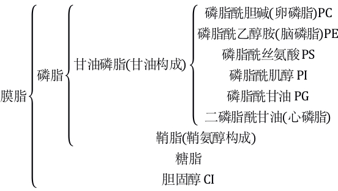

# Cell Membrane

### 1. Constituent of Cell Membrane

生物膜主要由脂质(50%)和蛋白质(40%), 外加少量的糖(2~10%)构成. 在构成生物膜的脂质中, **磷脂**最丰富, 对于动物和支原体细胞膜则还含有部分**胆固醇**(支原体尤其多, 为了取代细胞壁的作用). 生物膜上的脂质主要成分如下.

膜脂上的关键脂质类型包括[磷脂]()、[糖脂]()和[胆固醇](). 根据构成单体的不同, 磷脂可以划分为甘油磷脂和鞘磷脂两类, 前者由[甘油]()构成, 后者由[鞘氨醇]()构成. 甘油磷脂的酰基种类非常丰富, 常见的有磷脂酰胆碱(卵磷脂)、磷脂酰乙醇胺(脑磷脂)、磷脂酰丝氨酸、磷脂酰肌醇、磷脂酰甘油、二磷脂酰甘油(心磷脂).
==TODO: Convert the graph into graphviz-style==

### 2. Structure of Cell Membrance

##### # Fluid Mosaic Model

根据目前细胞生物学界公认的流动镶嵌模型(fluid mosaic model)观点, **磷脂双分子层**构成了细胞膜的骨架. 这是由磷脂分子的**双嗜性**决定的, 由于磷脂分子含有一个由**磷酸和碱基**构成的**亲水头**和一个由长链脂肪酸分子构成的**疏水尾**, 因此在空气-水界面上可以铺展开成为一层, 其中亲水头紧靠水面而疏水尾朝向空气; 而两层的磷脂在水域环境中则可以形成一个磷脂球, 疏水尾相对, 亲水头则朝向两面的水环境(对于细胞, 则就是细胞内和细胞外), 这就是磷脂双分子层作为细胞膜的存在状态. 

蛋白质分子作为装饰, “有的镶在磷脂双分子层表面, 有的部分或全部嵌入磷脂双粉子层中, 有的贯穿于整个磷脂双分子层”. 这实际上指的是膜上的两类蛋白: **表面蛋白**(外在蛋白)和**整合蛋白**(内在蛋白/固有蛋白). 表面蛋白一般通过较弱的静电作用(似乎还不能称之为离子键)或其他弱键固定在膜上, 而整合蛋白则通过疏水作用(跨膜结构域与脂双层疏水核心的相互作用)、和膜成分形成离子键和共价键等较强的相互作用固定在膜上. 整合蛋白一般含量较多, 占到80%左右, 而表面蛋白占到20%.

|                              | 表面蛋白(外在蛋白)                                           | 整合蛋白(内在/固有蛋白)                                      |
| ---------------------------- | ------------------------------------------------------------ | ------------------------------------------------------------ |
| **含量**               | 20％~30％                                                    | 70％~80％                                                    |
| **固定方式与存在形式** | 通过带电氨基酸残基与脂质的极性基团以静电引力相结合, 或以离子键与膜中的整合蛋白相结合, 附着于膜的表面(主要是内表面) | 其肽链一次或多次穿越膜的脂质双层, 穿越脂质双层的肽段以疏水性残基为主, 以α螺旋结构存在, 暴露于膜外表面或内表面的肽段是亲水性的, 形成连接相邻跨膜α螺旋的细胞外环或细胞内环 |
| **举例**               | [红细胞膜内表面骨架蛋白]()                                 | [G蛋白偶联受体](G_protein-coupled_receptor)、[转运蛋白]() |

除上述两种蛋白外还有一种蛋白称为**脂锚定蛋白**, 通过和膜上的脂肪酸或糖脂的共价连接固定在膜上.

膜上的糖链则主要与膜脂、膜蛋白相结合, 以糖脂或糖蛋白的形式存在, 糖链的分布是具有极性的, 只有质膜的**外侧面**才具有糖链, 因此我们可以通过糖链的位置来确定质膜的内外表面. 生物膜的内外表面的化学成分分布不平衡, 有一定的差异性, 这和膜两侧分别具备不同的功能是统一的.

##### # Fluid

流动镶嵌模型的核心(或者说其创新性)在于细胞膜的**流动性**. 该模型声称细胞膜上的一切成分, 无论膜脂、膜蛋白还是糖脂等等成分都处于不断的流动状态之中.

> 细胞膜的流动性有一个经典的实验证明(1970): 用不同颜色的荧光标记的人和小鼠的膜蛋白, 并将细胞融合, 在刚刚融合时, 融和细胞的一半发绿色荧光, 另一半发红色荧光, 在$37\rm{^\circ C}$下经过40min后, 两种颜色的荧光在细胞膜上均匀分布. 很显然, 这表明了细胞膜的流动性.

膜蛋白有以下三种运动形式: 

1. 在膜平面上的侧向运动. 受骨架蛋白和细胞外信号调节.
2. 沿膜平面垂直轴的旋转运动, 有快慢之分, 其中慢运动受骨架蛋白调节.
3. 插入和内化(内化是细胞脱敏机制之一). 

影响细胞流动性的因素主要包括内部因素(膜脂的成分和结构)和环境因素(主要是环境温度)两类.

1. 温度越高流动性越大.
2. 不饱和脂肪酸越多流动性越大.
3. 脂肪酸链越短流动性越大.
4. 胆固醇含量. 胆固醇分子中的类固醇核(甾核)与磷脂分子的脂肪酸烃链平行排列, 相互作用, 在膜中起“流动性阻尼器”功能. 在不同温度下, 胆固醇对膜的流动性影响不同, 在一般情况下(较温和的温度下), 胆固醇限制了磷脂分子的移动而降低了膜的流动性. 但由于胆固醇同时阻碍了磷脂分子的紧密排列, 使膜的固化温度降低[^1]. 细胞膜中胆固醇与磷脂含量的比值c/p是一定的, 该比值在不同细胞差别较大, 在红细胞约为1[^2], 其他细胞为0.03~0.1. c/p比值可用来反映膜的流动性和膜的病变.

细胞膜流动性降低可能造成的不良影响包括:

1. 影响细胞的变形能力和一些其他功能.
2. 损害免疫细胞对抗原的结合和反应能力, 因为免疫细胞对抗原的识别依赖于膜上相应的受体蛋白在膜中的移动.

尽管细胞膜的流动性降低可能造成不良影响, 但在某些情况下可能具有积极意义, 甚至作为生物体对环境的适应策略, 特别是对低温的抵抗, 例如

1. 许多耐寒的植物, 如[冬小麦](), 在秋季其中不饱和磷脂增多, 使得其生物膜在冬季不致固化.
2. 在地球两极的生物细胞膜磷脂分子的脂肪酸不饱和程度很高.

##### # Cell Membrance Research History

19世纪末, 欧文顿(Overton)用500多种化学物质对植物细胞的通透性进行实验, 发现细胞对不同物质的通透性是不一样的: 脂溶性的物质比水溶性的物质更容易透过细胞膜进入细胞, 于是他提出膜是由脂质构成的. 到了二十世纪初, 科学家第一次将膜从哺乳动物的红细胞中分离出来, 通过化学分析表明膜的成分是脂质和蛋白质, 否定了Overton的单纯脂质观点.

1925年两位荷兰科学家用丙酮从人的红细胞中提取出脂质, 并且在空气—水界面上铺展成单分子层, 测量得到单分子层的面积恰为红细胞表面积的两倍. 他们由此得出结论: 细胞膜中的脂质分子排列为连续的两层(但并没有给出对蛋白质位置和存在形式的解释).

1959年**罗伯特森**(Robertson)在当时新近出现的电子显微镜下观察到细胞膜“暗—亮—暗”三层结构, 从而提出生物膜的“蛋白质—脂质—蛋白质”模型, 即中间的亮层对应着脂质分子, 而两边的暗层对应着蛋白质分子, 蛋白质分子平铺在脂质分子的两侧(后面我们知道这个模型是错误的, 蛋白质在膜内外没有这么均匀的平铺行为, 那么问题就来了: 电镜下的暗—亮—暗究竟是哪些结构造成的? 一般认为, 这只是由于脂质分子两边亲水头的**电子密度**较高, 而中间疏水尾的电子密度较低导致的, 和蛋白质则没有什么太大关系), 在他的模型中生物膜是静态的. 但很快对这个静态模型就有了质疑, 理由很简单: 如果生物膜是静态的则许多生理功能将非常难以实现; 另外, 新的证据指出, 膜蛋白并不是全部平铺在脂质的表面, 有一些是“镶嵌”在脂质中的.

于是就有了上面1970年荧光细胞融合的实验, 在这个实验以及其他一些证据的基础上, **桑格**(Singer)和**尼克森**(Nicolson)于1972年提出了**流动镶嵌模型**. 这个模型现在为大多数的证据所接受, 但它也并不是完美的, 上面一节提到, 一种称为脂筏模型作为模型的一个补充已经起到了成效.

##### # Function of Cell Membrane

细胞膜的功能有以下几点

1. 屏障功能. 将细胞与外界环境分隔开, 为细胞的生命活动提供相对稳定的内环境;
2. 物质转运功能.控制物质进出细胞, 又称为细胞的选择透过性, 主要表现为允许营养物质进入细胞但阻断一些不良物质的进入(细胞用在物质转运方面的能量约占细胞总耗能的2/3). 一般动物细胞消耗所生成的1/3ATP在钠泵上以维持细胞内高K+低Na+环境, 在神经元这一数据则为2/3. 可见为了维持离子浓度所付出的能量代价是很大的. 
3. 信号转导功能.

另外, 细胞膜的成分还具有重要的病理学意义: 膜蛋白的异常和某些遗传病、恶性肿瘤、神经退行性疾病相关, 例如细胞在癌变过程中, 细胞膜上会呈现出甲胎蛋白(AFP)和癌胚抗原(CEA)等标志性物质, 因此可以利用这些物质的血液浓度来检测是否出现了细胞癌变. 

[^1]: 此段依照《陈阅增普通生物学(第三版)》P47, 而《生理学》(八年制第二版)中的表述形式为“膜中胆固醇的含量在一定程度上与膜的流动性呈反变关系”，应是只考虑了生理(温和)条件下的情形.
[^2]: 《陈阅增普通生物学(第三版)》P47“哺乳动物细胞中，它可能和磷脂分子一样多”及《高中生物奥赛讲义》P57“动物生物膜还含有胆固醇，并且分子数目可等同于磷脂分子(哺乳动物)”，均是指哺乳动物红细胞.

