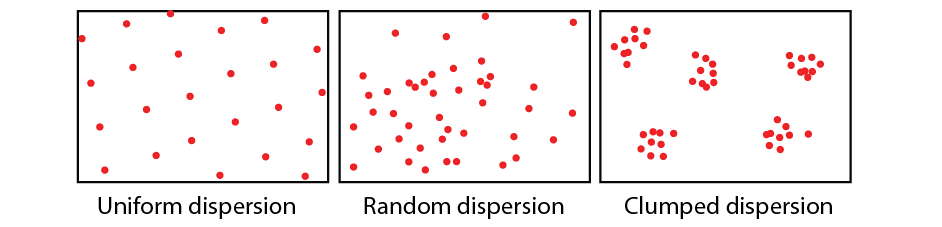
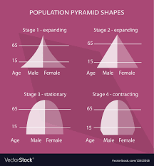

# Population Ecology

### 1. Population Ecology Introduction

**Population** is the cluster of the same species in particular space and time. We study the population from its space, number, and genetic characteristics.

### 2. Space Characteristics of Population

There are 3 typical **population dispersion** or **population distribution** patterns:

- **Uniform dispersion**. The [Oryza sativa](https://en.wikipedia.org/wiki/Oryza_sativa) evenly planted in the farmland is in uniform dispersion
- **Random dispersion**. the weeds are normally grow in random distribution.
- **Clumped dispersion**.

### 3. Number Characteristics of Population

##### # Number Characteristics of Population Classification

The most important parameter of population is the **population size**. The number of individuals per unit area or volume is the **population density**.

Those parameters as the first derivative of population are the **primary population parameters**, and those parameters have effect on the primary population are secondary population parameters.

##### # Population Size Measurement

There are two approaches to measure the population size and density:

- **Quadrats Method**.
- **Mark-Recapture Method**.

For the immobile and slow-moving organisms such as plant and small animals, we use quadrats method to compute the population size. 

For the fast-moving animals such as mammals, birds and fish, the mark-recapture method is ofen used. We capture a sample of species, marked in their body, and release them back, after the sample is uniform mixed with the population, we sample it again, then the population size can be compute by the marked to total ratio.

##### # Primary Population Parameters

The primary population parameters include **birth rate**, **death rate**, **immigration rate** and **emmigration rate**. The **natural growth rate** is defined as the substraction of birth rate and death rate.

The **age/sex distribution** of population is the composition of a population in terms of the proportions of individuals of different ages/sex, which can be represented by the **population pyramid** or **age-gender-pyramid**.

There are three types of age distribution:

- **Stationary**. The size of population kept stationary.
- **Expansive**. More younger inhabitants in the population. The size will increase in the future.
- **Constrictive**. More old inhabitants in the population. The size will decrease in the future.

##### # Modelling Population Growth

Under the ideal environment (adequate food and space, comfortable climate, no predators, etc.), the size of population will grow as exponential, for the natural growth rate $\lambda$, $N_t=N_0\lambda^t$.

However the resource and space is with limit. When the population density grows, the [intraspecific competition](/Users/rex/Library/Mobile Documents/com~apple~CloudDocs/skill/notes/nature_science/biology/ecology/population_ecology/intraspecific_relationship/intraspecific_relationship.md) also increases, and the predators increase, etc. All of the factors lead to the decrease of the natural growth rate. When the birth rate is the same as the death rate, the growth of population stops and the size is kept stationary, which is defined as the **carrying capacity** or **$K$-value** of that population. The difference and differential equation modelling the growth of population mathematically is given in [population_growth_model](/Users/rex/Library/Mobile Documents/com~apple~CloudDocs/skill/notes/nature_science/biology/ecology/population_ecology/population_growth_model/population_growth_model.md). This phenomenon is first recognized and described by the ecologist [Georgii Gause](https://en.wikipedia.org/wiki/Georgy_Gause) in the experiment in [Paramecium](https://en.wikipedia.org/wiki/Paramecium).

Note that the population size is not fixed in the K-value but change around it due to multiple random environment factors.

Two intrepretations of $K$-value:

- The control of carrying capacity (through modifying the environment) is the key to control the population living in. The natural reserve shall be established to increase the $K$-value for the endangered species.
- The differential equation tells $K/2$ is the point where the population has maximum growth rate. That is, we shall keep the population size in the $K/2$ point to make the best growth rate of animal resource, but avoid the pest population size to reach this point.

