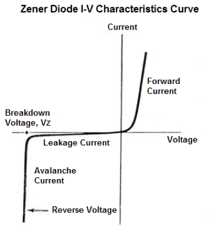
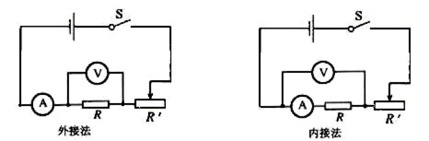
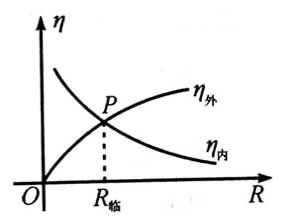
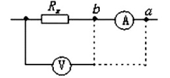

# Constant Current

$$
\newcommand{\Om}{\mathrm{\Omega\cdot m}}
$$

考虑两个存在电势差的金属导体A(+)和B(-), 如果用导线将二者相连, 则电子会顺导线流动, 很快系统会达到静电平衡状态, 两导体成为等势体, 导线上也不再有电子的运动. 但如果有这样一个装置: 它不断地将到达A的自由电子运往B处, 从而使得A,B之间的电势差得以保持, 那么导线上的电流也将持续存在, 这样的装置就称为**电源**. 这里聚集正电荷的导体A就称为**正极**, 而导体B称为**负极**.

由稳定分布的电荷所产生的不随时间变化的电场称为**恒定电场**, 理想电路中建立的电场就是恒定电场. 在恒定电场中, 电流的大小和时间不随时间变化.

### 1. Electric Current

单位时间内通过某一截面的电荷量定义为**电流强度**(electric current), 即

$$
I = \frac{q}{t}
$$

电流强度的单位是**安培**($\mathrm{A}$), 这是国际单位制七个基本物理量之一, 因此实际上电荷量单位库仑$\mathrm{C} = \mathrm{A\cdot s}$.

形成电流需要具备两个条件: 这是一个导体(也就是有能够自由移动的电荷), 并且导体两端存在电压. 根据第一节的叙述我们知道, 电源能够提供稳定的电压, 从而形成稳定电流, 而没有电源的电路则只能形成一个瞬时电流, 随后电势差很快消失.

电流是标量. 我们规定正电荷移动的方向为电流的方向. 在外电路中电流从电源的正极流向负极, 而在内电路中电流从电源的负极流向正极, 总体上看电流形成一个环路.

带电粒子的运动可以形成等效电流, 此时我们有

$$
I = \frac{q}{T}
$$

式中$q$是带电粒子的电荷量, 而$T$是粒子运动的周期.

利用这个式子我们可以计算安培分子电流假说(用于解释磁体磁场的形成, 在磁场部分会再次提到)中电子所形成的分子电流.

> **Example**. 记电子的电荷量为$e$, 半径为$r$, 计算氢原子电子绕核所形成的电流强度.
>
> **Solution**. 首先我们需要给出电子运动的周期, 根据库仑定律有
> 
> $$
> k\frac{e^2}{r^2} = m\left( \frac{2\pi}{T} \right)^2r
> $$
> 
> 从而
> 
> $$
> T = \frac{2\pi r}{e}\sqrt{\frac{mr}{k}}
> $$
> 
> 代入电流的表达式即有
>
> $$
> I = \frac{e}{T} = \frac{e^2}{2\pi r}\sqrt{\frac{k}{mr}}
> $$

> **Example**. 如果导体中单位体积中有$n$个可以自由移动的电荷, 每一个电荷的电荷量为$q$, 电荷的定向运动速率为$v$, 导体横截面积为$S$, 求导体中的电流强度
>
> **Solution**. 取一个截面$S$, 则$t$时间内通过它的电荷量
> 
> $$
> Q = nqV = nqvts
> $$
> 
> 从而
> 
> $$
> I = \frac{Q}{t} = nqvs
> $$

### 2. Resistance

##### # Ohm's Law

实验表明：对于同一段导体而言，不论电压和电流怎样变化，它们的比值$U/I$都是一个常数：

$$
R = \frac{U}{I}
$$

这里的比值$R$和电压、电流无关，仅仅由导体本身的性质决定. 当导体两端的电压一定时，比值$R$越大则电流$I$越小，这暗示着$R$似乎表明了导体对电流的阻碍作用，因此我们称之为导体的**电阻**(resistance). 电阻的单位是**欧姆**(ohm), 记作$\Omega$.

上式可以改写作

$$
I = \frac{U}{R}
$$

即通过导体的电流与导体两端的电压成正比，和导体的电阻成反比. 这个结论称为**部分电路欧姆定律**. 部分电路欧姆定律仅适用于金属导电和电解液导电，并且必须是**纯电阻电路**（即电能全部转化为热能的电路，若转化为其他形式的能量，如的电动机将电能转化为机械能、电解槽将电能转化为化学能等均不服从欧姆定律），不适用于气体导电。

欧姆定律的另一个变形形式$U = IR$可以用来表示电流经过一电阻时的**电势降落**. 适用条件和欧姆定律相同.

##### # Determinant of Resistence

实验表明：**同种材料**的导体，其电阻与它的长度成正比，与它的横截面积成反比. 即

$$
R = \rho\frac{l}{S}
$$

上式中$\rho$称为材料的**电阻率**，单位为$\mathrm{\Omega\cdot m}$. 电阻率由材料自身的特性和温度决定. 纯金属的电阻率较小，合金的电阻率较大，橡胶的电阻率最大. 电阻率还和温度有关. 一般地，对于金属而言，电阻率随温度的升高而增大；某些合金(如锰铜和康铜)的电阻率几乎不受温度的影响. 利用它们可制作标准电阻.

许多导体的电阻率$\rho$随温度变化的规律为$\rho = \rho_0(1+\alpha t)$, 其中称$\alpha$为**电阻温度系数**, 单位$\mathrm{^\circ C}^{-1}$, $\rho_0$是材料在$t = 0\mathrm{^\circ C}$时的电阻率，在一定的温度范围内$\alpha$是与温度无关的常量. 金属的电阻一般随温度的增加而增加，具有正温度系数; 而某些非金属如碳等则相反，具有负温度系数. 利用具有正负温度系数的两种材料的互补特性可制成一定温度范围内不随温度变化的电阻.

> **Example**. 在$0\mathrm{^\circ C}$时, 铜的电阻率为$1.7\times 10^{-8}\mathrm{\Omega\cdot m}$, 碳的电阻率为$3.5\times 10^{-5}\mathrm{\Omega\cdot m}$, 在$t = 0\mathrm{^\circ C}$附近, 铜的电阻温度系数为$3.9\times 10^{-3}\mathrm{^\circ C}^{-1}$, 碳的电阻温度系数为$-5.0\times 10^{-4}\mathrm{^\circ C}^{-1}$. 将横截面积相同的碳棒和铜棒串接成$1.0\mathrm{m}$的导体, 要求其电阻在$t = 0\mathrm{^\circ C}$附近不随温度变化, 求所需碳棒的长度(忽略碳棒和铜棒的尺寸随温度的变化).
>
> **Solution**. 令$t$最后的系数为零即可
> 
> $$
> \rho_{10}\alpha_1L_1 + \rho_{20}\alpha_2L_2 = 0
> $$
> 
> 注意到$L_1 + L_2 = 1$, 从而 $L_1 = 3.8\times 10^3 \mathrm{m}$

 室温时, 

- 金属导体的电阻率约为$10^{-8} \sim 10^{-6}\mathrm{\Omega\cdot m}$.
- 绝缘体的电阻率约为$10^8 \sim 10^{18} \mathrm{\Omega\cdot m}$.
- 半导体的电阻率介于两者之间, 为$10^{-5}\sim10^{6}\mathrm{\Omega\cdot m}$.

绝缘体和半导体的电阻除了大小和金属导体差别很大外，它们随温度的变化规律也和金属导体不同，一般都随着温度的升高而急剧减小，且变化不是线性的，不能用$\rho = \rho_0(1+\alpha t)$描述.

##### # Current–Voltage Characteristic

以电流为纵轴、电压为横轴所作出的导体上电流随电压变化的曲线称为$I-U$图线, 伏安特性曲线呈现一条直线的原件称为**线性元件**，否则称为**非线性元件**. 线性元件的电阻始终保持恒定，不随电压、电流的变化而变化. 而非线性原件则不然.

由于电阻是严格依照某一状态下的U/I比值定义的，和变化率无关，因此电阻和曲线切线的斜率无关，只能用某点与原点连线的**割线斜率的倒数**来计算. 只是在线性元件中，割线斜率就是切线斜率，因此二者是统一的.

**二极管**具有**单向导电性**，是典型的非线性元件，其伏安特性曲线如右图所示. 加正向电压时，二极管显示的电阻较小，通过二极管的电流较大，而加反向电压时二极管显示的电阻较大，通过二极管的电流较小. 但当反向电压加大到一定程度以后，二极管会被击穿而产生很大的反向电流.

二极管由**半导体材料**制成. 其电阻率随着温度的升高而减小，因此伏安特性曲线不是直线.

##### # Measurement Methods

实验原理：部分电路欧姆定律. 使用电压表测定电阻两端的电压，电流表测定通过电阻的电流，则
$$
R = \frac{U}{I}
$$
根据电流表的位置，将电流表接在电压表两接线柱外侧的接法称为“外接法”，而接在两接线柱内侧的接法称为“内接法”. 对于外接法，由于**电压表的分流作用**，测量所得的电流值比通过R的实际电流偏大，因此所测得的电阻R偏小. 当电阻R较小时，电压表的分流作用不明显，因此外接法适用于**小电阻**. 类似地，对于内接法，由于**电流表的分压作用**，测量所得的电压值比R实际分到的电压偏大，因此所测得的电阻R偏大. 当电阻R较大时，电流表的分流作用不明显，因此内接法适用于**大电阻**.

那么上述标准中的“较小”和“较大”要如何判别呢？只需要求出使得两种测法误差相同的$R_x$所需满足的条件，继而和这个临界值进行比较即可. 定量而言，对于外接法有

$$
R_T
= \frac{U}{I_R + I_V}
= \frac{1}{\cfrac{I_R}{U} + \cfrac{I_V}{U}}
= \frac{1}{\cfrac{1}{R_x} + \cfrac{1}{R_V}}
= \frac{R_xR_V}{R_x + R_V}
$$

$$
\Delta R = R_T - R_x = -\frac{R_x^2}{R_x + R_V}
$$

对于内接法有

$$
R_T = \frac{U_A + U_R}{I} = R_A + R_x
$$

$$
\Delta R = R_T - R_x = R_A
$$

如图，当$R_x$较小时，外接法的相对误差较小，而$R_x$较大时，内接法的相对误差较小；考虑当二者绝对值相等时，待测电阻$R_x$所需满足的条件，即有

$$
R_A = \frac{R_x^2}{R_x + R_V}
$$

即

$$
R_x^2 - R_xR_A = R_AR_V
$$

注意到上式为带一次项的二次方程，不易解出$R_x$的实用表达式，考虑令$R_A\rightarrow 0$抹去一次项得到

$$
R_x = \sqrt{R_AR_V}
$$

因此：当$R_x > \sqrt{R_A R_V}$选择内接法，当$R_x < \sqrt{R_A R_V}$选择外接法，当$R_x = \sqrt{R_A R_V}$时选择两种接法的误差相同.

上述判断需要至少知道$R_x$的大致范围，如果并不知道则只能用**试触法**来进行估计. 将电路按照如图方式连接:

空出电压表的一个接头，然后分别和a,b两点接触一下，观察电压表和电流表示数的变化情况. 若电流表示数变化更显著，则说明电压表的分流作用较强，$R_x$是一个高阻值电阻，应选用内接法；若电压表示数更显著，则说明电流表的分压作用较强，$R_x$是一个低阻值电阻，应选用外接法.

这里的“更显著”指的是相对于原来值增大或减小的幅度，即$\Delta I / I$和$\Delta U / U$.

"大内小外": 大电阻、内接法、测量结果也偏大; 小电阻、外接法、测量结果也偏小

##### 

### 3. Power Supply

