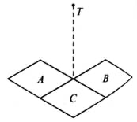

# Electric Field

$$
\newcommand{\b}{\bold}
\newcommand{\bE}{\b E}
\newcommand{\bF}{\b F}
\newcommand{\bS}{\b S}
\newcommand{\g}{\mathrm{g}}
\newcommand{\d}{\mathrm{d}}
\newcommand{\dS}{\d\bS}
$$

##### # Definition

爱因斯坦告诉我们, 世界上不存在超距作用. 电荷和电荷之间的作用是通过一种由电荷在其周围空间激发的, 被称为电场的**物质**来传递的.

相对于参考系静止的电荷所激发出的电场称为静电场. 静电场是一种特殊的电磁场.

一个对象的物理特性需要通过它和其他物体的相互作用体现出来. 对于电场而言, 从电场对电荷有力的作用这一特点出发, 我们引入**电场强度**的概念; 而从电场对在其中的移动的电荷做功这一特点出发, 我们引入**电势**的概念. 电场强度和电势都是电场的基本性质, 我们这里首先讨论电场强度.

##### # Electric Field Intensity

为了探索电场对其中电荷的作用力, 我们小心翼翼地电场中放入一个试探电荷$q_0$, 这个电荷的电荷量必须足够小, 以至于它对原来电场分布的影响可以被忽略(但不可能完全没有影响). 实验表明, 在电场的同一位置, 试探电荷所受到的力都是相等的, 而力的大小与试探电荷的电荷量成正比. 因而我们可以定义力和电荷量的比值:

$$
\bE = \frac{\bF}{q}
$$

称为电场在这一点的电场强度, 简称场强, 单位$\mathrm{N/C}$. 注意到上式中$\bF$是矢量而$q$是标量, 因此得到的电场强度$\bE$是矢量, 方向规定为正电荷在这一点处所受力的方向.

在具体求解场强时, 常常要充分利用对称关系

>  **Example**. 如图, 三个同样的正方形均匀带电介质薄板像图那样一起并都放置于绝缘水平面上, 所有板上电荷的面密度都相同, 这时, 位于三板接触处上方某点$T$处场强为$E_1$, 当拿走板A时$T$点场强变为$E_2$, 求当B板也拿走后$T$处的场强变为多少?
>
> 

根据对称性, 每块板在$T$点场强的垂直分量$E_y$相等, 水平分量大小$E_x$相等, 故有

$$
\left\{\begin{array}{ll}
E_1^2 = E_x^2 + (3E_y)^2  \\
E_2^2 = (\sqrt2 E_x)^2 + (3E_y)^2
\end{array}\right.
$$

从而

$$
E_3 = \sqrt{E_x^2 + E_y^2} = \sqrt{\frac{4E_2^2 - E_1^2}{7}}
$$

##### # Electric Field Line

对于空间中的任意一点, 根据定义都可以计算得到其场强$\bE$, 因此场强是坐标(位矢)的函数, 空间中所有点的场强$\bE$形成一个矢量场. 为了形象地描述这个矢量场, 法拉第提出了电场线的概念.

法拉第规定电场线是这样的一族曲线:

- 上面每一点的切线方向和该点处的场强方向相同.
- 场强大的地方把电场线画密, 场强小的地方把电场线画疏.

综合以上两点我们得到了一族可以表示电场中场强的大小和方向分布的曲线. 容易证明, 这样规定的电场线有以下的性质:

- 电场线起始于正电荷(或无限远处), 终止于负电荷(或无限远处), 不会在没有电荷的地方中断.
- 电荷激发的电场的电场线不能形成闭合曲线.
- 在没有点电荷的空间, 任意两条电场线都不会相交.

##### # Electric Field of Point Charge

考虑点电荷$+q$在空间所激发的电场(这时点电荷$+q$通常被称为场源电荷). 考虑电场中点电荷距离为$r$的一点$P$的电场强度, 根据定义, 我们先把一个试探电荷$+q_0$放在$P$点上, 计算$q_0$所受到的电场力

$$
\bF = \frac{qq_0}{r^2}
$$

接着计算该点的电场强度

$$
\bE = \frac{\bF}{q_0} = \frac{qq_0}{r^2q_0} = \frac{q}{r^2}
$$

由于同种电荷相互排斥, 因此其方向在两点连线上并背离场源电荷.

容易发现, 在这个计算过程中试探电荷的电荷量被约掉了(请注意, 这并不是什么意外, 库仑定律保证了试探电荷的电荷量是必然被约掉的, 正如牛顿第二定律保证了引力定律中加速度与自身质量无关一样; 否则对于电场中的某一个点, 电荷量与其所受到的力的大小不成正比的话, 电场强度这个概念就不会存在)

从点电荷在空间所激发出的电场公式

$$
\bE = \frac{q}{r^2}
$$

来看, 点电荷激发出的电场, 其电场强度在空间当中也是按照球面稀释的. 孤立点电荷$+q$的电场线如图所示:

让我们考察一下它是否符合法拉第对电场线的两大要求: 首先, 是否满足“每一点的切线方向都和该点处的场强方向相同”? 由于任意一点$P$的场强方向都是在$P$与场源电荷的连线上并背离场源电荷的, 因此, 在从场源电荷引出每一条射线上的点, 其场强方向都保持一致, 并且与这条射线延伸的方向相同, 因此满足第一条性质. 其次, 是否满足"场强大的地方把电场线画密, 场强小的地方把电场线画疏"? 我们注意到, 点电荷的场强服从平方反比定律, 在远离点电荷的地方场强较小, 而从点电荷引出的射线, 随着它们的延伸, 它们之间的距离会不断增大, 则单位面积内的电场线会不断减少, 恰好反映了场强不断减小的这个事实, 因此第二条也是符合的(前提是每一条射线之间的角度保持一致), 这完全是一个巧合. 因此, 这个电场线的图形是合法的.

只需要更改一下上图中电场线的方向即可得到孤立负电荷的图线:

对于其合法性的论证过程也是类似的, 这里不再赘述.

##### # Uniform Electric Field

每一点的场强均相同的电场称为匀强电场, 其电场线为一族**等距平行直线**:

两块大小相等、相互正对、靠的很近并且带有**等量异种电荷**的金属板之间(除边缘外)的电场可以近似视为匀强电场.

在匀强电场中, 带电粒子受到**恒定的电场力**作用, 由于高中求解运动学的手段限制, 因此常常以匀强电场作为背景考察粒子的运动情况. 值得注意的是题目是否考虑粒子的重力, 若可以忽略则粒子作匀变速运动, 若不能忽略则可能作匀变速运动, 也可能处于平衡状态, 此时重力和电场力恰好平衡, 有$qE = m\g$, 粒子比荷满足

$$
\frac{q}{m} = \frac{\g}{E}
$$

##### # Principle of Proposition of Electric Field

根据静电力叠加原理很容易得到: 两个以上的点电荷在某一点处所产生的场强等于两个点电荷单独存在时在该处场强的矢量和. 这一结论被称为**场强叠加原理(principle of proposition of electric field)**.

因此, 在一个多点电荷的系统中, 只要我们知道了点电荷的分布情况以及它们各自的电荷量, 我们就可以根据场强叠加原理来求出任意一点的电场强度.

##### # 多个独立点电荷形成的电场

以下我们考虑两个同种电荷(同正或同负)、两个异种电荷所形成的电场线:

对于等量同种电荷形成的电场, 首先注意到其对称性: 将两点电荷所在位置记为$M, N$, 则图像关于直线$MN$以及线段$MN$的中垂线对称. 设$MN = 2L$, 且所带电荷量均为$q$.

考虑在这两条对称轴上的电场变化特点, 在两点电荷所连线段上, 不妨设其在线段$OM$上,即满足$0< x < L$, 我们有

$$
E = kq\left[\frac{1}{x^2} - \frac{1}{(2L - x)^2} \right]
$$

考虑某试探电荷从$M\rightarrow O$的移动过程, 则该电荷受到$M$的斥力大于$N$的, 但$M$的斥力逐渐减小, $N$的斥力逐渐增大, 因此合力方向始终向右并且在逐渐减小, 直到连线中点$O$处减小到$0$.

考虑在中垂线上的变化特点, 我们有

$$
E = 2E_M\sin\theta = 2kq\frac{\sin\theta}{(L/\cos\theta)^2} = 2kq\frac{\cos^2\theta\sin\theta}{L^2}
$$

试图构造和为常数的积的形式(当然也可以将$\cos$消去后换元求导):

$$
2(\cos^2\theta \sin\theta)^2 = (1-\sin^2\theta)(1-\sin^2\theta)(2\sin^2\theta) \le \left(\frac23\right)^3
$$

故

$$
\cos^2\theta \sin\theta \le \frac{2}{3\sqrt3}
$$

当且仅当$1 - \sin^2\theta = 2\sin^2\theta$, 即$\sin\theta = \cfrac{\sqrt3}{3}$时等号成立.

从而

$$
E \le \frac{4\sqrt3}{9}\cdot\frac{kq}{L^2}
$$

这意味着在中垂线上, 从O出发向无穷远处前进时, 场强将先增大后减小, 方向始终沿中垂线背离O点.(当然还可以从始末状态的角度考虑: 由于O点处和无穷远处的场强均为零且其他地方的场强不恒为零, 因此该过程中场强必然先增大或减小)

##### # Electric Dipole

如图, 两个相距很近的等量异种电荷组成的系统称为电偶极子. 若$P$为电偶极子延长线上距中点$O$距离为$r$的点, 则

$$
E_P
= E_+ - E_-
= k\frac{q}{\left(q - \cfrac{l}{2}\right)^2} - k\frac{q}{\left(q + \cfrac{l}{2}\right)^2}
= k\frac{2rlq}{\left(r^2 - \cfrac{l^2}{4}\right)^2}
$$

##### # Gauss's Law

定义垂直穿过某一**有向面**的电场线条数称为通过该平面的**电场强度通量**$\Phi_E$, 简称E通量.

显然, 对于一个垂直于匀强电场放置的平面$\dS$, 其$\bE$通量大小为$E\bS$.

对于一个一般曲面, 将曲面划分为无限多个面积元$\dS$, 则每一个面积元上场强可以被视为是均匀的, 设$\dS$的法线单位矢量$e_n$场强$\bE$成$\theta$角, 则有

$$
\d\Phi_\bE = \bE\cos\theta = \bE\cdot\dS
$$

对曲面积分得

$$
\Phi_\bE = \iint_S \bE\cdot\dS
$$

当S是闭合曲面时上式可改写成

$$
\Phi_\bE = \oiint_S \bE\cdot\dS
$$
