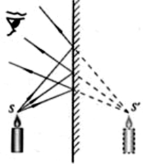
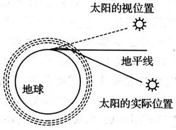
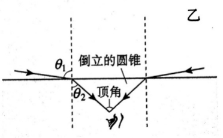
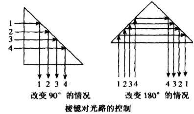

# Geometrical Optics

$$
\newcommand{\c}{\text{c}}
\newcommand{\d}{\text{d}}
$$

几何光学将光理想化为一条条**光线**进行处理, 表示光的传播路径和方向, 这是一种很粒子论的抽象方法, 早在牛顿以前的时代就已经广泛使用了, 它虽然并不能反映光的波粒二象性本质, 但是在实际的生产应用中足够满足需求. 以下介绍几何光学中关于光线路径选择的三条定理, 在说明了反映折射—反射关系和折射发生条件的全反射概念以后, 讨论将这三条定理统一起来的费马原理. 

##### # Rules for Light Propagation

光在同种均匀介质中是沿直线传播的, 并且在传播过程中与其他光束相遇时, 各光束**独立传播**, 不改变其性质和传播方向. 在到达一种介质和另一种介质的分界面时, (如果不发生全反射的话)一部分光会返回到第一种介质, 这种现象称为光的**反射**; 而另一部分光则会进入到第二种介质, 称为光的**折射**. 

对于光的反射和折射, 我们有如下的**反射定律**和**折射定律**(**斯涅尔定律**):

反射定律表明, 反射光线和入射光线、法线在同一平面内, 反射光线与入射光线分居法线两侧, 反射角等于入射角. 

折射定律表明, 折射光线和入射光线、法线在同一平面内, 折射光线与入射光线分居法线两侧, 且入射角的正弦和折射角的正弦成正比, 比值等于光在这两种介质中的传播速度之比, 定义为**相对折射率**

$$
\frac{\sin\theta_1}{\sin\theta_2} = \frac{v_1}{v_2} = n_{12}
$$
如果光从真空中射入某种介质, 则其入射角和折射角之比称为介质的绝对折射率

$$
\frac{\sin\theta_1}{\sin\theta_2} = \frac{\c}{v} = n
$$
由于光在真空中的传播速度$c$大于在其他任何介质中的传播速度$v$,因此绝对折射率总满足$n>1$, 即光从真空中射入任何介质时总有入射角大于折射角.

容易得到, 介质1到介质2的相对折射率等于介质2和介质1的绝对折射率之比

$$
n_{12} = \frac{v_1}{v_2} = \frac{\c/v_1}{\c/v_2} = \frac{n_2}{n_1}
$$
注意到空气的绝对折射率非常接近真空, 因此在几何光学中一般将空气作为真空处理.

##### # Examples about Rules for Light Propagation

[镜面反射和漫反射]

一束**平行光**投射在光滑的物体表面, 得到的反射光束仍然是平行的, 这样的反射称为**镜面反射**; 而一般的物体表面都比较粗糙, 因此平行光反射后的光线不再平行, 而是射向了各个方向, 这样的反射称为**漫反射**. 

举个例子, 想象这样一个场景: 我们在月光下走夜路(没有路灯), 而刚刚又下过雨, 路面上有些地方有积水. 这时如何判断路上哪里有积水, 而哪里没有呢? 这要分两种情况: 第一, 当我们面向月亮走时, 由于积水对月光发生镜面反射, 反射后的光线方向和我们的行进方向相反, 因此光线恰好进入我们的双眼, 而路面发生漫反射, 因此积水部分亮; 而当我们背对月光走时, 积水发生镜面反射后的光线方向和我们的行进方向相同, 因此积水会非常之暗, 反而是发生漫反射的路面更亮一些. 但实际上在上述过程中, 路面的亮度始终没有发生改变(如果考虑上人因背对月光而产生的投影, 则背对时会更暗一些), 只是积水的亮度发生了变化, 记$F(x)$为正对月光时的x亮度, $B(x)$为背对月光时的x亮度, 则我们有$B(W) < B(L) \le F(L) < F(W)$.

[平面镜成像]

根据光的反射定律以及几何知识可以证明: 平面镜所成的是等大、正立的**虚像**, 并且像与物到平面镜的距离相等, 且对应点的连线与平面镜垂直. 换句话说, 像和物关于平面镜**对称**. 

平面镜成像是“左右颠倒”的, 这其实是很奇怪的一个特性, 涉及到人类对于方向的感知和向量的定义问题, 由于其内容很复杂这里不予以详述, 如果需要解决再查找相关的资料. 

除平面镜外, 凹面镜和凸面镜也是两类常见的面镜. 凸面镜起到发散光线的作用, 例如汽车的后视镜; 而凹面镜起到会聚光线的作用, 例如太阳灶、手电筒后面的聚光镜. 

[大气对恒星光线的折射]

由于地球是被大气层包裹着的, 太阳光穿过日地间的真空到达地球外层时, 会被大气层所折射, 并且由于大气层是不均匀的, 离地面越高空气越稀薄, 因此太阳光在大气层中走的是一条曲线. 画出光路图并反向延长以后容易发现, 在日出时, 当太阳还在地平线以下, 其视位置就已经高出了地平线, 使得日出提前了; 类似地, 日落的时间则比事实上延后了. 因此, 结合两个方面的作用大气层使得地面上的日照时间被延长了. 

除此之外, 大气的折射作用还使得地表观测的恒星的光看起来不稳定, 即“星星一闪一闪眨眼睛”的现象, 这是由于大气的密度在随时间不断发生变化, 从而使得大气的折射率发生变化, 恒星的光传播的路径发生改变, 使得星光到达地球上另一个地点, 我们站在原来的地方就无法看见它的光, 这就产生了一次闪烁. 这和隔着火焰上的热空气(折射率不稳定的介质)看物体, 物像会发生抖动是同样的机制.

##### # Total Reflection

相对而言, 我们把折射率小(传播速度快)的介质称为**光疏介质**, 折射率大(传播速度小)的介质称为**光密介质**. 

根据折射定律我们知道, 光从光疏介质射向光密介质时, 光线向法线偏折, 折射角小于入射角; 光从光密介质射向光疏介质时, 光线远离法线偏折, 折射角大于入射角, 在这种情况下, 我们可以发现, 当入射角逐渐增大, 还没有达到90°(即和折射平面重合)时, 折射角就已经增大到了90°度, 当入射角继续增大时, 折射光就会**完全消失**, 只剩下反射光线, 这种现象称为**全反射**, 这时的入射角称为**临界角**. 事实上, 折射光的消失并不是突然发生的, 而是随着入射角的增大而逐渐变弱的. 

当光从介质射入真空中时, 根据折射定律, 其临界角服从

$$
\frac{\sin C}{\sin 90^\circ} = \frac{1}{n}
$$
即

$$
\sin C = n^{-1}
$$
因此, 折射率越大, 发生全反射所需要的临界角就越小. 我们可以通过临界角来间接测定介质的折射率. 水的临界角为48.8°, 玻璃的临界角为32°~42°.

全反射概念可以解释很多现象, 例如潜水视角的圆锥面, 并且在生产中有许多重要应用, 例如全反射棱镜、光导纤维等. 现逐一解释如下. 

[潜水视角的圆锥面]

临界角除了意味着全反射现象的分界线, 也意味着(在光密介质中)从光疏介质射进来的光的角度限制区间. 例如, 对于空气—水界面, 从空气射入水中的光线, 其折射角都在[img]之间, 因此对于水面下的潜水员来说, 水面上的景物都出现在顶角为[img]的**倒立圆锥**里. 

[全反射棱镜]

如右图, **全反射棱镜**的形状是一个等腰直角三角形, 当光线从图示情况垂直射入玻璃时, 由于光的方向和玻璃面垂直, 因此光线不发生偏折, 但在玻璃内内部, 光射向玻璃与空气的界面时, 入射角[img]大于玻璃的临界角[img], 发生全反射. 这种棱镜广泛用于在光学仪器中用来控制光路. 例如**双筒望远镜**中就用到了全反射棱镜. 

[光导纤维]

光导纤维由内芯和外套两层组成, 内芯的反射率比外套大, 因此光在传播过程中在**内芯-外套分界面上**(注意不是空腔-外套, 光纤中是不存在空腔的)发生全反射, 使得光能够始终在光纤中沿着锯齿形线路传输, 因此能够从光纤的一端传播到另外一端. 这就是光纤的实现原理. 

医学上用光纤制成内窥镜观察脏器的内部, 内窥镜中有两组光纤, 一组把光传到人体内部进行照明, 另一组把体内的图像传出供医生观察. 

##### # Fermat's Principle

考虑光在某一折射率为的$n$的介质中传播了距离$s$, 则光传播这段距离所用时间

$$
t = \frac{s}{v} = \frac{s}{\c/n} = \frac{ns}{\c}
$$
从而我们有

$$
\c t = ns
$$
由于真空中的光速$\c$为定值, 因此$t\propto ns$, 当n为定值时该正比关系是显然的, 上式使得我们能够在n变化时通过积分方法求解$t$. 我们把折射率和光通过的几何路径之积$ns$定义为**光程**.

光的直线传播、反射定律和折射定律可以被统一成: 光从一点传播到到另一点时, 取光程(极小值、极大值或恒定值)的路径, 这称为**费马原理**:

$$
P = \int_A^B n \d l
$$
为极值.

即**光线在实际路程上的变分为零**.

根据光程的推导可知, 费马原理同时意味着光所花时间最短. 应用费马原理解释直线传播定律和反射定律(“将军饮马”问题)都是显然的. 下面考虑利用费马原理导出折射定律.

**Example 1**. 证明光的折射定律和费马原理等效.

Pathway 1. 

Fermat原理在折射定律的证明过程表明了: 某一类运动学极值问题可以通过类比成折射定律来解决(本质上是封装掉了费马原理的证明过程). 具体应用请参照《费马原理的应用》文档.
