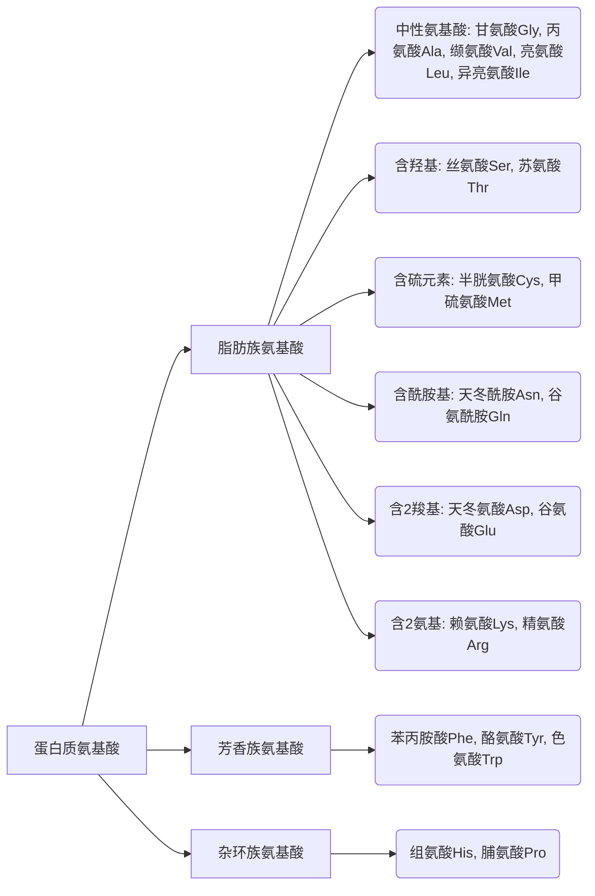

```mermaid
graph LR;

蛋白质氨基酸 --> 脂肪族氨基酸
蛋白质氨基酸 --> 芳香族氨基酸 --> c6h6(苯丙胺酸Phe, 酪氨酸Tyr, 色氨酸Trp)
蛋白质氨基酸 --> 杂环族氨基酸 --> zh(组氨酸His, 脯氨酸Pro)

脂肪族氨基酸 --> m(中性氨基酸: 甘氨酸Gly, 丙氨酸Ala, 缬氨酸Val, 亮氨酸Leu, 异亮氨酸Ile)
脂肪族氨基酸 --> s(含羟基: 丝氨酸Ser, 苏氨酸Thr)
脂肪族氨基酸 --> ss(含硫元素: 半胱氨酸Cys, 甲硫氨酸Met)
脂肪族氨基酸 --> xa(含酰胺基: 天冬酰胺Asn, 谷氨酰胺Gln)
脂肪族氨基酸 --> cooh(含2羧基: 天冬氨酸Asp, 谷氨酸Glu)
脂肪族氨基酸 --> nh2(含2氨基: 赖氨酸Lys, 精氨酸Arg)
```

