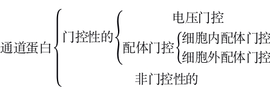

# Membrane Transport

我们知道物质进出细胞都必须经过细胞膜, 细胞膜有控制物质进出细胞的功能. 由于分子的种类繁多, 因此它们进出细胞的方式也有所不同, 大致上可以分为以下三种方式: **自由扩散(simple diffusion)**、**易化扩散(facilitated diffusion)**和**主动运输(active transport)**. 其中自由扩散和易化扩散由于不需要能量, 因此又被统称为**被动转运(passive transport)**, 而易化扩散和主动运输的共同点在于都需要蛋白质协助, 自由扩散则不需要.

### 1. Simple Diffusion

自由扩散是一些**脂溶**性或**小分子非极性**的物质, 能够自由地顺浓度梯度透过磷脂双分子层, 不需要蛋白质的协助. 常见的可以实现自由扩散的分子有脂溶性的$\ce{O_2, CO_2, N_2}$, 苯, 类固醇激素等; 小分子非极性的有乙醇、尿素、甘油等. 而像葡萄糖这样较大的极性分子, 或是$\ce{K+, Na+}$这样虽然小但是带电荷的分子就不能通过主动运输跨膜.

水分子虽然是极性分子但是分子很小, 能有限度地以渗透方式跨膜, 但主要是走水通道蛋白AQP跨膜.

需要注意的是, 上述实例仅仅是就含质膜在内的大多数生物膜而言, 由于不同膜的脂质成分不同, 因此对自由扩散的限制程度也是不同的. 例如线粒体内膜, 由于缺乏**胆固醇**而富含**心磷脂**, 通透性非常差, 导致任何物质都不可能通过自由扩散跨膜, 必须走蛋白路线, 从而能够建立起质子的电化学梯度, 使氧化磷酸化机制成为可能.

### 2. Facilitated Diffusion

协助扩散(易化扩散)是分子在**跨膜蛋白**的协助下顺浓度梯度转运的过程. 根据辅助蛋白的不同, 可以分为**通道介导**的易化扩散和**载体介导**的易化扩散两类. 

##### # Channel Mediated Facilitated Diffusion

**通道介导的易化扩散(channel mediated facilitated diffusion)**走的是**通道蛋白(channel protein)**, 这种蛋白质在中间造出一个孔道结构以使得某些物质(最常见的是离子, 称为离子通道)可以从中穿过. 通道蛋白分为门控性(gated)的和非门控性(non-gated)的两类, 非门控性的通道蛋白长期开放, 不受任何其他因素的调节, 例如细胞之间的缝隙连接通道; 而门控性的通道蛋白则会随着外界的某些特定条件的变化而改变通道开关的状态.

典型的门控因素有**电压门控性**和**配体门控性**(或称为化学门控性), 前者敏感于膜内外的电势差, 而后者敏感于特定化学物质与通道蛋白其他亚基的结合, 因此配体门控通道实际上同时也是一种**受体**, 配体门控通道根据受的是细胞内物质还是细胞外物质(典型的如激素、神经递质)的调节分为细胞外配体门控通道和细胞内配体门控通道. 

以上关于通道的分类可以形式化表示如下: 

电压门控的通道的经典实例是, 在动作电位的产生过程起到核心作用的电压门控性$\ce{Na+}$通道. 下面一小节通过对这个通道结构的介绍来获得一些对通道蛋白具体实现技术的认识.

##### # Voltage-Gated Sodium Channel

**电压门控钠通道(voltage-gated sodium channel)**由α、β1和β2三个亚基构成. 其中α亚基含有四个跨膜结构域Ⅰ~Ⅳ, 每个结构域含有六次跨膜α螺旋S1~S6. 其中的S4是通道的电压感受器(又称为m门), 如图, S5~S6在折叠以后, 二者中间的的β折叠结构(称为**P区**)作为水相孔道的内衬, S1~S3则作为连接S5,S6和膜脂的中介部分.

在结构域Ⅰ和Ⅱ之间含有多个蛋白激酶的磷酸化位点. 例如**E387位点**可以与[河豚毒素(TTX)]()结合阻断$\ce{Na+}$通道.

位于胞质区连接结构域Ⅲ的S6和结构域Ⅵ的S1片段间的45个氨基酸组成失活环, 其中1488-1490位的**IFM**(Ile, Phe, Met)序列是通道失活所必须的, 在**持续去极化**时可从细胞内阻塞孔道, 发挥**失活门**(h门)的作用.

##### # Carrier Mediated Facilitated Diffusion

载体介导的易化扩散使用的是**载体蛋白(carrier protein)**, 这是一种**变构蛋白(allosteric protein)**, 当它所转运的分子结合到蛋白上时, 蛋白会改变结构从而将分子运输到膜的另外一侧. 可以想象, 这种变构作用相对于通道直接允许分子通过来说是更费时的, 因此(在其他条件相同时)转运速率要比通道来得低, 但通道的专一性则要比通道蛋白更强, 不会因为分子大小的缘故而把本不是为了它的运输而设计的小分子漏了过去.

##### # Glucose Transporter

动物体中**葡萄糖转运体(Glucose Transporter, GLUT)**有五个家族, 命名为GLUT1-5.

==TODO: Adjust the classification of GLUTs based on the wikipedia reference.==

GLUT1/2/3三个家族极其相似, 它们的$K_m$值比正常血液中的葡萄糖浓度要低, 因此基本上都是以最大速率转运葡萄糖. D-半乳糖、D-甘露糖、D-阿拉伯糖, 和其他一些D-型糖类, 包括甘油, 由该家族其他一些亚型所转运.

- GLUT1存在于红细胞、心、[血脑屏障](blood-brain_barrier.md)、神经胶质细胞、肌肉、胎盘. 可根据浓度梯度对葡萄糖分子进行双向转运(多数为输入), 对红细胞和脑细胞获取葡萄糖有重要意义. 在肌肉中可被胰岛素、饮食、缺氧所激活.
- GLUT2存在于肝、胰腺、肠道、肾. 对葡萄糖的亲和力较低, 从而增加血糖浓度, 在消化道对糖的吸收中起重要作用. 在肝细胞催化葡萄糖出入膜, 并负责葡萄糖的输出. 在胰腺β细胞与检测血糖水平有关.
- GLUT3存在于脑、肾、胎盘.
- GLUT4存在于肌肉、脂肪、心、胚细胞. 对胰岛素敏感, 在肌肉和脂肪中可被胰岛素所激活, 在肌肉中可被缺氧和饮食所激活.
- GLUT5定位于肌肉外膜上. 存在于肌肉、精子. 以果糖作底物.

一些糖的类似物, 如[根皮素]()、2,4,6-三羟基苯乙酮是GLUT的竞争性抑制剂.

### 3. Active Transport

主动运输是一种逆浓度梯度的运输, 需要消耗能量并且一定需要蛋白质的协助, 这种蛋白一般称为**泵**(pump), 典型的例如动物细胞膜上的$\ce{Na+-K+}$**泵**, 每消耗1分子ATP将2个$\ce{Na+}$转运到细胞外, 3个$\ce{K+}$转运到细胞内, 从而建立细胞内外的$\ce{Na+}$和$\ce{K^+}$的浓度梯度. 另外还有植物细胞膜和液泡膜上的**质子泵**, 每消耗1分子ATP将一个$\ce{H+}$转运到细胞外或液泡内.

##### # Endocytosis and Exocytosis

对于生物大分子, 例如蛋白质、病毒等等, 如果使用常规的跨膜运输方式会破坏细胞膜的结构, 因此细胞采用了另外一种称为**胞吞(endocytosis)**和**胞吐(exocytosis)**的方式来转运它们. 例如外泌蛋白的胞吐过程: 由高尔基体出芽而来的脂质小泡包裹着外泌蛋白, 然后小泡和细胞膜融合成为其中的一部分, 将其中的外泌蛋白释放到细胞外. 

胞吞和胞吐是必然需要消耗能量的. 高中阶段一般不认为它们属于主动运输(因为根本就不跨膜), 但翟中和认为只要消耗能量就应该归类成主动运输. 

