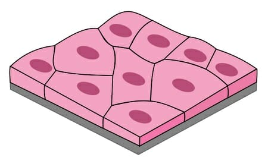
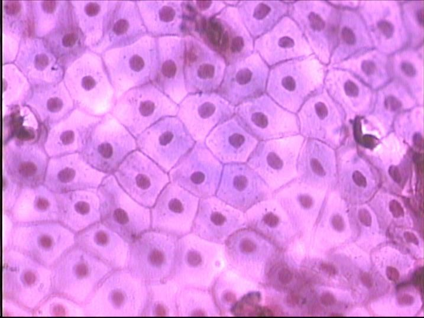

# Epithelium

### 1. Introduction to Epithelium

**上皮组织(epithelial tissue)**, 简称为**上皮(epithelium)**, 由细胞和少量的细胞间质构成. 上皮细胞覆盖在体表或体内器官/管腔等的表面, 因此有**游离面**和**基底面**的区分, 因此我们说上皮组织具有**极性(polarity)**, 游离面朝向外界腔隙, 常常会分化出一些特殊的结构以适应其功能、而基底面通过**基膜**和深处的结缔组织相连.

绝大部分上皮组织没有血管, 其营养物质来自结缔组织中的毛细血管渗透; 上皮组织内分布着丰富的游离神经末梢.

根据功能的不同, 可将上皮组织大致分为**被覆上皮**和**腺上皮**两类. 除此之外, 还有少部分特化了的上皮: 例如具有收缩能力的上皮细胞, 称为**肌上皮细胞(myoepithelial cell)**; 以及能够感受某种物理或化学刺激的细胞, 称为**感觉上皮细胞(sensory epithelial cell)**.

由于被覆上皮体现了上皮组织的核心功能: 保护功能, 因此很多时候我们平常所说的上皮组织都是狭义地指被覆上皮[^1], 但应当注意严格意义下不要遗漏掉考虑其他几类上皮, 例如在对上皮组织功能的讨论中: 上皮组织具有保护功能, 这是就被覆上皮而言的, 结合其他分类可知, 上皮组织的功能包括保护、分泌、收缩、感觉等等(下面几节还将提到更多的功能).

被覆上皮的分类最为繁杂, 在各种不同器官以不同的形态呈现, 因而内容最丰富.

### 2. Covering Epithelium

##### # Classification of Covering Epithelium

根据细胞层数的不同, 首先分为**单层上皮(simple epithelium)**和**复层上皮(stratified epithelium)**两类. 根据细胞**在垂直切面上**的的形状(对于单层上皮)或**最上层细胞在垂直切面上**的形状(对于复层上皮), 还可以继续分别分为扁平(鳞状)、柱状、立方上皮. 下面我们将讨论两类特殊的被覆上皮, 然后给出形式化的分类网络.

因此, 我们可以这样概括被覆上皮的分类: 

[img]

注意到这里我们并没有给出复层立方上皮, 这是因为这类上皮没有特殊的集中分布. 下面我们逐一讨论这些类型的上皮的形态特征和在高等哺乳动物体内(特别是人体内)的分布情况.

##### # Simple Squamous Epithelium

单层扁平(鳞状)上皮从表面看呈现**多边形**, 细胞边缘呈**锯齿状**, 细胞之间彼此**嵌合**(右图通过蛙肠系膜铺片给出的单层扁平上皮的真实表面形态). 从垂直切面上看, 单层扁平上皮是非常薄的, 仅仅在中央含核的部分略厚一些. 

特别地, 分布在心脏、血管和淋巴管腔面的单层扁平上皮称为**内皮**. 内皮的特点在于表面光滑, 有利于血液和淋巴液流通, 也有利于内皮细胞内外的物质交换(这主要是针对只有一层内皮的毛细血管壁而言的, 非毛细血管的内皮位于厚厚的结缔组织层之内, 这显然是没办法和血管外进行物质交换的). 下图中的AB分别是中动脉和中静脉的内皮图示, 其中箭头指向的是内皮细胞的细胞核.

分布在胸膜、腹膜、心包膜表面的单层扁平上皮称为**间皮**. 间皮的特点是表面湿润、光滑, 便于内脏活动.

除此之外, 还有另外一些没有赋予特殊名词的单层扁平上皮, 例如肺泡只由一层单层扁平上皮构成, 以实现气体交换功能; **肾小囊壁层**也只由一层单层扁平上皮构成, 以实现滤过功能.

##### # Simple Cuboidal Epithelium

##### # Pseudostratified Ciliated Columnar Epithelium

在单层上皮中有一类特殊的柱状上皮, 称为**假复层柱状上皮**, 这类上皮虽然每一个细胞的基底面都位于基膜上(因而严格意义上是单层的), 但只有其中部分种类的细胞(柱状细胞和杯形细胞)的顶端能够到达游离面, 其他种类的细胞都被这两类细胞隔断在了下面, 因此从垂直切面上看, 细胞的高矮不同, 并且细胞核的位置也不在同一平面上[^2], 非常类似于复层上皮的性状, 因此称之为“假复层”.

##### # Transitional Epithelium

在复层上皮中也有一类特殊的上皮, 称为**变移上皮(transitional epithelium)**或移行上皮, 分布于肾盂、肾盏、输尿管和膀胱的腔面. 变移上皮的形状和层数随所在器官的功能状况而发生变化, 例当膀胱收缩时, 上皮变厚, 细胞层数增多, 细胞呈立方形, 当膀胱充盈扩张时, 上皮变薄, 细胞层数变少, 细胞形状变扁.

变移上皮的表层细胞细胞质丰富, 细胞质浓缩, 嗜酸性强, 可以防止尿液侵蚀. 部分表层细胞含双核, 一个表层细胞覆盖几个细胞者称为盖细胞.

### 3. Glandular Epithelium

 



[^1]: 以及在思考时所对应的图式中也是如此, 注意这里的思想很贝克莱.
[^2]: 注意这一点是很重要的, 因为在染色下垂直切面中细胞的边界其实并不明显, 很多情况下需要根据核的位置来判断.

