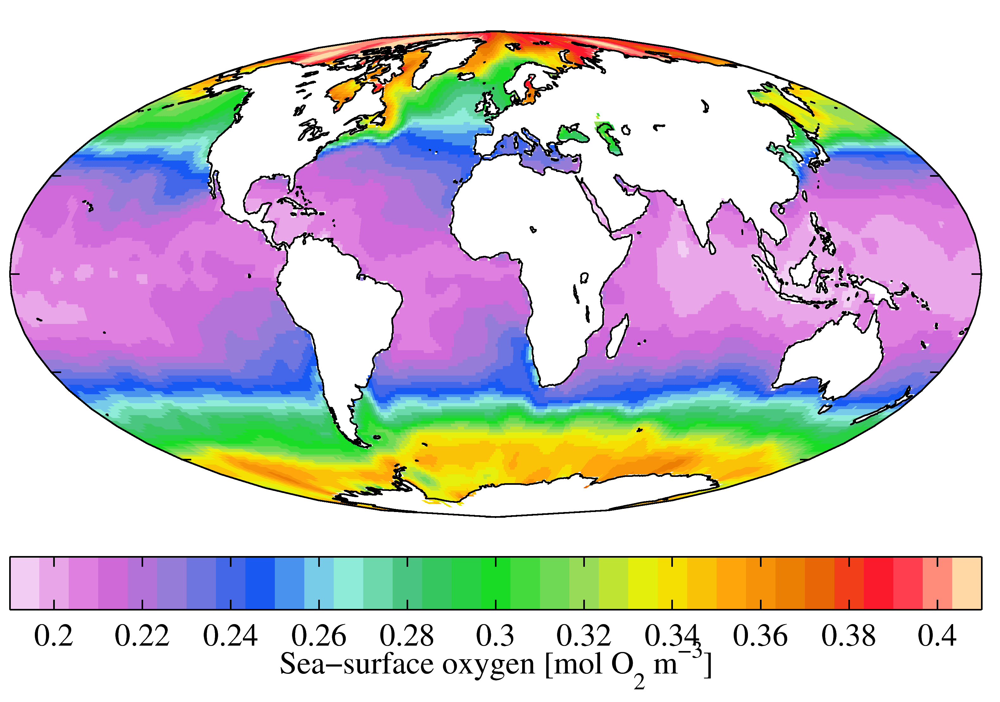

# Oxygen

### 1. Oxygen Element

##### # Atomic Property

1. Describe the position of oxygen in the periodic table.(atomic number, group, period, block, element category) (069)

2. Draw the atomic electron configuration expression and graph of oxygen. (059)

3. What's the isotopes of oxygen? (137)

4. What's the common oxidation states of oxygen? Give the examples (157)

##### # Element History

1. How is the oxygen element generate in the beginning? (494)

### 2. Dioxygen

##### # Physical Properties

1. Describe the color in all states, and the smell in gas. (039)

	What color do we used to color the oxygen gas cylinder in China? (027)

	What color do we used to color the liquid cylinder in China? (215)
	
	What color do we used to color the oxygen gas cylinder in ISO standard? (215)

2. What is the solubility of oxygen in water in the standard condition(mg/liter)? (255)

	How about in the 0 degree comparing to the 25 degrees water case? (227)

	How about in the seawater comparing to the pure water case? (227)

	How about in the organic solvents comparing to the water case? (226)

	Why can't we use the boiled water to farm fish?

	Why the fishes go to the surface of water when it's rainy?

	Illustrate why the sea-oxygen distribution shows as the following.

##### # Position

1. Oxygen constitutes what partition of Earth's atmosphere?

##### # Chemistry Properties

1. How to generate oxygen in the laboratory? Give at least 2 approaches.

2. How to generate oxygen in the industry? Give at least 2 approaches.

	In the Moon base or the Space Station, which approach will be used to generate oxygen?

3. Give examples about the reactions of oxygen with the metallic simple substances(Cu, Fe, Na). Describe the reality signifincance about these reations.

4. Give examples about the reactions of oxygen with the nonmetallic simple substances(H, C, S). Describe the realty signifincance about these reactions.

5. Design an experiment to calculate the partition of oxygen in the Earth's atmosphere. Why and how to choose the meterial to consume the oxygen?

6. Describe the oxygen cycle in Earth. List the core chemical reaction formulas. 

# Reference

[wiki-oxygen]: https://en.wikipedia.org/wiki/Oxygen
[gb7144]: http://c.gb688.cn/bzgk/gb/showGb?type=online&hcno=5CD35A41D3B485E0F073F68EF987246D

